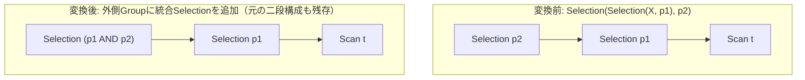

# merge_selections

- 状態: draft / 執筆基準リビジョン: `3880673` (2026-09-12)
- 定義位置: `plan/cascades.cpp` の `RuleSet::Default()`（登録名 `"merge_selections"`）

## 概要

`merge_selections` は、多段にネストした選択演算 `Selection(Selection(X, p1), p2)` を、述語の論理積を正規化した単一の選択演算 `Selection(..., p1 AND p2)` として外側Groupに追加する論理変換Ruleです。選択ノード数を集約し、連言の重複排除や矛盾検出（恒偽化）を可能にすることで、後続の最適化を支援します。

## 変換前後の関係

外側Groupに、内側Groupを子として参照したまま述語を統合した等価式を追加します。



本Ruleは外側Groupに新しい式を追加するのみであり、子ノードの参照先は内側Groupのままとなります。子ノードを直接 $X$ に繋ぎ替えて木をフラット化する変形は、相補的なRuleである `merge_adjacent_filters` が担当します。

## 適用条件

パターン照合には `Selection(Selection(Any(), "inner"))` を用います（`plan/cascades.hpp`）。変換ラムダ内の処理は以下のとおりです（`plan/cascades.cpp`）。

```cpp
          const Group& inner_group = memo.Get(bindings.at("inner"));
          for (const LogicalExpression& inner : inner_group.expressions) {
            if (inner.operation != LogicalOperator::kSelection) {
              continue;
            }
            const Expression merged = CanonicalizeConjuncts(
                BinaryExpressionExp(*inner.predicate, BinaryOperation::kAnd,
                                    *expression.predicate));
            memo.AddExpression(
                group,
                LogicalExpression{.operation = LogicalOperator::kSelection,
                                  .children = expression.children,
                                  .predicate = merged});
          }
```

適用条件は以下のとおりです。

1. **内側ノードの演算子**: 内側Group（`inner`）に `LogicalOperator::kSelection` を持つ式が存在すること。
2. **述語の存在**: 内側式および外側式の双方が有効な述語を保持していること（`*inner.predicate` および `*expression.predicate`）。

## 意味論的根拠と連言正規化

2つの連続する選択述語を論理積で結合する変形 $Selection(p2, Selection(p1, X)) \equiv Selection(p1 \land p2, X)$ は、関係代数の定義上無条件に成立します。

本Ruleにおける品質管理の中核は、結合された述語を必ず `CanonicalizeConjuncts` により正規化する点にあります（`plan/cascades.cpp`）。

```cpp
  // Provably-empty predicate: a contradictory conjunction, an always-false
  // conjunct, or a disjunction whose every branch is contradictory.
  if (ConjunctionIsContradictory(conjuncts) ||
      std::ranges::any_of(conjuncts, ExpressionIsAlwaysFalse)) {
    return ConstantValueExp(Value(false));
  }
```

`CanonicalizeConjuncts` は、連言をソートして同一条件を重複排除するだけでなく、`ConjunctionIsContradictory` により「同一列に対する矛盾した等式・不等式・NULL検査」を検知し、述語全体を即座に定数 `false` へ縮退させます。この正規化処理を経由することにより、多段適用の反復によって式が肥大化する問題を防ぎ、矛盾を含むクエリを即座に恒偽状態へと導きます。

## 実装の詳細

- **代替式の網羅**: 内側Groupに複数の `kSelection` 式が存在する場合、ループによりその各々と外側述語を合成した式を網羅的に生成します。
- **外側Groupへの登録**: 生成された統合式は親Group（`group`）に登録されます。親Group内には二段構成の既存式と統合式が併存し、最終的なコスト評価（`SearchEngine`）によって最適な物理実行パスが選択されます。

## 最適化効果

- **演算オーバーヘッドの削減**: 実行時におけるタプルごとのフィルタ評価段数が減少し、CPU命令実行数が削減されます。
- **後続Ruleへの波及**: 述語が正規化されることで、定数畳み込み（`eliminate_true_selection`）や矛盾検知（`eliminate_false_selection` による空関係化）などの簡約Ruleが即座に適用可能になります。

## 関連Ruleとの相互作用

- `merge_adjacent_filters`: 本Ruleと同一のパターンにマッチしますが、子ノードの参照を内側Groupの子（`inner.children`）に直接繋ぎ替えるフラット化変形を行います。
- `eliminate_false_selection`: 統合述語が矛盾により `false` 定数へ縮退した際、部分木全体を空集合ノード（`kEmpty`）へ置換します。
- `push_selection_into_scan`: 内側ノードの下位がスキャンである場合、統合された述語をスキャンフィルタへと押し込みます。

## 検証テスト

- `plan/cascades_test.cpp`:
  - `CascadesTest.MergeSelectionsCollapsesSelectionChain`: 外側Groupに統合述語を持つSelection式が追加されることを検証。

