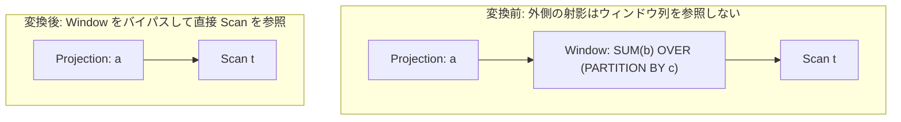

# no_op_window_elimination

- 状態: draft / 執筆基準リビジョン: `3880673` (2026-09-12)
- 定義位置: `plan/cascades.cpp` の `RuleSet::Default()`（登録名 `"no_op_window_elimination"`）

## 概要

`no_op_window_elimination` は、クエリの後続（上位）演算子がウィンドウ関数の計算結果を一切参照していない場合に、`Window` 演算ノードを完全にバイパス（素通り）させる論理変換Ruleです。

ウィンドウ関数の実行に伴う高コストなパーティション分割、データ並べ替え、およびフレームスキャン処理を丸ごと消去し、入力データを直接上位へ流す代替案を提供します。

## 変換前後の関係

外側がウィンドウ計算列を使用しない場合、`Window` ノードを除去して入力スキャンノードを直接参照する射影演算へと書き換えます。



式自身の形態に応じて、単一の `Window` のバイパス、または上位 `Projection` と連携したバイパスの2形態を扱います。

## 適用条件

パターン照合には `Pattern::Any()` を使用し、変換ラムダ内で以下の2つの構造形態を判定します。

```cpp
    // no_op_window_elimination: Remove Window operator when the outer
    // expressions do not reference any window function results. Both
    // bypasses below are gated on exactly that: dropping a Window node
    // whose `$win` outputs (or raw calls) are still referenced would
    // orphan columns (or evaluate calls row-at-a-time, which the
    // evaluator rejects).
```

### 形態 1: 自式が `kWindow` である場合

1. 子ノード数が1つであり、子グループが自グループ自身でないこと（循環防止）。
2. ターゲットリストが空である場合、子グループの各式をそのまま親グループへ複製する（循環式を除く）。
3. ターゲットリストが存在する場合、**ターゲットリスト内のどの式もウィンドウ関数呼び出し（`TreeContainsWindowCall`）を含まない**ことを確認した上で、`Projection(child)` を生成する。

### 形態 2: 自式が `kProjection` であり、子グループに `kWindow` が存在する場合

1. 内側 Window の子ノードが親グループ自身でないこと。
2. 外側のターゲットリストが内側 Window の出力を利用していないこと。具体的には、
   - 外側式木が生のウィンドウ関数呼び出しを含まないこと。
   - 外側のターゲットリストに含まれる未修飾の列参照が、内側 Window の定義する出力名（`$win` 等）と一致しないこと。

## 意味論的根拠と多重度保存・例外保護

関係代数において、ウィンドウ演算は入力関係の各行に対して厳密に1つの出力行を生成する（$|W(R)| = |R|$）ため、行の多重度（Multiplicity）を一切変更しません。したがって、ウィンドウ関数によって算出された付加属性が後続のどの式（射影、フィルタ、ソート、集約等）からも参照されない場合、演算そのものを脱落させても出力タプルの集合および多重度は完全に保存されます。

ガード条件の根拠は以下の通りです。

- **孤児列（Orphan Column）の発生防止**: ウィンドウ関数出力（`$win` 列）への参照が上位に残存したまま `Window` を除去すると、物理実行フェーズで未束縛の属性参照が発生し実行時パニックを引き起こします。
- **行単位評価の禁止**: 生のウィンドウ関数呼び出しが射影式に残っている場合、`Window` ノードが除去されると評価器がウィンドウ関数を行単位（row-at-a-time）で評価しようとして実行時エラーとなります。ヘルパー `TreeContainsWindowCall` および出力名チェック関数 `outer_uses_window` は、この不正な状態を確実に遮断します。

## 実装の詳細

形態 1 におけるウィンドウ関数呼び出しの非存在検査は以下の通りです。

```cpp
              } else if (!std::ranges::any_of(
                             expression.target_list,
                             [](const NamedExpression& target) {
                               return target.expression &&
                                      TreeContainsWindowCall(
                                          target.expression);
                             })) {
                memo.AddExpression(
                    group, LogicalExpression{
                               .operation = LogicalOperator::kProjection,
                               .children = {child},
                               .target_list = expression.target_list,
                               .output_schema = expression.output_schema});
              }
```

形態 2 における外側からの依存検査ロジックは以下の通りです。

```cpp
              const auto outer_uses_window = [](const LogicalExpression& outer,
                                                const LogicalExpression& win) {
                std::unordered_set<std::string> outputs;
                for (const NamedExpression& target : win.target_list) {
                  if (!target.name.empty()) {
                    outputs.insert(target.name);
                  }
                }
                for (const NamedExpression& target : outer.target_list) {
                  if (!target.expression) {
                    continue;
                  }
                  if (TreeContainsWindowCall(target.expression)) {
                    return true;
                  }
                  for (const auto& col : target.expression->TouchedColumns()) {
                    if (col.schema.empty() && outputs.contains(col.name)) {
                      return true;
                    }
                  }
                }
                return false;
              };
```

依存が存在しないことが証明された場合、`win.children[0]` を入力とする新たな `kProjection` 式を親グループに追加します。

## 最適化効果

本Ruleの適用により、以下の多大なコスト削減が達成されます。

- **高コストソートの回避**: ウィンドウ関数の評価にはパーティション順序に基づくソーティングが不可欠です。参照されない Window が除去されることで、基底のソート処理が丸ごと省略されます。
- **中間バッファの削減**: 行ごとの状態保持やウィンドウフレームのバッファリングが不要となり、メモリ使用量が大幅に削減されます。

## 関連 Rule と相互作用

- `split_window` / `merge_adjacent_windows`: ウィンドウ演算の分解・融合を担うRuleです。それらの過程で不要化されたウィンドウ出力を本Ruleが最終的に刈り取ります。
- `push_selection_through_window`: ウィンドウ演算を透過してフィルタを押し下げるRuleです。
- `eliminate_identity_projection`: 本Ruleによって生成された射影が入力と完全に一致する場合、恒等射影として除去されます。

## 検証テスト

- `plan/cascades_test.cpp`:
  - `CascadesTest.NoOpWindowElimination`: 上位の射影で参照されていない `Window` ノードが正しくバイパスされ、直結した代替プランが生成されることを検証。
