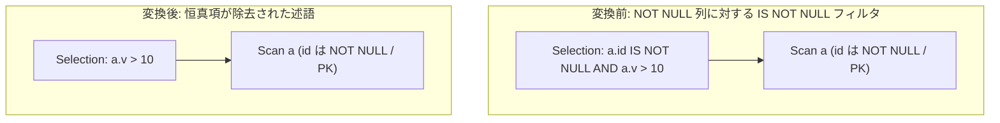

# not_null_is_not_null_elimination

- 状態: draft / 執筆基準リビジョン: `3880673` (2026-09-12)
- 定義位置: `plan/cascades.cpp` の `RuleSet::Default()`（登録名 `"not_null_is_not_null_elimination"`）

## 概要

`not_null_is_not_null_elimination` は、選択演算の述語に含まれる `col IS NOT NULL` 連言項について、対象列 `col` がスキーマ上で NOT NULL 制約または PRIMARY KEY 制約を持つことが静的に証明できる場合に、その連言項を述語から除去する論理変換Ruleです。

常に TRUE と評価される冗長な NULL チェック条件をコンパイル時に排除し、実行時の式評価コストを低減させるとともに、後続の述語プッシュダウンやインデックス選択の適合性を高めます。

## 変換前後の関係

述語内から恒真な `IS NOT NULL` 項を除去した新たな選択演算代替式を親グループに追加します。



すべての連言項が除去された場合は、恒真述語 `TRUE` を持つ `Selection` 式が生成され、後続の `eliminate_true_selection` へ処理が引き継がれます。

## 適用条件

パターン照合には `Selection(Any("input"))` を用い、対象演算子は `LogicalOperator::kSelection` です。

以下のガード条件をすべて満たす必要があります。

1. **選択ノードの完全性**: 式が `kSelection` であり、子ノードを1つ持ち、述語が存在すること。
2. **非循環性の担保**: 子グループが親グループ自身でないこと（`input_id != group`）。
3. **NOT NULL 制約の静的証明**: 子グループ内のいずれかの代替式の `output_schema` において、`Constraint::kNotNull` または `Constraint::kPrimaryKey` が明示宣言されている列が存在すること（UNIQUE 制約単独は不可）。
4. **対象項の合致**: 述語の連言中に「素の列参照に対する `kIsNotNull` 単項式」が存在し、かつその修飾名がステップ3で収集された証明済み列集合に含まれていること。

```cpp
                // Only a declared NOT NULL / PRIMARY KEY proves the column
                // cannot hold NULL. SQL UNIQUE permits NULLs (multiple of
                // them, even), and a column merely *named* id/pk may be
                // nullable, so neither is a sound proof.
                if (col.GetConstraint().ctype == Constraint::kNotNull ||
                    col.GetConstraint().ctype == Constraint::kPrimaryKey) {
                  // Qualified name only: t2.x must not be proven NOT NULL by
                  // another relation's NOT NULL x.
                  not_null_cols.insert(col.Name().ToString());
                }
```

## 意味論的根拠と三値論理・NULLセマンティクス

SQL の三値論理において、値 $v$ に対する `v IS NOT NULL` は、$v \neq \text{NULL}$ のとき TRUE、$v = \text{NULL}$ のとき FALSE を返します。スキーマ制約として NOT NULL または PRIMARY KEY が宣言されている列は、DBMS の整合性保護により実行時に NULL を保持することが不可能です。したがって、当該列に対する `col IS NOT NULL` は常に TRUE に評価され、連言（AND）から脱落させても式全体の真理値は不変です。

証明材料を厳格に限定する理由は以下の通りです。

- **UNIQUE 制約の排除**: SQL 標準において UNIQUE 制約は NULL 値の格納を許容します（複数の NULL の共存も許容）。したがって「UNIQUE 制約が存在する」ことだけでは非 NULL 性の証明にはならず、これを除去すると NULL 行が誤ってフィルタを通過してしまいます。
- **名前による推測の禁止**: 列名が `id` や `pk` であるというヒューリスティクスは意味論的証明になり得ません。
- **完全修飾名の必須化**: `col.Name().ToString()` による完全修飾名（表名＋列名）で集合を管理することにより、別リレーションの同名列の NOT NULL 性が誤って適用される混線を防ぎます。

## 実装の詳細

述語の走査と証明済み項のフィルタリングは以下のように行われます。

```cpp
          const auto conjuncts = SplitConjuncts(*expression.predicate);
          std::vector<Expression> kept;
          bool changed = false;
          for (const auto& conj : conjuncts) {
            if (conj && conj->Type() == TypeTag::kUnaryExp &&
                conj->AsUnaryExpression().Op() == UnaryOperation::kIsNotNull) {
              const auto& child = conj->AsUnaryExpression().Child();
              if (child && child->Type() == TypeTag::kColumnValue) {
                const ColumnName& col_name =
                    child->AsColumnValue().GetColumnName();
                if (not_null_cols.contains(col_name.ToString())) {
                  changed = true;
                  continue;
                }
              }
            }
            kept.push_back(conj);
          }
```

- **全項除去時のフォールバック**: 証明によりすべての項が除去された場合（`kept.empty()`）、本Ruleは Selection 自体を消去せず、明示的に `ConstantValueExp(Value(true))` を述語とする Selection ノードを生成します。

  ```cpp
            if (kept.empty()) {
              memo.AddExpression(
                  group,
                  LogicalExpression{.operation = LogicalOperator::kSelection,
                                    .children = {input_id},
                                    .predicate = ConstantValueExp(Value(true)),
                                    .target_list = expression.target_list,
                                    .output_schema = expression.output_schema});
            }
  ```

- **残余項の正規化**: 残った項が存在する場合は、`CombineConjuncts` で結合した上で `CanonicalizeConjuncts` により正規化して親グループへ追加します。

## 最適化効果

本Ruleの適用により、以下のメリットが得られます。

- **冗長評価の排除**: 毎行評価されていたブール判定が消去されます。
- **SARG 探索の単純化**: 複合述語から不要な条件が取り除かれることで、オプティマイザが真にインデックス探索引数として利用すべき述語に集中でき、より効率的なアクセスパスを選択できます。

## 関連 Rule との相互作用

- `eliminate_true_selection`: すべての述語が除去されて `Selection(TRUE)` となった式を検知し、Selection 演算子そのものを除去して下位スキャンを直接露出させます。
- `outer_to_inner_join_on_null_rejecting_filter`: NULL 排除性を利用して外部結合を内部結合へ昇格させる関連Ruleです。
- 式書き換え層（`expression/rewrite.cpp`）: 式レベルの恒真変形（`NOT (x IS NULL)` 等）を事前に本Ruleが受容可能な形式へと整えます。

## 検証テスト

- `plan/cascades_test.cpp`:
  - `CascadesTest.NotNullIsNotNullElimination`: NOT NULL 制約を持つ列に対する `IS NOT NULL` 条件が述語から正しく除去されることを検証。
