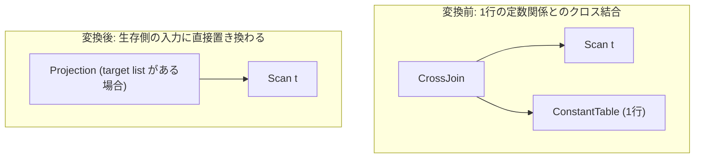

# one_row_cross_join_elimination

- 状態: draft / 執筆基準リビジョン: `3880673` (2026-09-12)
- 定義位置: `plan/cascades.cpp` の `RuleSet::Default()`（登録名 `"one_row_cross_join_elimination"`）

## 概要

`one_row_cross_join_elimination` は、クロス結合 `CrossJoin(L, R)` のいずれか一方の入力が「厳密に1行のみを生成する関係」（定数テーブル、スカラ集約、Max1Row など）である場合に、結合演算を除去して対向側の生存入力グループの論理式で置き換える論理変換Ruleです。

1行関係との直積は対向関係の行多重度を 1 対 1 で完全に保存するため、直積計算を丸ごとバイパスして対向側の式を展開します。

## 変換前後の関係

クロス結合ノードを除去し、対向側の入力ノードからなる射影または既存論理式を親グループへ直接追加します。



自式がターゲットリストを保持している場合は生存側を入力とする `Projection` を生成し、持たない場合は生存側グループの論理式をそのままインポートします。

## 適用条件

パターン照合には `CrossJoin(Any("left"), Any("right"))` を用い、対象演算子は `LogicalOperator::kCrossJoin` です。

以下のガード条件をすべて満たす必要があります。

1. **子ノード数**: 式が `kCrossJoin` であり、正確に2つの子ノードを持つこと。
2. **非循環性の担保**: 左右の子グループが親グループ自身でないこと。
3. **単一行関係の成立**: 左右のいずれか少なくとも一方が単一行関係であること（`is_one_row` 判定が真）。双方が単一行の場合は右側を消去側、左側を生存側として処理します。
4. **関係集合の完全一致**: 生存側グループのリレーション集合が、親グループのリレーション集合と完全に等しいこと（`memo.Get(left_id).relations == memo.Get(group).relations` 等）。

単一行関係の判定 `is_one_row` は、タグ情報またはグループ内の論理演算子を検査します。

```cpp
          const auto is_one_row = [](const Group& g) -> bool {
            if (g.tag.find("constant") != std::string::npos ||
                g.tag.find("max1row") != std::string::npos ||
                g.tag.find("one_row") != std::string::npos) {
              return true;
            }
            return std::ranges::any_of(
                g.expressions, [](const LogicalExpression& expr) {
                  return expr.operation == LogicalOperator::kConstantTable ||
                         expr.operation == LogicalOperator::kMax1Row ||
                         (expr.operation == LogicalOperator::kValues &&
                          expr.values.size() == 1) ||
                         (expr.operation == LogicalOperator::kAggregation &&
                          expr.grouping_sets.empty() &&
                          expr.partition_by.empty());
                });
          };
```

## 意味論的根拠と多重度保存・関係集合の整合

数学的直積において、任意の集合 $R$ と単一行集合 $S_1$（$|S_1| = 1$）の直積行数は厳密に保存されます。

$$|R \times S_1| = |R| \times 1 = |R|$$

したがって、$S_1$ 側の行が存在しない（0行）リスクや複数行に増殖するリスクがない限り、結合演算を除去しても多重度および行集合は完全に一致します。

ガード条件の根拠は以下の通りです。

- **多重度 1 の厳格性**: `kAggregation` の判定において `grouping_sets.empty() && partition_by.empty()` を必須とするのは、GROUP BY のないスカラ集約（例: `SELECT COUNT(*) FROM t`）のみが入力 0 行時でも必ず 1 行を返す保証を持つためです。GROUP BY が付与された集約は 0 行または複数行を返し得るため除外されます。
- **関係集合の一致（条件4）**: 1行側の関係が通常のリレーション（テーブル）である場合、それを消去すると親グループが代表すべきリレーション集合から脱落し、メモ構造の不変条件（Invariants）を破壊します。定数テーブルやサブクエリ集約のように「リレーション集合を持たない（空集合である）」場合に限り、生存側の関係集合と親の関係集合が一致し、安全に消去できます。

## 実装の詳細

右側が単一行関係として判定された場合の変換コードは以下の通りです。

```cpp
          if (right_one_row &&
              memo.Get(left_id).relations == memo.Get(group).relations) {
            if (!expression.target_list.empty()) {
              memo.AddExpression(
                  group,
                  LogicalExpression{.operation = LogicalOperator::kProjection,
                                    .children = {left_id},
                                    .target_list = expression.target_list,
                                    .output_schema = expression.output_schema});
            } else {
              for (const LogicalExpression& alt :
                   memo.Get(left_id).expressions) {
                if (std::ranges::find(alt.children, group) ==
                    alt.children.end()) {
                  memo.AddExpression(group, alt);
                }
              }
            }
          }
```

- **ターゲットリストのハンドリング**: 自式にターゲットリストが定義されている場合は、生存側の入力 ID を子とする `kProjection` を生成して列の射影を正しく継承します。
- **式の直接インポート**: ターゲットリストがない場合は、生存側グループ内の代替式を親グループへ直接複製し、探索成果を再利用します。この際、子ノードに親グループ自身を含む循環式は確実に除外されます。左側が単一行の場合も対称に処理されます。

## 最適化効果

本Ruleの適用により、以下の性能向上が得られます。

- **直積演算の完全消去**: 行数積算によるタプル生成処理が排除され、生存側のアクセスパスのみでデータ供給が可能となります。
- **スカラサブクエリの平坦化**: `WHERE x = (SELECT MAX(y) FROM s)` のようなスカラ集約サブクエリとの結合が解消され、不要なネステッドループ処理が取り除かれます。

## 関連 Rule との相互作用

- `join_identity_dummy`: 1行側が属性を持たない `DummyScan` である極小ケースを処理するRuleです。本Ruleと協調して単位元結合を解消します。
- `max1_row`（実装Rule）: スカラサブクエリに対して最大1行制約を強制するオペレータであり、本Ruleの判定材料となります。
- `cross_to_inner_with_predicate`: 直積に述語が付与された場合の内部結合化Ruleであり、本Ruleの対象外となる述語付き結合を処理します。

## 検証テスト

- `plan/cascades_test.cpp`:
  - `CascadesTest.OneRowCrossJoinElimination`: 単一行の定数側（`one_row_const` タグ付きグループ）を持つクロス結合を探索した際、結合が消去され生存側の式へと置換されることを検証。
