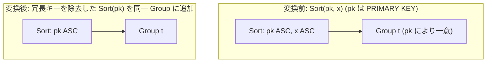

# order_by_redundant_column_removal

- 状態: draft / 執筆基準リビジョン: `3880673` (2026-09-12)
- 定義位置: `plan/cascades.cpp` の `RuleSet::Default()`（登録名 `"order_by_redundant_column_removal"`。ヘルパー関数 `LogicalProperties::IsUniqueOn` を使用）

## 概要

`order_by_redundant_column_removal` は、ソート演算 `Sort(k1, k2, ...)` において、キー列のプレフィックス（接頭辞部分列）が一意（UNIQUE / PRIMARY KEY）であると静的に証明できる場合に、そのプレフィックスより後続に位置する冗長なソートキーを切り落とす論理変換Ruleです。

キーのプレフィックスだけで全タプルが一意に識別される場合、後続のキーがタイブレーク（同順位の解消）に使われる局面は一切生じません。したがって、行の順序付け結果を厳密に保ったまま比較キー長を切り詰め、ソート処理を高速化します。

## 変換前後の関係

同一グループ内に、後続キーを切り落とした短縮版の `kSort` 式を追加します。



元の多キーソート式と短縮ソート式が並存し、コスト比較および要求順序プロパティ（Enforcer）との照合に供されます。

## 適用条件

パターン照合には `Sort(Any("input"))` を用い、対象演算子は `LogicalOperator::kSort` です。

```cpp
    // order_by_redundant_column_removal: Sort(k1, k2, ...) -> Sort(k1, ...)
    // dropping trailing keys once a key prefix is unique: no two rows agree
    // on the prefix, so later keys never break a tie. The surviving prefix
    // keeps its directions and NULLS placement.
```

以下のガード条件をすべて満たす必要があります。

1. **ソートノードの基本制約**: 式が `kSort` であり、単一の子ノードを持ち、ターゲットリストの要素数が2以上であること（`target_list.size() >= 2`。単一キーは対象外）。
2. **非循環性の担保**: 入力グループが親グループ自身でないこと。
3. **キー列の純粋性**: 試行するプレフィックス長 `keep`（1 から `target_list.size() - 1`）について、先頭 `keep` 個のキーがすべて素の列参照（`TypeTag::kColumnValue`）であること（複雑な式キーが混在する場合はスキップ）。
4. **一意性の証明**: 先頭 `keep` 個のキー列集合について、`input_group.logical_properties.IsUniqueOn(prefix)` が成立すること。
5. **最短一致による単一登録**: 一意性が証明された最小の `keep` で代替式を1つ登録し、直ちに処理を終了（`return`）すること。

```cpp
            LogicalExpression trimmed = expression;
            trimmed.target_list.erase(
                trimmed.target_list.begin() + static_cast<ptrdiff_t>(keep),
                trimmed.target_list.end());
            trimmed.sort_ascending.resize(
                std::min(trimmed.sort_ascending.size(), keep));
            trimmed.sort_nulls_first.resize(
                std::min(trimmed.sort_nulls_first.size(), keep));
            memo.AddExpression(group, std::move(trimmed));
            return;
```

## 意味論的根拠と物理実行の契約

ソートの順序関係は、辞書式順序（Lexicographical Order）として定義されます。キー列のプレフィックス $K_{\text{prefix}}$ においてすべてのタプルが異なる値をとる（一意である）ならば、任意の2行 $r_1, r_2$ について $K_{\text{prefix}}(r_1) \neq K_{\text{prefix}}(r_2)$ が常に成立します。このため、後続のキー $K_{\text{suffix}}$ の比較ステップへ到達することは論理的にあり得ず、タプル間の順序比較結果はプレフィックスのみで確定します。

証明とプロパティ維持の根拠は以下の通りです。

- **一意性判定（`IsUniqueOn`）**: `LogicalProperties` において、入力が最大1行（`max_1_row`）であるか、またはカタログ由来の候補キー（Candidate Keys）のいずれかが指定列集合に内包されているかを厳密に判定します。
- **順序仕様の保存**: 残存する各キーの昇順／降順指定（`sort_ascending`）および NULLS FIRST / NULLS LAST 指定（`sort_nulls_first`）は完全に保存され、切り落とされる後続キーの要素分のみ配列サイズを縮小します。

## 実装の詳細

プレフィックスの走査と一意性判定ループは以下の通りです。

```cpp
          for (size_t keep = 1; keep < expression.target_list.size(); ++keep) {
            std::unordered_set<std::string> prefix;
            bool all_columns = true;
            for (size_t i = 0; i < keep; ++i) {
              const NamedExpression& key = expression.target_list[i];
              if (!key.expression ||
                  key.expression->Type() != TypeTag::kColumnValue) {
                all_columns = false;
                break;
              }
              prefix.insert(
                  key.expression->AsColumnValue().GetColumnName().ToString());
            }
            if (!all_columns || prefix.empty()) {
              continue;
            }
            if (!input_group.logical_properties.IsUniqueOn(prefix)) {
              continue;
            }
```

- **安全な列名抽出**: 完全修飾名（`ToString()`）により列集合を構築します。式キーが存在する場合は `all_columns = false` となり安全に除外されます。
- **早期リターン**: ループは `keep = 1` から昇順に検査するため、最初に一意性が成立した時点で最短のキープレフィックスが確定し、即座にグループへ登録されて終了します。

## 最適化効果

本Ruleの適用により、以下の性能向上が得られます。

- **比較処理のオーバーヘッド削減**: ソート実行時におけるキー比較関数呼び出し回数および複数列比較の分岐が削減されます。
- **順序プロパティ照合の容易化**: 短縮されたソートキーは、要求された物理プロパティ（`PhysicalProperties::ordering`）との一致判定を満たしやすくなり、不要な明示的ソートオペレータの挿入（SortEnforcer）を未然に防止します。

## 関連 Rule との相互作用

- `eliminate_double_sort`: 同一の順序仕様を持つ多段ソートを1段に縮約するRuleです。
- `limit_push_through_sort` / `rank_row_number_to_topn`: ソートキーが最短化されることで、TopN アルゴリズムやインデックススキャンとの親和性が向上します。
- `pk_unique_distinct_elimination`: 同一の `LogicalProperties::IsUniqueOn` 一意性証明基盤を利用するRuleです。

## 検証テスト

- `plan/cascades_test.cpp`:
  - `CascadesTest.OrderByRedundantColumnRemoval`: PRIMARY KEY 列 `t.pk` と任意列 `x` を含む `Sort(pk, x)` から、キー1個の `Sort(pk)` 代替式が正しく生成されることを検証。
