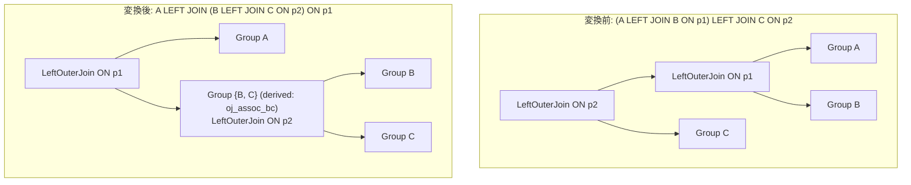

# outer_join_associativity

- 状態: draft / 執筆基準リビジョン: `3880673` (2026-09-12)
- 定義位置: `plan/cascades.cpp` の `RuleSet::Default()`（登録名 `"outer_join_associativity"`）

## 概要

`outer_join_associativity` は、左外部結合の連鎖 `(A LEFT JOIN B ON p1) LEFT JOIN C ON p2` を `A LEFT JOIN (B LEFT JOIN C ON p2) ON p1` へと再結合（結合順序の結合則変換）する論理変換Ruleです。

外部結合は内部結合と異なり無条件の結合則が成立しません。本Ruleは、外側結合述語 `p2` が結合対象関係 `B` の属性に対して NULL 排除的（null-rejecting）である場合に限り発火し、代数的一致性を保証しながら外部結合ツリーの再順序付け探索を可能にします。

## 変換前後の関係

既存の結合木に対し、`B` と `C` を内側で先行して外部結合する派生グループ（`oj_assoc_bc` タグ）を新設し、その結果と `A` を結合する新たな左外部結合式を親グループへ追加します。



外側の結合述語は `p1` に、内側の新設結合の述語は `p2` にそれぞれ再配置されます。

## 適用条件

パターン照合には `OuterJoin(Any("input"), Any("c"))` を用います。

変換ラムダ内において、以下のガード条件をすべて満たす必要があります。

1. **左外部結合の特定**: 外側式が `kOuterJoin` であり、正確に2つの子ノードを持ち、`join_type == 0`（LEFT OUTER JOIN）かつ有効な述語 `p2` を持つこと。
2. **内側左外部結合の特定**: 第0子グループ内に、`kOuterJoin`、2子ノード、`join_type == 0` である式 `(A LOJ B ON p1)` が存在すること。
3. **参照関係のスコープ限定**: 外側述語 `p2` が触れる全列が、関係 `B` または関係 `C` の属性のみで構成されていること（関係 `A` の列を参照していないこと）。

   ```cpp
            bool touches_only_bc = true;
            for (const auto& col : (*expression.predicate)->TouchedColumns()) {
              if (std::ranges::find(b_rels, col.schema) == b_rels.end() &&
                  std::ranges::find(c_rels, col.schema) == c_rels.end()) {
                touches_only_bc = false;
                break;
              }
            }
            if (!touches_only_bc) {
              continue;
            }
   ```

4. **関係 B に対する NULL 排除性**: 述語 `p2` が関係 `B` の属性に対して NULL 排除的であること（`ExpressionRejectsNullsOnRelations(*expression.predicate, b_rels)` が真）。
5. **非循環派生グループの確保**: 新規に作成する派生グループ `bc_group`（タグ `"oj_assoc_bc"`）が親グループ自身、または `B`, `C` のグループと一致しないこと。

## 意味論的根拠と三値論理・NULLセマンティクス

左外部結合において、マッチしない左入力行は右側属性をすべて NULL で埋めて出力されます。

変換前プラン `(A LOJ B ON p1) LOJ C ON p2` では、`A` の行が `B` にマッチせず `(a, NULL)` となったタプルに対しても `p2` が評価されます。ここで、もし `p2` が $B$ の属性が NULL のときでも真となり得る場合（例: `b.id IS NULL` や `b.id = c.id OR b.id IS NULL`）、NULL 補完行が `C` とマッチして `(a, NULL, c)` というタプルが生成されてしまいます。

一方、変換後プラン `A LOJ (B LOJ C ON p2) ON p1` では、`B LOJ C` の評価対象となるのは $B$ に実在するタプルのみです。したがって、$A$ の行がマッチしない場合の結果は常に `(a, NULL, NULL)` となり、両プランの結果が食い違います。

`p2` が $B$ 上で NULL 排除的（$B$ の属性が NULL であれば `p2` が FALSE または UNKNOWN となる）であれば、変換前プランにおいても NULL 補完行が `C` とマッチすることはあり得ず、結果は必ず `(a, NULL, NULL)` となります。これにより、再結合後プランとの代数的一致性が完全に保証されます。

`plan/cascades.cpp` の `ExpressionRejectsNullsOnRelations` は、比較演算子（`kEquals`, `kLessThan` 等）のオペランドに厳密関数（`IsStrictOnRelations`）が適用されているかを検証し、AND 条件なら一方、OR 条件なら双方が NULL 排除的であることを判定します。

## 実装の詳細

再結合処理は、派生グループの構築と結合式の多段登録によって構成されます。

```cpp
            const GroupId bc_group = memo.EnsureDerivedGroup(
                UnionRelations(b_rels, c_rels), "oj_assoc_bc");
            if (bc_group == group || bc_group == b_id || bc_group == c_id) {
              continue;
            }

            memo.AddExpression(
                bc_group,
                LogicalExpression{.operation = LogicalOperator::kOuterJoin,
                                  .children = {b_id, c_id},
                                  .predicate = expression.predicate,
                                  .target_list = expression.target_list,
                                  .join_type = 0,
                                  .output_schema = expression.output_schema});

            memo.AddExpression(
                group,
                LogicalExpression{.operation = LogicalOperator::kOuterJoin,
                                  .children = {a_id, bc_group},
                                  .predicate = inner_oj.predicate,
                                  .target_list = expression.target_list,
                                  .join_type = 0,
                                  .output_schema = expression.output_schema});
```

- **派生グループ（Derived Group）の利用**: `EnsureDerivedGroup` を用い、タグ `"oj_assoc_bc"` で中間グループを単離します。これにより、単一表スキャンを持たない中間関係グループが基底の Memo 構造と干渉することを防ぎます。
- **述語の再配置**: 内側の `bc_group` に外側述語 `expression.predicate`（`p2`）を設定し、親グループには内側結合述語 `inner_oj.predicate`（`p1`）を設定します。

## 最適化効果

本Ruleの適用により、外部結合を含むクエリにおいて以下の結合順序最適化が可能となります。

- **小規模テーブルの先行結合**: `(A LOJ B) LOJ C` では `C` は必ず最後に評価されますが、`B` と `C` が共に小さく索引化されている場合、先に `B LOJ C` を計算して中間サイズを抑制した上で `A` と結合する方がコスト的に極めて有利となります。
- **探索空間の拡張**: 外部結合の結合則の適用により、結合順序列挙の幅が広がり、最適なハッシュ結合順序が選択可能になります。

## 関連 Rule との相互作用

- `join_associativity_left` / `join_associativity_right`: 内部結合（`kJoin`）専用の結合則Ruleです。外部結合は本Ruleが専任で担当します。
- `right_to_left_outer_join`: RIGHT OUTER JOIN を LEFT OUTER JOIN へ標準化するRuleであり、本Ruleの適用対象を増大させます。
- `push_filter_through_left_join_left_side`: 外部結合の左側入力へフィルタを押し下げるRuleであり、同一の NULL 排除性判定機構を利用します。

## 検証テスト

- `plan/cascades_test.cpp`:
  - `CascadesTest.OuterJoinAssociativity`: `(a LOJ b) LOJ c` の探索により、左子に `a`、右子に `bc_group` を持つ `LeftOuterJoin` 式が生成されることを検証。
  - `CascadesTest.OuterJoinAssociativityRejectsInvalidPredicate`: 述語 `p2` が関係 `A` の列を参照している場合に、発火が正しく拒絶されることを検証。
