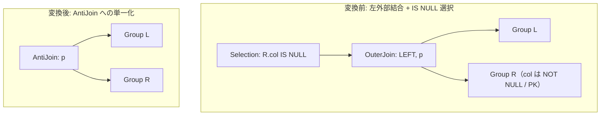

# outer_to_anti_join

- 状態: draft   /   執筆基準リビジョン: `3880673` (2026-09-12)
- 定義位置: `plan/cascades.cpp` の `RuleSet::Default()`（登録名 `"outer_to_anti_join"`）

## 概要

左外部結合とその直上の NULL 検査フィルタ $\sigma_{R.\text{key IS NULL}}(\text{LeftOuterJoin}(L, R, p))$ を、専用の反結合演算子 $\text{AntiJoin}(L, R, p)$ へ置換する論理 Rule です。

SQL において頻出する「外部結合と IS NULL 述語による除外パターン」を単一の論理演算子へ畳み込むことで、NULL パディングされた中間タプルの生成および後段でのフィルタ評価を完全に回避します。

## 変換前後の関係



## 適用条件

パターンは `Selection(Any("input"))` であり、ルートが `kSelection` ノードであることを検査します（`plan/cascades.cpp`）。

```cpp
    // outer_to_anti_join: Convert LeftOuterJoin(L, R, p) followed by
    // Selection(R.key IS NULL) into AntiJoin(L, R, p).
```

適用判定（guard）は以下のすべての条件を要求します。

1. **左外部結合の特定**: 入力グループ内の式が `kOuterJoin` かつ `join_type == 0`（LEFT OUTER JOIN）であること（RIGHT および FULL は対象外）。
2. **純粋な NULL 検査連言**: 選択述語を `SplitConjuncts` で分解したすべての連言が、$R$ 側の属性に対する単項演算 `kIsNull`（`col IS NULL`）であること。他の述語（残余連言）が 1 つでも混在する場合は不発火。
3. **右側属性の所属性**: NULL 検査対象の列が右側リレーション $R$ に一意に解決されること（`resolves_to_right`）。
4. **カタログ定義の非 NULL 性**: 対象列がカタログスキーマにおいて NOT NULL 制約または主キー（Primary Key）として宣言されていること（`ColumnIsDeclaredNonNull`）。
5. **有効述語数**: 検査対象となる IS NULL 連言が少なくとも 1 つ以上存在すること（`null_checks > 0`）。

## 意味論的根拠と安全性制約

### 1. 除外イディオムの代数同値性
左外部結合 $L = \Join_p R$ は、結合条件 $p$ に一致したタプルと、一致しなかった $L$ のタプルに $R$ 側の属性を NULL 補完したタプルの和集合を生成します。

もし $R.\text{col}$ が本来 NULL を取り得ない属性（NOT NULL または主キー）であれば、$R.\text{col IS NULL}$ を満たす行は「結合条件 $p$ に一致しなかった左側のタプル」と完全に一致します。したがって、以下の代数同値性が成立します。

$$\sigma_{R.\text{key IS NULL}}(L =\Join_p R) \equiv L \triangleright_p R \quad (\text{AntiJoin})$$

### 2. 残余連言の消失防止
変換後の $\text{AntiJoin}$ ノードは結合述語 $p$ のみを保持し、上位の Selection ノード自体を消去します。

```cpp
            // The Selection must be EXACTLY `right.col IS NULL` conjuncts:
            // the AntiJoin replacement keeps only the join condition, so any
            // residual conjunct (left- or right-referencing) would be lost.
```

もし述語に $R.\text{key IS NULL} \land L.x = 5$ のような残余連言が含まれていた場合、無条件に AntiJoin 化すると $L.x = 5$ のフィルタ条件が脱落して出力行が増加します。そのため、連言集合が厳密に $R$ 側への `IS NULL` のみで構成されている必要があります。

### 3. NULL 可能列による誤判定の抑止
もし $R.\text{col}$ が NULL 許容列である場合、結合条件 $p$ に一致した正当なタプルであっても元データとして $R.\text{col}$ が NULL であった行が $\sigma_{R.\text{col IS NULL}}$ を通過してしまいます。AntiJoin は一致タプルを無条件に破棄するため、出力から正当な行が脱落します。

```cpp
              // A matched row whose null-tested column is genuinely NULL
              // satisfies `col IS NULL` but is dropped by the AntiJoin;
              // the rewrite is only sound for NOT NULL columns.
```

このため、カタログ情報（`ColumnIsDeclaredNonNull`）に基づく厳格な制約確認が必須となります。

## 実装の詳細

変換処理は以下の構造で Memo に新たな論理式を登録します。

```cpp
            if (convertible && null_checks > 0) {
              memo.AddExpression(
                  group, LogicalExpression{
                             .operation = LogicalOperator::kAntiJoin,
                             .children = {left_id, right_id},
                             .predicate = join_expr.predicate,
                             .target_list = expression.target_list.empty()
                                                ? join_expr.target_list
                                                : expression.target_list,
                             .output_schema = expression.output_schema});
            }
```

Selection 演算子の述語は AntiJoin の意味論へ完全に吸収されるため廃棄され、結合述語 `join_expr.predicate` のみが保持されます。出力スキーマは元の Selection の `output_schema` を踏襲します。

## 最適化効果

- **中間タプル生成の排除**: 不一致行を表現するための NULL パディング行の構築・メモリ割り当て処理が完全に消滅します。
- **専用アルゴリズムの適用**: 物理最適化において、右側のマッチ有無のみをビットマップやハッシュ表で追跡する `anti_hash_join` や `anti_merge_join` が選択可能となり、メモリ消費量と実行時間が大幅に削減されます。

## 関連 Rule との相互作用

- `outer_to_inner_join_on_null_rejecting_filter`: NULL 拒否述語が存在する場合に内部結合へ変換する相補的 Rule です。本 Rule は「NULL 許容行のみを残す」という逆方向の条件を扱います。
- `mark_join_to_filter`: 相関サブクエリ由来の MarkJoin を semi/anti join へ展開する処理と目的を共有します。
- `join_empty_simplification`: 反結合の右側が空関係である場合の恒等単純化（$L \triangleright \emptyset \equiv L$）を後段で実行します。

## 検証テスト

`plan/cascades_test.cpp` における以下のテストケースで検証されています。

- `CascadesTest.OuterToAntiJoinRewrite`:
  主キーに対する `t2.id IS NULL` フィルタを伴う LEFT JOIN が正しく AntiJoin へ変換されることを確認します。
- `CascadesTest.OuterToAntiJoinRefusesNullableNullTestedColumn`:
  NULL 許容列に対する検査では変換が抑止されることを確認します。
- `CascadesTest.OuterToAntiJoinRefusesLeftResidualConjunct`:
  左側属性への残余述語が含まれる場合に変換が抑止されることを確認します。
- `CascadesTest.OuterToAntiJoinRequiresNullCheckOnAllRightColumns`:
  右側属性に対する他の述語（例: `r.name = 'foo'`）が混在する場合に変換が抑止されることを確認します。
