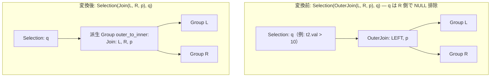

# outer_to_inner_join_on_null_rejecting_filter

- 状態: draft   /   執筆基準リビジョン: `3880673` (2026-09-12)
- 定義位置: `plan/cascades.cpp` の `RuleSet::Default()`（登録名 `"outer_to_inner_join_on_null_rejecting_filter"`）

## 概要

外部結合演算の上に位置する選択演算 $\sigma_q(\text{OuterJoin}(L, R, p))$ において、選択述語 $q$ が NULL 補完される側のリレーションに対して NULL 排除性（null-rejecting）を持つ場合に、外部結合を内部結合 $\text{Join}(L, R, p)$ へ降格する論理 Rule です。

外部結合によって生成される NULL パディング行が直上のフィルタによって必然的に排除される（三値論理で `UNKNOWN` / `FALSE` となり脱落する）ことを静的に証明し、実行効率の高い内部結合へと変換します。

## 変換前後の関係



## 適用条件

パターンは `Selection(Any("input"))` であり、ルートが `kSelection` ノードであることを検査します（`plan/cascades.cpp`）。

```cpp
    // outer_to_inner_join_on_null_rejecting_filter: When Selection over
    // OuterJoin has null-rejecting predicates on the outer-generated nullable
    // relations, rewrite to InnerJoin with the same join condition.
```

適用判定（guard）は以下の条件により構成されます。

1. **選択述語の存在**: `kSelection` が述語 `expression.predicate` を保持していること。
2. **結合種別に応じた NULL 排除性**: 入力グループ内の各 `kOuterJoin` 式に対し、NULL 補完側の関係集合を対象として `ExpressionRejectsNullsOnRelations` を呼び出します。
   - **LEFT OUTER JOIN**（`join_type == 0`）: 右側関係集合 $R$ に対し $q$ が NULL 排除であること。
   - **RIGHT OUTER JOIN**（`join_type == 1`）: 左側関係集合 $L$ に対し $q$ が NULL 排除であること。
   - **FULL OUTER JOIN**（`join_type == 2`）: 左右双方の関係集合 $L$ および $R$ の双方に対し $q$ が NULL 排除であること。
3. **サイクル防止**: 派生グループ `EnsureDerivedGroup(input.relations, "outer_to_inner")` が現在のグループ自身や入力グループと一致しないこと。

## 意味論的根拠と NULL 排除性の判定

### 1. ON 節と WHERE 節の評価順序
SQL 意味論において、外部結合の結合述語（ON 節 $p$）は NULL 補完の**前**に評価され、上位の選択述語（WHERE 節 $q$）は NULL 補完の**後**に評価されます。

結合条件に不一致であった行は、相手側の属性がすべて NULL に置換された上で上位の選択ノードへ送出されます。もし $q$ が対象属性の NULL に対して真（`TRUE`）を返し得ない述語であれば、これらの補完行は $\sigma_q$ によってすべて破棄されます。したがって、補完行を最初から生成しない内部結合を実行しても、最終的な結果タプル集合は代数的に一致します。

### 2. 厳格性（Strictness）の検証と例外
述語が NULL を排除するか否かは `ExpressionRejectsNullsOnRelations` および `IsStrictOnRelations` により判定されます。

- **NULL 排除の成立**:
  - 比較演算子（`=`、`!=`、`<`、`<=`、`>`、`>=`）および `LIKE`: いずれかのオペランドが対象関係の属性に厳密に依存する場合。SQL の三値論理において、オペランドが NULL のとき比較演算は `UNKNOWN` を返し、フィルタで除外されます。
  - `IS NOT NULL` 単項演算子。
  - 算術演算、`CAST`、および文字関数（`upper`, `lower`, `length`, `trim` 等）は NULL 伝播特性（厳格性）を保持するため、入れ子になっていても NULL 排除性が維持されます。
- **NULL 排除の不成立（変換禁止例）**:
  - `IS NULL`: NULL パディング行を明示的に選択するため、内部結合化は結果を破壊します（`outer_to_anti_join` の管轄）。
  - `COALESCE(col, 0) = 0`: NULL を非 NULL 値へ置換して評価するため、パディング行が通過する可能性があります。
  - 論理和（OR）結合: 両辺がともに NULL 排除でなければ、片方の枝で NULL が許容されてしまいます。

## 実装の詳細

変換処理は `"outer_to_inner"` タグを持つ派生グループを確保し、その中に内部結合ノードを配置した上で、上位に元の選択ノードを被せる 2 段構造を構築します。

```cpp
            const GroupId inner_group = memo.EnsureDerivedGroup(
                memo.Get(input_id).relations, "outer_to_inner");
            if (inner_group == group || inner_group == input_id) {
              continue;
            }
            memo.AddExpression(
                inner_group,
                LogicalExpression{.operation = LogicalOperator::kJoin,
                                  .children = {left_id, right_id},
                                  .predicate = join_expr.predicate,
                                  .target_list = join_expr.target_list,
                                  .output_schema = join_expr.output_schema});
            memo.AddExpression(
                group,
                LogicalExpression{.operation = LogicalOperator::kSelection,
                                  .children = {inner_group},
                                  .predicate = expression.predicate,
                                  .target_list = expression.target_list,
                                  .output_schema = expression.output_schema});
```

選択述語 $q$ は内部結合の上位に Selection として維持されます。これにより、内部結合から出力された一致行に対する通常のフィルタリング責任が完全に全うされます。

## 最適化効果

- **アルゴリズム選択肢の拡大**: 外部結合専用の物理アルゴリズムから、インメモリハッシュ結合、ソートマージ結合、インデックス結合など、より柔軟で高効率な物理計画への探索空間が解放されます。
- **結合順序交換の解禁**: 外部結合には結合則や交換則に厳しい制約がありますが、内部結合に還元されることで `join_commutativity` や `join_enumeration` による自由な結合順序の並べ替えが可能になります。

## 関連 Rule との相互作用

- `outer_to_anti_join`: 述語が純粋な `col IS NULL` の連言である場合に、内部結合ではなく AntiJoin への単一化を選択します。
- `push_filter_through_left_join_left_side`: 外部結合のまま残存する場合の次善策であり、本 Rule が適用された場合は内部結合用の一般的な述語プッシュダウン（`push_selection_through_join`）が適用されます。
- `push_selection_into_scan`: 内部結合の上位に残された述語 $q$ は、後続パスで各テーブルスキャンへ押し込まれます。

## 検証テスト

`plan/cascades_test.cpp` における以下のテストケースで検証されています。

- `CascadesTest.OuterToInnerJoinOnNullRejectingFilter`:
  `t2.val > 10` 等の不等号述語により内部結合への降格が発生することを確認します。
- `CascadesTest.OuterToInnerJoinOnNullRejectingIsNotNull`:
  `t2.val IS NOT NULL` により内部結合への降格が発生することを確認します。
- `CascadesTest.OuterToInnerJoinNullAllowingPredicateDoesNotRewrite`:
  `t2.val IS NULL` において内部結合化が抑止されることを確認します。
- `CascadesTest.OuterToInnerJoinCoalesceDoesNotRewrite`:
  `COALESCE(t2.val, 0) = 0` のように NULL を値化する述語において降格が抑止されることを確認します。
