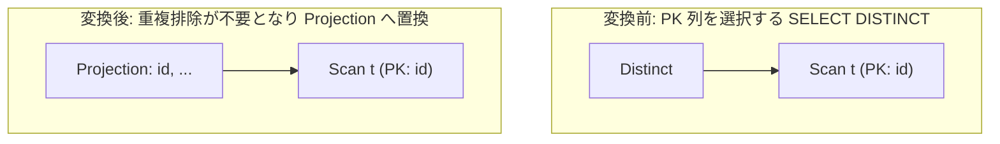

# pk_unique_distinct_elimination

- 状態: draft / 執筆基準リビジョン: `3880673` (2026-09-12)
- 定義位置: `plan/cascades.cpp` の `RuleSet::Default()`（登録名 `"pk_unique_distinct_elimination"`。ヘルパー関数 `LogicalProperties::IsUniqueOn` を使用）

## 概要

`pk_unique_distinct_elimination` は、重複排除演算 `Distinct(X)` について、射影される出力列の集合全体が PRIMARY KEY または UNIQUE 制約により一意であると静的に証明できる場合に、`Distinct` 演算を単なる射影演算 `Projection(X)` へと置き換える論理変換Ruleです。

元より重複が存在しない一意な行集合に対する重複排除処理は何らタプル数を変化させないため、高コストなハッシュ集約やソーティング処理を完全に排除します。

## 変換前後の関係

`Distinct` 演算子ノードを取り除き、同一の属性を出力する素の `Projection` ノードを親グループに追加します。



元の `kDistinct` 式も保持されますが、コスト評価において射影ノードが圧倒的に有利となるため、重複排除オペレータが実行計画から脱落します。

## 適用条件

パターン照合には `Distinct(Any("input"))` を用い、対象演算子は `LogicalOperator::kDistinct` です。

以下のガード条件をすべて満たす必要があります。

1. **子ノード数と非循環性**: 式が `kDistinct` であり、単一の子ノードを持ち、その子グループが親グループ自身でないこと。
2. **ターゲットリストの補完可能性**: ターゲットリストが空の場合（`SELECT DISTINCT *` 等）、自式または子式の `output_schema` から全列の列参照ターゲットを構築できること。構築後も空である場合は発火しません。
3. **射影列集合そのものの一意性証明**: ターゲットリストに含まれる素の列参照（`kColumnValue`）からなる列集合 `proj_cols` について、`input_group.logical_properties.IsUniqueOn(proj_cols)` が成立すること。

```cpp
          // The PROJECTED column set itself must be unique: a unique column
          // that the projection drops does not make the projected rows
          // distinct (from fix_rules).
```

## 意味論的根拠と多重度保存・一意性保証

重複排除 $\delta(R)$ は、行多重度をすべて 1 に圧縮する集合化操作です。入力 $R$ において、出力対象となる属性集合 $A$ の値がすでに関係内で一意（キー制約を満たす）であるならば、任意の相異なる2タプル $t_1, t_2 \in R$ について $t_1[A] \neq t_2[A]$ が保証されます。したがって、$|\delta(\pi_A(R))| = |\pi_A(R)|$ であり、行集合および多重度は一切変化しません。

条件3のガードの根拠は極めて本質的です。テーブル $t$ が `id`（PK）と `category`（非一意）を持つとき、以下の2つのクエリを比較します。

- `SELECT DISTINCT id FROM t`: 射影される列 `id` は一意であるため、DISTINCT は不要であり安全に削除できます。
- `SELECT DISTINCT category FROM t`: テーブル $t$ 自体は `id` により一意ですが、射影によって `id` が脱落しているため、結果の `category` 列には重複行が発生します。

もし「入力テーブルが一意キーを持つ」ことだけを根拠に DISTINCT を削除してしまうと、本来重複排除されるべき行が重複出力されて結果が壊れます。そのため、本Ruleは**射影される列集合そのもの**が `IsUniqueOn` を満たすことを厳格に検査します。関数呼び出しや複合式を含むターゲットは一意性証明の材料から除外されます。

## 実装の詳細

ターゲットリストの補完および一意性の判定処理は以下の通りです。

```cpp
          std::vector<NamedExpression> target_list = expression.target_list;
          const Schema* schema_to_use = nullptr;
          if (target_list.empty()) {
            if (expression.output_schema.ColumnCount() > 0) {
              schema_to_use = &expression.output_schema;
            } else {
              for (const auto& child : input_group.expressions) {
                if (child.output_schema.ColumnCount() > 0) {
                  schema_to_use = &child.output_schema;
                  break;
                }
              }
            }
            if (schema_to_use != nullptr) {
              for (size_t i = 0; i < schema_to_use->ColumnCount(); ++i) {
                const auto& col = schema_to_use->GetColumn(i);
                target_list.emplace_back(col.Name().ToString(),
                                         ColumnValueExp(col.Name()));
              }
            }
          }
```

素の列参照のみを `proj_cols` に抽出し、`LogicalProperties` に対して判定を委譲します。

```cpp
          std::unordered_set<std::string> proj_cols;
          for (const auto& target : target_list) {
            if (target.expression &&
                target.expression->Type() == TypeTag::kColumnValue) {
              proj_cols.insert(target.expression->AsColumnValue()
                                   .GetColumnName()
                                   .ToString());
              proj_cols.insert(
                  target.expression->AsColumnValue().GetColumnName().name);
            }
          }

          if (!input_group.logical_properties.IsUniqueOn(proj_cols)) {
            return;
          }

          memo.AddExpression(
              group,
              LogicalExpression{.operation = LogicalOperator::kProjection,
                                .children = {input_id},
                                .target_list = std::move(target_list),
                                .output_schema = std::move(out_schema)});
```

## 最適化効果

本Ruleの適用により、以下の性能向上が得られます。

- **ハッシュ表／ソートバッファの完全排除**: DISTINCT 実行のために確保される大規模メモリおよびCPU比較コストがゼロになります。
- **パイプライン処理の継続**: 全行をメモリに蓄積する必要がなくなるため、下位スキャンからのストリーミング実行（パイプライン）が維持されます。

## 関連 Rule との相互作用

- `unique_group_key_aggregate_elimination`: 一意キーでグループ化された集約演算を射影へ簡約する類似Ruleです。
- `push_filter_through_distinct`: DISTINCT を消去できない場合に、選択述語を先行適用してデータ量を絞る補完的Ruleです。
- `distinct_over_group_by`: GROUP BY の上に存在する DISTINCT を1つにまとめるRuleです。

## 検証テスト

- `plan/cascades_test.cpp`:
  - `CascadesTest.PkUniqueDistinctElimination`: 一意キーを含む射影に対する DISTINCT が正しく `Projection` 式へと置き換えられることを検証。
