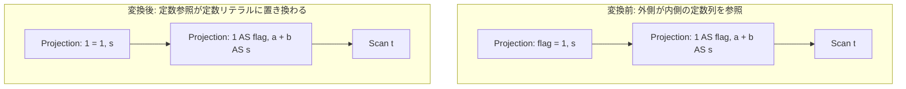

# projection_constant_propagation

- 状態: draft / 執筆基準リビジョン: `3880673` (2026-09-12)
- 定義位置: `plan/cascades.cpp` の `RuleSet::Default()` (登録名 `"projection_constant_propagation"`)

## 概要

`projection_constant_propagation` は、隣接する 2 段の射影 `Projection(Projection(X))` において、内側の射影が出力する定数列への参照を、外側の射影の式内に直接リテラルとして伝搬・置換する変換ルールです。

外側の式に含まれる「内側の定数列への参照」をコンパイル時に定数リテラルへ置き換えることで、実行時における列参照解決のオーバーヘッドを削減し、後続の式レイヤーにおける定数畳み込み（Constant Folding）や述語単純化の機会を創出します。

## 変換前後の関係

内側が `1 AS flag, a + b AS s` を生成し、外側が `flag = 1` を評価する場合、外側の式における `flag` 参照が定数 `1` へ展開され、`1 = 1` へ変換されます。



## 適用条件

パターンは `Projection(Any("input"))` です。以下のガード条件をすべて満たす場合に適用されます。

1. 対象の論理式が `kProjection` であり、その `target_list` が空でないこと。
2. 入力グループ（子ノード）内の各論理式から `kProjection` の代替式を走査し、その `target_list` の中に定数式（`Type() == TypeTag::kConstantValue`）となる出力が 1 つ以上存在すること。
3. 外側の `target_list` 内に内側の定数出力を参照する式が存在し、`RewriteThroughOutputs` による書き換えによって式の文字列表現が変化した（`changed == true`）こと。

登録部の定義は以下のとおりです。

```cpp
    // projection_constant_propagation: Propagate constants through projection
    // into subsequent expressions.
```

## 意味論的根拠と定数畳み込み・代数的一致

本ルールの正当性は、決定的な定数式の評価結果が入力行の状態に依存せず常に不変であるという性質に基づきます。

内側の射影出力が定数リテラルである場合、入力関係の多重度やタプルの値にかかわらず、その属性値はすべての行で同一の定数値を返します。したがって、外側の射影における当該列参照をその定数式そのものでインライン置換しても、評価結果の多重度、順序、および計算値は完全に一致します。

なお、非定数出力（例: `a + b`）の合成・展開は本ルールの責務ではなく、`merge_projections` による全体合成で処理されます。また、実際に置換が発生して文字列表現が変化した場合（`changed == true`）のみ Memo グループへ新たな式を登録することで、実質的な進展のない同一式の重複探索や `expression_cap_` の浪費を防止します。

## 実装の詳細

実装では、まず内側の射影から定数出力を抽出します。

```cpp
            std::vector<NamedExpression> const_outputs;
            for (const auto& target : inner.target_list) {
              if (target.expression &&
                  target.expression->Type() == TypeTag::kConstantValue) {
                const_outputs.push_back(target);
              }
            }
            if (const_outputs.empty()) {
              continue;
            }
```

続いて、外側の各出力式に対して式書き換えヘルパー `RewriteThroughOutputs` を適用します。探索対象として `const_outputs` を渡すため、内側の定数列を参照している箇所のみが定数式へ置換されます。

```cpp
            for (const auto& target : expression.target_list) {
              std::optional<Expression> rewritten =
                  RewriteThroughOutputs(target.expression, const_outputs);
              if (rewritten &&
                  (*rewritten)->ToString() != target.expression->ToString()) {
                propagated.emplace_back(target.name, *rewritten);
                changed = true;
              } else {
                propagated.push_back(target);
              }
            }
```

書き換えが発生した場合、子ノードのグループ参照（`expression.children`）は維持したまま、更新された `target_list` を持つ新たな `LogicalExpression` を Memo の同一グループへ登録します。

```cpp
            if (changed) {
              memo.AddExpression(
                  group,
                  LogicalExpression{.operation = LogicalOperator::kProjection,
                                    .children = expression.children,
                                    .target_list = std::move(propagated),
                                    .output_schema = expression.output_schema});
            }
```

## 最適化効果

定数参照が直接リテラルへ置換されることで、タプルごとの属性ルックアップや動的評価のオーバーヘッドが解消されます。

さらに重要な効果として、後続の式最適化レイヤーにおける定数畳み込みとの連携が挙げられます。たとえば `flag = 1` が `1 = 1` に置換された場合、式評価レイヤーで `TRUE` へ即座に畳み込まれます。これにより、上位の選択条件が恒真と判定されて `eliminate_true_selection` によりフィルタごと消去されるなど、連鎖的な最適化の契機となります。

## 関連 Rule との相互作用

- `merge_projections` / `merge_adjacent_projections`: 同一の `Projection(Projection(X))` 構造を対象としますが、これらが射影の階層そのものを潰して 1 段に統合するのに対し、本ルールは子構造を維持したまま定数参照の伝搬のみを行います。Memo 内では異なる構造の等価表現として共存します。
- 式書き換えレイヤー（`expression/rewrite.cpp`）の定数畳み込み: 本ルールが展開した定数式（例: `1 = 1`）を評価し、`TRUE` や簡約値へと定数畳み込みを実行します。
- `eliminate_true_selection` / `eliminate_false_selection`: 定数伝搬と畳み込みの結果生じた恒真・恒偽述語を検出し、不要なオペレータを除去します。

## 検証テスト

- `plan/cascades_test.cpp` の `ProjectionConstantPropagation`:
  - 2 段の射影において、内側の定数出力を参照する外側の式が定数リテラルに正しく置換されることを検証。

