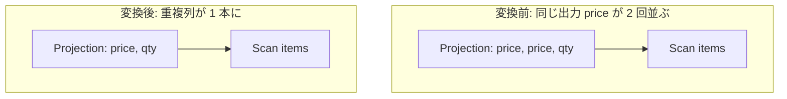

# projection_cse_and_pruning

- 状態: draft / 執筆基準リビジョン: `3880673` (2026-09-12)
- 定義位置: `plan/cascades.cpp` の `RuleSet::Default()` (登録名 `"projection_cse_and_pruning"`)

## 概要

`projection_cse_and_pruning` は、射影の `target_list` 内に存在する「出力名および式の文字列表現が完全に同一である重複ターゲット」を検出し、重複する出力列を 1 つに剪定（Pruning）する変換ルールです。

ルール名に CSE（Common Subexpression Elimination; 共通部分式除去）が含まれていますが、現在の実装は出力列名と式定義が完全に一致する出力項目の重複排除に特化しています。出力名が異なる共通部分式（例: `SELECT a + 1 AS x, a + 1 AS y`）の統合は行いません。

## 変換前後の関係

同一の出力名と式定義を持つ列（例: `price`）が複数回定義されている場合、初出の列のみを残して重複列を削除します。



## 適用条件

パターンは `Projection(Any("input"))` です。以下のガード条件をすべて満たす場合に適用されます。

1. 対象の論理式が `kProjection` であり、その `target_list` の要素数が 2 以上であること（`target_list.size() <= 1` の場合は重複が存在し得ないため発火しない）。
2. 重複除去後のターゲットリスト `unique_targets` のサイズが元の `target_list` より小さく、かつ空でないこと。

登録部の定義は以下のとおりです。

```cpp
    // projection_cse_and_pruning: Common subexpression elimination (CSE) for
    // identical expressions in projection target lists, and pruning of
    // duplicate projection columns.
```

## 意味論的根拠と出力スキーマの同一性

本ルールの正当性は、関係代数および SQL における同一属性・同一式の多重出力を物理行上で統合しても、属性参照の決定性が維持される点にあります。

重複判定のシグネチャは `出力名 + ":" + 式のToString()` で構成されます。出力名が同一で評価式も完全に一致する場合、タプル内のどの位置を読み出しても値および型は同一であり、後続オペレータから見て一方を削減しても意味論的同一性が維持されます。

対照的に、同一の式であっても別名が与えられている場合（例: `SELECT price AS p1, price AS p2`）は、下流のスキーマにおいて `p1` と `p2` という異なる名前で参照されるため、列を削減することはできません。本ルールが名前の一致を必須条件としているのは、出力スキーマの名前空間を保全するためです。

なお、`target.expression` が未設定の項目は走査対象からスキップされます。

## 実装の詳細

実装では、各ターゲットのシグネチャを生成し、`std::unordered_set` を用いて初出項目のみを `unique_targets` に収集します。

```cpp
          std::vector<NamedExpression> unique_targets;
          std::unordered_set<std::string> seen;
          for (const auto& target : expression.target_list) {
            if (!target.expression) {
              continue;
            }
            std::string sig = target.name + ":" + target.expression->ToString();
            if (!seen.contains(sig)) {
              seen.insert(sig);
              unique_targets.push_back(target);
            }
          }
```

重複が検出され、かつ有効な出力が 1 つ以上残っている場合、子ノードの参照（`expression.children`）は維持したまま、重複排除後のターゲットリストを設定した新たな論理式を Memo グループへ登録します。

```cpp
          if (unique_targets.size() < expression.target_list.size() &&
              !unique_targets.empty()) {
            memo.AddExpression(
                group,
                LogicalExpression{.operation = LogicalOperator::kProjection,
                                  .children = expression.children,
                                  .target_list = std::move(unique_targets),
                                  .output_schema = expression.output_schema});
          }
```

## 最適化効果

本ルールの適用により以下の効果が得られます。

1. **不要な式評価の排除**: クエリ正規化やビュー展開の過程で生成された意図しない重複評価を削減します。
2. **タプル行幅の縮小**: 下流オペレータ（ソート、ハッシュ結合、マテリアライズバッファなど）へ渡されるタプルのバイト幅が削減され、キャッシュ局所性およびメモリ転送効率が向上します。

出力の順序や名前空間を壊すことなく、安全にペイロードをスリム化できます。

## 関連 Rule との相互作用

- `merge_projections` / `merge_adjacent_projections`: 複数段の射影が 1 段に統合された結果、ターゲットリスト内に同一属性の重複が生じることがあり、後続して本ルールが重複列を刈り込みます。
- `projection_constant_propagation`: 定数伝搬によって別個の列参照が同一の定数式へと置換された場合、本ルールによって重複列として統合されます。
- `push_projection_below_*` 系の射影プッシュダウン: 下位ノードへ伝搬すべき属性集合が本ルールによってあらかじめ最小化されるため、プッシュダウンされる射影もより細身になります。

## 検証テスト

- `plan/cascades_test.cpp` の `ProjectionCseAndPruning`:
  - 射影の target list 内に同一の名前と式を持つ重複出力が存在する場合、初出の 1 列にまとめられ、行幅が削減されることを検証。

