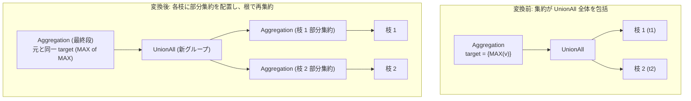

# push_aggregation_through_union_all

- 状態: done   /   執筆基準リビジョン: `3880673` (2026-09-12)
- 定義位置: `plan/cascades.cpp` の `RuleSet::Default()` (登録名 `"push_aggregation_through_union_all"`)

## 概要

`push_aggregation_through_union_all` は、`Aggregation(UnionAll(B1, B2, ...))` という論理構造に対し、分配可能な集約関数（`MIN`, `MAX`, `SUM`）を `UnionAll` の各枝へと押し込み、その上で再集約を行う等価論理式を Memo に登録する変換ルールです。

部分集約（Partial Aggregation）をユニオンの各枝で事前に評価することにより、`UnionAll` ノードおよび最終段の集約ノードが処理すべき入力行数を各枝のグループ数まで劇的に圧縮します。

## 変換前後の関係



## 適用条件

パターンは `Aggregation(Any("input"))`、対象演算子は `LogicalOperator::kAggregation` です。発火には以下のガード条件をすべて満たす必要があります。

1. **集約式の形状**: 対象集約ノードの子数が 1 であること。
2. **入力ノードの種別**: 入力グループ内に子数が 2 以上の `kUnionAll` 論理式が存在すること。
3. **未集約枝の存在**: `UnionAll` のすべての枝が既に `kAggregation` 式を含んでいる場合は適用を抑止します（再帰的・無限適用防止）。
4. **集約関数の分解可能性**: すべての集約ターゲットについて、以下の条件を満たすこと。
   - `DISTINCT` 修飾が存在しないこと。
   - `HAVING` 述語修飾が存在しないこと。
   - 集約関数の種類が `MIN`, `MAX`, `SUM` のいずれかであること（`COUNT` や `AVG` は不可）。
5. **循環防止**: 枝ごとに導出される派生グループ `partial_agg_union` が枝自身や親グループと一致しないこと。また、部分集約を束ねる派生グループ `union_all_part_agg` が親グループおよび入力グループと一致しないこと。

## 意味論的根拠と代数的一致

本ルールの意味論的正当性は、対象集約関数が持つ結合律（Associativity）と可換律（Commutativity）、ならびに `UnionAll`（バッグ代数の直和）に対する分配可能性に基づきます。

`MIN`, `MAX`, `SUM` は部分集約結果に対して同一の集約関数を再帰的に適用しても値が不変です：
- $\min(S_1 \cup S_2) = \min(\min(S_1), \min(S_2))$
- $\max(S_1 \cup S_2) = \max(\max(S_1), \max(S_2))$
- $\sum(S_1 \cup S_2) = \sum(\sum(S_1), \sum(S_2))$

一方で、以下のケースでは等価性が成立しないため、ガード条件により厳密に排除されます：

- **`COUNT` の排除**: $\mathrm{count}(S_1 \cup S_2) \neq \mathrm{count}(\mathrm{count}(S_1), \mathrm{count}(S_2))$ であり、再集約段で `SUM` への書き換えが必要となります。本ルールは同一集約式の複製を前提とするため `COUNT` を禁止し、`aggregate_union_transpose` に委ねています。
- **`DISTINCT` の排除**: 部分集約の段階で重複を排除してしまうと、異なる枝間に跨る重複値を検出できなくなります（例: 枝 1 に `{1, 1}`、枝 2 に `{1}` がある場合、部分集約で各枝 `{1}` になると全体の多重度構造が崩れます）。
- **バッグ代数と NULL 処理**: SQL の三値論理において `MIN`, `MAX`, `SUM` は NULL 値を無視します。各枝で NULL が無視された結果が空集合になれば NULL が返り、最終段の再集約でも同一の結果が得られるため、三値論理の帰結は保存されます。

## 実装の詳細

`plan/cascades.cpp` における変換処理は、以下の 3 段階で構成されます。

1. **枝ごとの部分集約グループの構築**:
   元の集約式の完全な複製（ターゲットリスト、`grouping_sets`, `partition_by` を包含）を作成し、子ノードのみを各枝の `child_id` に差し替えます。
   ```cpp
   LogicalExpression part_agg = expression;
   part_agg.children = {child_id};
   memo.AddExpression(part_group, std::move(part_agg));
   partial_branches.push_back(part_group);
   ```
2. **中間 `UnionAll` の登録**:
   各枝の部分集約グループを子として持つ新しい `UnionAll` 式を、派生グループ `union_all_part_agg` に登録します。
3. **最終再集約式の登録**:
   元の親グループに対し、子ノードを中間 `UnionAll` グループに差し替えた集約式を登録します。
   ```cpp
   LogicalExpression final_agg = expression;
   final_agg.children = {new_union};
   memo.AddExpression(group, std::move(final_agg));
   ```

## 最適化効果

`UnionAll` の前段で各枝のデータを集約することにより、中間演算パイプラインに流れるタプル数を大幅に削減します。
特に各枝の基数が大きく、グループ化キーのカーディナリティが小さい場合、`UnionAll` ノードでの結合オーバーヘッドおよびルート集約でのハッシュテーブル走査コストが最小化されます。

## 関連 Rule との相互作用

- `aggregate_union_transpose`: 本ルールの兄弟関係にあるルール。`COUNT` を `SUM` に変換して部分集約を可能にするターゲットリストの書き換え処理を備えています。
- `union_all_merge`: 本ルールが生成した中間 `UnionAll` に対し、さらなるユニオンの平坦化を行う契機を作ります。
- `count_distinct_expansion`: `DISTINCT` を含む集約を 2 段の集約に分解し、部分集約可能にする別経路のルールです。

## 検証テスト

- `plan/cascades_test.cpp`: `CascadesTest.PushAggregationThroughUnionAll`
  - `MAX` 集約を `UnionAll` 上で探索させ、各枝に部分集約が配置された等価プランが Memo に生成されることを検証。
- `CascadesTest.DefaultRulesIncludePredicateAndProjectionTransforms`:
  - `RuleSet::Default()` に `push_aggregation_through_union_all` が正しく登録されていることを確認。
