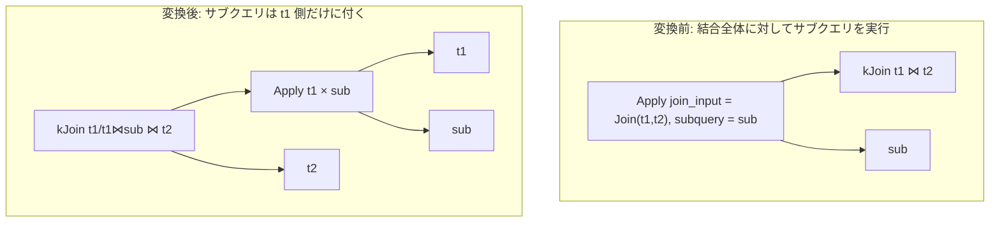

# push_apply_through_join

- 状態: done   /   執筆基準リビジョン: `3880673` (2026-09-12)
- 定義位置: `plan/cascades.cpp` の `RuleSet::Default()`(`built.Add(Rule("push_apply_through_join", …)`)
  登録式

## 概要

`Apply(Join(L, R), Sub)` — 結合の上でサブクエリを実行する形 — を、
サブクエリが **L だけと相関している**ときに限り
`Join(Apply(L, Sub), R)` へ書き換える Rule です。登録前のコメントが形と条件を
述べています。

```cpp
    // push_apply_through_join: Apply(Join(L, R), Subquery) -> Join(Apply(L,
    // Subquery), R) when Subquery only correlates with L.
```

Apply の「行ごとの実行」を結合の右側から追い出し、相関に不要な R の行数分の
再実行を防ぐ変換です。

## 変換前後の関係

Apply の条件が `t1.val = sub.val`(左結合入力の `t1` 側だけ)の例です。



## 適用条件

パターンは `Apply(Any("join_input"), Any("subquery"))`、`target = kApply` です。
ガードは次のとおりです。

(1) 子を 2 個持つ `kApply` で、左側のグループに `kJoin`(子 2 個)の代替が
あること。

```cpp
          if (expression.operation != LogicalOperator::kApply ||
              expression.children.size() != 2) {
            return;
          }
```

```cpp
            if (join_expr.operation != LogicalOperator::kJoin ||
                join_expr.children.size() != 2) {
              continue;
            }
```

(2) Apply の条件が触れる列が**右結合入力 `R`(`jr_rels`)のリレーションに
含まれない**こと。Apply の条件が無ければ無条件に通ります。
なお、登録コメントは「Subquery only correlates with L」と述べていますが、
実装が検査しているのは Apply 自身の条件述語(`expression.predicate`)が
`R` に触れないことだけです。サブクエリ内部の相関が実際に `L` だけに
閉じているかはここでは検査しません(現状こうなっています)。

```cpp
            bool only_touches_jl = true;
            if (expression.predicate && *expression.predicate) {
              for (const auto& col :
                   (*expression.predicate)->TouchedColumns()) {
                if (std::ranges::find(jr_rels, col.schema) != jr_rels.end()) {
                  only_touches_jl = false;
                  break;
                }
              }
            }
            if (!only_touches_jl) {
              continue;
            }
```

(3) 新しい Apply のグループ(`push_apply_jl`、関係集合は
`L ∪ subquery`)が、自分自身・`L`・`subquery` のどれとも一致しないこと
(循環自衛)。

発火しないケース: 左側に `kJoin` の代替が無い / Apply の条件が R の列を
触る / 派生グループが循環する、です。

## 意味論的根拠と相関スコープ

Apply の各反復の結果は「左側の行」で決まります。結合 `Join(L, R)` の上で
Apply を実行すると、同じ L の行が R とのマッチ数だけ繰り返し現れ、Apply も
その回数だけ実行されます。しかし Apply の結果が L の行だけで決まるなら
(= 条件が R を触らないなら)、Apply を L の上に移しても各 L 行への適用結果は
同じで、あとから R と結合すれば元の結果が復元されます。

- **条件が R の列を触る場合は移動できません。** その条件は R の行の値に依存
  するため、Apply を R を含まないグループへ移すと評価できません(条件で使う
  列が存在しない)。
- 列の判定は `col.schema` が `jr_rels` に含まれるかという修飾名ベースです。
  非修飾名の列は `jr_rels` に見つからないため「R を触らない」と扱われます。
  `push_selection_through_apply`(左側のみを厳格に要求)とは方向が逆で、
  こちらは「R を含んでいたら拒否」という否定形のガードです(現状こうなって
  います)。
- 移動後の Apply は `L ⋈ Sub` の関係集合を持ち、元の結合条件
  (`join_expr.predicate`)は新しい `kJoin` が引き継ぎます。 Apply の適用が
  L 行ごとに 1 回であることを除けば行の組は保たれるため、意味は保存されます。

## 実装の詳細

変換部は、新しい Apply グループの作成と、Apply + Join の 2 式の追加です。

```cpp
            const GroupId new_apply_group = memo.EnsureDerivedGroup(
                UnionRelations(jl_rels, memo.Get(subquery_id).relations),
                "push_apply_jl");
            if (new_apply_group == group || new_apply_group == jl_id ||
                new_apply_group == subquery_id) {
              continue;
            }
            memo.AddExpression(
                new_apply_group,
                LogicalExpression{.operation = LogicalOperator::kApply,
                                  .children = {jl_id, subquery_id},
                                  .predicate = expression.predicate,
                                  .join_type = expression.join_type});
            memo.AddExpression(
                group,
                LogicalExpression{.operation = LogicalOperator::kJoin,
                                  .children = {new_apply_group, jr_id},
                                  .predicate = join_expr.predicate,
                                  .target_list = expression.target_list,
                                  .output_schema = expression.output_schema});
```

- 新しい Apply の式には `predicate` と `join_type` だけを写し、`target_list` /
  `output_schema` は書いていません(外側の Join が元の Apply の
  `target_list` / `output_schema` を引き継ぐ構造です)。
- 外側の Join は元の結合条件 `join_expr.predicate` をそのまま使うため、
  R とのマッチ条件は変わりません。
- タグ `push_apply_jl` は固定文字列で、条件の指紋を含みません。同じ
  (L, Sub) の組に対する別条件の Apply は同じグループに別式として追加される
  点に留意する必要があります。

## 最適化効果

- Apply の実行回数が「`L ⋈ R` の行数」から「L の行数」に減ります
  (R が増殖する結合ほど効果が大きい)。
- Apply が結合の片枝になるため、外側の結合順序の入替(`join_commutativity`
  など)や、`apply_to_join` による Apply の結合化が後段で効きます。

## 関連 Rule との相互作用

- `apply_to_join`: 移動後の Apply が対象になります(相関が条件に上がって
  いれば結合へ下ろせる)。
- `hoist_correlated_selection_to_apply`: 相関条件を Apply の条件へ上げる
  Rule。こちらの条件の「触れる列」判定と組み合わせて、相関が L に閉じる形
  を作ります。
- `push_selection_through_apply`: Apply の上のフィルタを左側へ押す Rule。
  本 Rule と組み合わせて「フィルタ → Apply の移動」の順で適用され得ます。

## 検証テスト

- `plan/cascades_test.cpp` の `CascadesTest.PushApplyThroughJoin` —
  `Apply(Join(t1, t2), sub)`(条件は `t1.val = sub.val`)が、`Apply(t1, sub)`
  を左枝に持つ `kJoin` の代替を生むことを検証します。
- R の列を参照する述語に対する適用抑止テストは現行テストスイートには含まれていません。
