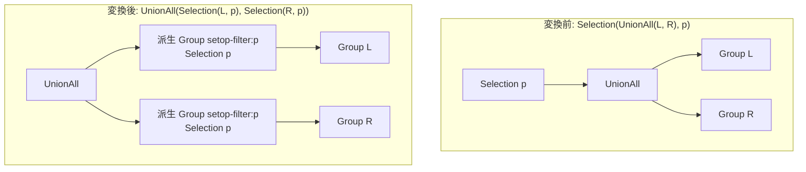

# push_filter_past_setop

- 状態: done   /   執筆基準リビジョン: `3880673` (2026-09-12)
- 定義位置: `plan/cascades.cpp` の `RuleSet::Default()`(`built.Add(Rule("push_filter_past_setop", …)`)
  登録式。ヘルパは `TouchedColumns` / `EnsureDerivedGroup`。

## 概要

`Selection(Union/Intersect/Except(…), p)` を、集合演算の **各分岐**に
`Selection(分岐, p)` を被せた形に置き換える Rule です。述語が行ごとの
フィルタである限り「先に集合演算してから絞る」ことと「各分岐を絞ってから
集合演算する」ことは同じ結果になるため、フィルタを入力側へ降ろして
各分岐の処理量を減らします。

## 変換前後の関係



## 適用条件

パターンは `Selection(Any("input"))` で、対象演算子は
`LogicalOperator::kSelection` です。登録コメントが変換の根拠と
guard の動機を述べます。

```cpp
    // Selection(SetOp(children), p) is equivalent to the same set operation
    // over Selection(child, p) for every branch when p resolves in every
    // branch.  Set-operation outputs are positionally aligned, so a qualified
    // predicate such as t1.a > 0 must NOT be pushed into a branch that lacks
    // relation t1. Row-wise filtering commutes with duplicate elimination,
    // so this holds for UNION/INTERSECT/EXCEPT including ALL variants.
```

guard の列挙は次のとおりです。

- 対象の式が `kUnion` / `kUnionAll` / `kIntersect` / `kIntersectAll` /
  `kExcept` / `kExceptAll` の 6 種のいずれかで、Selection が述語を
  持つこと。
- **分岐解決 gate**(D5 監査表は「only when the predicate resolves in
  every branch」と要約): 述語が触れるすべての列が、**すべての分岐**で
  解決できること。修飾付き列は分岐の `relations` への所属、修飾なし列は
  カタログ公開スキーマでの名前解決で判定します。

```cpp
            // Gate: every column in the predicate must resolve in every
            // branch; otherwise pushing would filter on a non-existent or
            // wrong relation.  Qualified columns resolve through the branch
            // relation lists; an unqualified column is only pushable when it
            // resolves by name in EVERY branch's catalog-published schema —
            // when the schemas are unavailable the push must refuse.
```

- **サイクル gate**: 述語ごとの派生グループ
  (`"setop-filter:" + 述語の ToString()`)が、分岐本人でも自グループでも
  ないこと。衝突したら `cycle = true` で不発します。

## 意味論的根拠と多重度保存

この Rule の意味保存の核心は 2 つあります。

1. **行ごとのフィルタは重複排除と可換**。UNION(DISTINCT) や
   INTERSECT / EXCEPT は行の重複を潰しますが、フィルタが行の値だけに
   依存するなら「潰してから絞る」は「絞ってから潰す」と同じ行集合に
   なります。登録コメントの「Row-wise filtering commutes with duplicate
   elimination」がこの根拠で、ALL 変種(重複を潰さない)では自明に可換です。
2. **集合演算の出力は位置揃えの契約**。しかし述語が分岐の誰かが持って
   いない列に触れるとき、押し込んだ先でその列は解決できません。
   修飾付き `t1.a > 0` を `t1` を持たない分岐へ押し込むのは誤りであり、
   修飾なし列でも「どの分岐でも名前解決できる」ことが証明できない限り
   発火してはいけません。schemas が利用できないときは明示的に拒否します。

D5 反例テストがこの 2 面を固定します。

- `PushFilterPastSetopRejectsUnresolvedQualifier`:
  `t1.a > 0` の Selection を `UnionAll({t1}, {t2})` の上に置くと、
  `t2` 分岐に Selection が現れないこと。
- `PushFilterPastSetopRejectsUnqualifiedColumnMissingInBranch`:
  修飾なし `x > 1` が `a.x` と `b.y` の UNION ALL で `b` 分岐に
  押し込まれないこと。

## 実装の詳細

分岐解決 gate の本体は次のとおりです。修飾ありは `relations` の所属、
修飾なしは全リレーションでの `Offset(...) >= 0` を要求します。

```cpp
            auto resolves_in_branch = [&](const Group& branch,
                                          const ColumnName& column) {
              if (!column.schema.empty()) {
                return std::ranges::find(branch.relations, column.schema) !=
                       branch.relations.end();
              }
              if (schemas.empty()) {
                return false;
              }
              return std::ranges::all_of(
                  branch.relations, [&](const auto& rel) {
                    const auto found = schemas.find(rel);
                    return found != schemas.end() &&
                           found->second.Offset(ColumnName("", column.name)) >=
                               0;
                  });
            };
```

発火部分は、各分岐に Selection を被せた派生グループを作り、
集合演算式の子を差し替えて自グループへ追加します。

```cpp
            std::vector<GroupId> filtered_children;
            filtered_children.reserve(setop.children.size());
            bool cycle = false;
            for (const GroupId child : setop.children) {
              const GroupId filtered = memo.EnsureDerivedGroup(
                  memo.Get(child).relations,
                  "setop-filter:" + (*expression.predicate)->ToString());
              if (filtered == child || filtered == group) {
                cycle = true;
                break;
              }
              memo.AddExpression(
                  filtered,
                  LogicalExpression{.operation = LogicalOperator::kSelection,
                                    .children = {child},
                                    .predicate = expression.predicate});
              filtered_children.push_back(filtered);
            }
```

- 元の Selection と集合演算の式も残るため、この Rule 自体は
  「等価な代替の追加」です。押し込み側が選ばれたとき、絞り込みが
  分岐ごとに行われるため、UNION の上流で処理する行が減ります。

## 最適化効果

適用後の Group には「上の Selection」と「分岐ごとの Selection」の 2 代替が
並びます。分岐側が選ばれると、集合演算の入力が先に間引かれ、
DISTINCT の処理対象行・集合演算の中間バッファが縮みます。分岐の 1 つが
スキャンであれば、押し込まれた Selection はさらに
`push_selection_into_scan` でスキャンフィルタへ合流でき、インデックス
レンジ抽出などの二次最適化に繋がります。

## 関連 Rule との相互作用

- `push_filter_through_distinct` / `push_filter_through_sort`:
  「フィルタと行単位の演算の可換性」を使う同じ族の Rule です。
- `push_selection_through_aggregation` / `push_selection_through_projection`:
  押し込んだ先の分岐が集約・射影のときに続けて効きます。
- `union_to_union_all_plus_distinct` / `union_all_merge`:
  分岐集合演算そのものの形を整える Rule で、本 Rule と独立に発火します。

## 検証テスト

- `plan/cascades_test.cpp` の
  `CascadesTest.PushFilterPastSetopRejectsUnresolvedQualifier` —
  修飾子が分岐にないときの不発。
- `CascadesTest.PushFilterPastSetopRejectsUnqualifiedColumnMissingInBranch`
  — 修飾なし列が片方の分岐にしかないときの不発。
  発火側の成功系を直接検証するテスト名は命名の対応未確認です。
