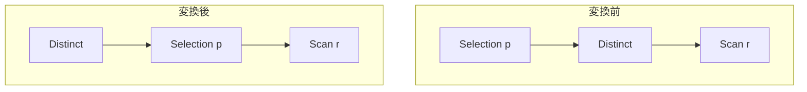

# push_filter_through_distinct

- 状態: done   /   執筆基準リビジョン: `3880673` (2026-09-12)
- 定義位置: `plan/cascades.cpp` の `RuleSet::Default()`(登録式。派生グループ
  `EnsureDerivedGroup` を使う標準的な transposition)

## 概要

`Selection(Distinct(R), p)` を `Distinct(Selection(R, p))` に置き換える
Rule です。フィルタは行の値だけに依存するので、重複排除とフィルタの順序は
入れ替えられます。フィルタを DISTINCT の下に置くことで、重複排除器に入る
行数が減ります。

## 変換前後の関係



Memo 上では、`filter-before-distinct:` タグの派生グループに
`Selection(R, p)` を追加し、外側グループには `Distinct(その派生グループ)`
を新しい等価代替として追加します(元の形も残ります)。

## 適用条件

パターンは `Selection(Distinct(Any(), "input"))` で、`target` は
`kSelection` です。変換ラムダ内の条件は次のとおりです。

```cpp
          for (const LogicalExpression& distinct :
               memo.Get(bindings.at("input")).expressions) {
            if (distinct.operation != LogicalOperator::kDistinct ||
                distinct.children.size() != 1 || !expression.predicate) {
              continue;
            }
            const GroupId filtered = memo.EnsureDerivedGroup(
                memo.Get(distinct.children[0]).relations,
                "filter-before-distinct:" +
                    (*expression.predicate)->ToString());
            if (filtered == group || filtered == distinct.children[0]) {
              continue;
            }
```

- 子グループに実際に `kDistinct`(子 1 個)の代替があること。
- Selection が述語を持つこと。
- 述語の `ToString()` をタグに含む派生グループを作り、それが外側グループ
  自身でも DISTINCT の子でもないこと(循環防止)。

## 意味論的根拠と行単位述語の可換性

登録直前のコメントに、意味保存の根拠が 1 文で書かれています。

```cpp
    // Selection(Distinct(R)) is equivalent to Distinct(Selection(R)): the
    // predicate depends only on row values, so duplicate elimination and
    // filtering commute without changing the distinct result.
```

- **順序交換が安全な理由**: DISTINCT は「各行がそれまでの行と重複しない
  こと」だけを見る演算子で、述語 `p` も行の値だけを見ます。ある行が `p`
  を通るかは独立に決まり、「重複の代表として残るか」の判定には影響しない
  ため、先に弾いてから重複排除しても残る行集合は同じです。
- **循環防止条件の理由**: 派生グループのタグは述語の文字列で指纹化されて
  いるものの、`filtered == group`(自分自身を子にする)や
  `filtered == distinct.children[0]`(DISTINCT が既にその形を持つのに
  同じ子を束ね直す)は、Rule の無限再適用や自己参照式を生むため禁止です。
  これは transposition 系 Rule に共通する自衛です。
- **guard がない点について**: この Rule は「述語が子の表に閉じる」ことを
  検査しません。DISTINCT の下は元の Selection の入力と同一の行・同一の
  スキーマ(列)を持つため、述語の列参照はそのまま有効です。列の再配置が
  必要な `push_selection_through_projection`(出力名を下の列に書き換える)
  と対照的です。

## 実装の詳細

変換本体は 2 つの `AddExpression` です。

```cpp
            memo.AddExpression(
                filtered,
                LogicalExpression{.operation = LogicalOperator::kSelection,
                                  .children = {distinct.children[0]},
                                  .predicate = expression.predicate});
            memo.AddExpression(
                group,
                LogicalExpression{.operation = LogicalOperator::kDistinct,
                                  .children = {filtered}});
```

- 派生グループ `filtered`(`filter-before-distinct:` + 述語の指紋)に
  `Selection(R, p)` を追加。述語オブジェクトは式間で共有されるため、
  述語のコピー・書き換えは発生しません(これが上記「書き換え不要」の
  実装上の表現です)。
- 外側グループには `Distinct(filtered)` を追加します。元の
  `Selection(Distinct(R))` も選択肢として残るため、探索エンジンはコストで
  両者を比較できます。
- このループには `return` / `break` がないため、子グループ内の
  `kDistinct` 代替すべてに対して変換を試みます(最初に適用可能な 1 つで
  打ち切る `push_filter_through_sort` と対照的です)。

## 最適化効果

適用後は `Distinct(Selection(R, p))` が選べるようになり、重複排除器の
ハッシュ表(またはソート)に入る行が「`p` を通った行」に減ります。行幅は
変わらず行数だけ減らす Rule で、選択率の高いフィルタほど効果が大きく
なります。また、下の `R` がさらにプッシュダウン可能な構造(スキャンや
結合)なら、`Selection` が下に来たことで `push_selection_into_scan` など
下流のプッシュダウン Rule の適用範囲に入ります。

## 関連 Rule との相互作用

- `push_selection_through_projection`: 隣接する演算子を越えるフィルタ
  プッシュダウンの同系統。DISTINCT は「述語を書き換えずに越えられる」、
  Projection は「出力名から下の列へ書き換えて越える」という対比です。
- `distinct_over_group_by` / `distinct_and_group_by_interchange`:
  DISTINCT の位置を扱う別ファミリー(集約系)の Rule。
- `eliminate_false_selection` / `eliminate_true_selection`: 押し込まれた
  Selection の述語が定数化した場合の簡約。

## 検証テスト

- `plan/cascades_test.cpp` の `CascadesTest.FilterIsPushedBelowDistinct` —
  Selection が DISTINCT の下へ移動した代替がメモに追加されることを
  検証します。
