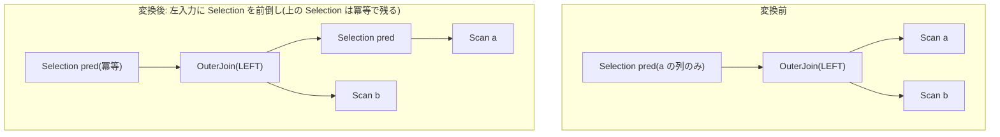

# push_filter_through_left_join_left_side

- 状態: done   /   執筆基準リビジョン: `3880673` (2026-09-12)
- 定義位置: `plan/cascades.cpp` の `RuleSet::Default()`(登録式。述語の閉包性は
  `expression/rewrite.cpp` の `ReferencesOnly` を使用)

## 概要

`Selection(pred, OuterJoin(L, R))` の述語 `pred` が **保存側である左入力の
列だけ** を参照し、かつ結合が LEFT(join_type 0)であるとき、
`Selection(pred, OuterJoin(Selection(pred, L), R))` へ書き換える Rule です
(外側 Selection は冪等のために残す)。フィルタを LEFT JOIN の左入力の
下に前倒しして、結合の入力行を減らします。

## 変換前後の関係



## 適用条件

パターンは `Selection(OuterJoin(Any("left"), Any("right"), "join"))` です。
DSL の `LeftOuterJoin`(型をパターンで固定するヘルパ)ではなく素の
`OuterJoin` を使っており、**join_type の検査は変換ラムダ側**で行います。
guard は次の 5 つです。

1. 述語を持つこと(`!expression.predicate` で早期 return)。
2. 左子グループのリレーション集合が空でないこと。
3. 述語が左側リレーション **のみ** を参照すること —
   `ReferencesOnly(pred, left_relations)`。この関数は触れる全列が
   「修飾名であり、かつ指定リレーション集合に含まれる」ことを要求します
   (`expression/rewrite.cpp` の `ReferencesOnly`。述語が空の場合は真を
   返しますが、本 Rule は手順 1 で述語の存在を先に検査しているため、
   実質的に列参照の検査として働きます)。
4. join グループ内の `kOuterJoin` かつ子 2 個の代替が **すべて**
   `join_type == 0`(LEFT)で、かつ子のリレーション集合が `left` / `right`
   のキャプチャと一致すること。一致しない代替が 1 つでもあれば全体を拒否
   します(下記の D5 的な漏れ防止)。
5. 上記を満たす LEFT 型の join 代替を集めた `guarded_joins` が空でないこと。
6. 派生グループ `filtered_left` が左グループ自身でも外側グループでも
   ないこと(循環防止)。

```cpp
          // Only push if predicate references only left-side relations.
          if (!ReferencesOnly(pred, left_relations)) {
            return;
          }
          // Only the preserved (left) side may be filtered early. RIGHT and
          // FULL outer joins NULL-supply the left side, so dropping left rows
          // here would remove NULL-padded output rows from the result.
```

## 意味論的根拠と外部結合の保存側契約

登録直前のコメントに、この Rule の正しさと禁止条件の両方が簡潔に
書かれています。

```cpp
    // push_filter_through_left_join_left_side: Selection(pred, OuterJoin(L, R))
    //   -> Selection(pred, OuterJoin(Selection(pred, L), R))
    // when pred references only columns from L and L is the preserved side
    // (join_type 0 = LEFT). Safe because the Selection on L filters rows
    // before the outer join, and unmatched L rows still get NULL-padded on
    // the right. For RIGHT/FULL outer joins L is the NULL-supplying side:
    // filtering it before the join would drop padded output rows, so the
    // rule must not fire there.
```

- **LEFT だけが対象の理由**。LEFT JOIN は「左の行は全て出力に現れる
  (マッチしなければ右側を NULL 補完)」という保存側の契約を持ちます。
  左の列だけで決まる述語で左入力を事前に弾いても、「弾かれた左行が結合で
  NULL 補完されて出力される(そして上の Selection でやはり弾かれる)」
  という経路が消えるだけで、最終的な行集合は同じです。逆に RIGHT /
  FULL では左側は NULL を **供給される** 側であり、先に弾くと「マッチ
  しなかった右行を NULL 補完した出力行」そのものを消してしまいます。
  これが手順 4(join_type == 0 のみを集め、異なる向きの代替が混ざれば全体を
  拒む)の理由です。コードコメントが述べるとおり、グループが複数の
  outer-join 代替(RIGHT は反転した LEFT に正規化、FULL は分解される)を
  持つ場合、左スキャングループの filter はそれら全てに共有されるため、
  1 つでも向きの違う代替があれば押し込みを諦めます(そうでないと
  フィルタが null 供給側へ漏れます)。
- **述語が左側に閉じる理由**(`ReferencesOnly`)。右側の列に触れる述語は
  NULL 補完行の評価で NULL になり得るため、結合の前に評価すると
  三値論理の結果が変わります。また未修飾名は左の列と証明できないため、
  `ReferencesOnly` は失敗扱いにします。
- **ON 条件を書き換えない理由**。変換コメントに「the Selection predicate
  is a row filter on the left side, not an ON-clause conjunct」とあります。
  述語を ON に足すのではなく、左入力への行フィルタとして置くのがこの
  Rule の意味です。

## 実装の詳細

変換は 3 段階です。まず左入力用の派生グループに Selection を置きます。

```cpp
          const GroupId filtered_left =
              memo.EnsureDerivedGroup(memo.Get(bindings.at("left")).relations,
                                      "left-join-filter:" + pred->ToString());
          if (filtered_left == bindings.at("left") || filtered_left == group) {
            return;
          }
          memo.AddExpression(
              filtered_left,
              LogicalExpression{.operation = LogicalOperator::kSelection,
                                .children = {bindings.at("left")},
                                .predicate = pred});
```

派生グループ(左グループそのもの)に追加すると自己参照式になるため、
必ず派生側に置きます(コメント "adding it into the left group itself would
be a self-referencing expression")。次に、LEFT 型の join 代替を
フィルタ済み左入力で組み替えます。

```cpp
          for (const LogicalExpression& join : guarded_joins) {
            // Rebuild the outer join with the filtered left input.  The join
            // condition stays the original one: the Selection predicate is a
            // row filter on the left side, not an ON-clause conjunct.
            memo.AddExpression(
                bindings.at("join"),
                LogicalExpression{
                    .operation = LogicalOperator::kOuterJoin,
                    .children = {filtered_left, bindings.at("right")},
                    .predicate = join.predicate,
                    .join_type = join.join_type});
          }
```

最後に、元の Selection を外側グループにそのまま足します(コメント
"Wrap with the original Selection (idempotent, keeps the plan shape stable
while the join alternative below carries the push)")。押し込んだ述語は
結合後にもう一度評価されますが冪等なので意味は変わらず、プラン形の
安定性が保たれます。

## 最適化効果

適用後は LEFT JOIN の左入力がフィルタ済みになり、(1) 結合の左入力行が
減り、(2) 右側との照合試行も減ります。保存側の行集合は最終的に同一なので
コストだけが下がります。outer join を越えるフィルタ押し込みは一般的には
危険ですが、この Rule は「保存側かつ左側」という安全な 1 ケースに限定した
ガードレール設計の見本です(null-rejection 解析の完全実装を待たず、
安全な形だけ個別に実装する方針。`docs/opt/AGENTS.md` §4 の
「ガードレール」の話題)。

## 関連 Rule との相互作用

- `push_limit_through_left_join`: LEFT JOIN の左側への Limit 前倒し。
  同じ「保存側は安全」の論理で動く Limit 版です。
- `push_selection_through_join` / `split_selection_over_join`: 内側結合
  (`kJoin`)限定の押し込み。outer join はこちらの専用 Rule が扱います。
- `outer_to_inner_join_on_null_rejecting_filter`: 述語が NULL を棄却する
  ことを証明できた場合に outer join を inner join に縮む Rule(第2部
  H 分類)。inner join に変わったあとは `split_selection_over_join` の
  対象になります。

## 検証テスト

- `plan/cascades_test.cpp` の `CascadesTest.PushFilterThroughLeftJoinLeftSide`
  — LEFT 型(join_type = 0)の OuterJoin 上の Selection `a.x = 1` に対し、
  左入力側に同じ述語の Selection を持つ OuterJoin 代替が作られることを
  検証します。RIGHT/FULL を拒む側面の反例テストは `plan/cascades_test.cpp`
  では確認できませんでした。
