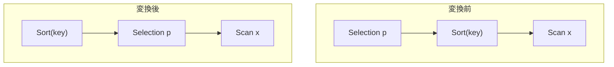

# push_filter_through_sort

- 状態: done   /   執筆基準リビジョン: `3880673` (2026-09-12)
- 定義位置: `plan/cascades.cpp` の `RuleSet::Default()`(登録式)

## 概要

`Selection(Sort(X), p)` を `Sort(Selection(X, p))` に置き換える Rule です。
フィルタは行の集合を変えるだけで行の順序に影響しないため、ソートと
フィルタは交換できます。フィルタをソートの下に置くことで、ソート対象の
行数が減ります。

## 変換前後の関係



Memo 上では、`filter-before-sort:` タグの派生グループに `Selection(X, p)`
を追加し、外側グループには元のソートキーを維持した `Sort(その派生
グループ)` を追加します。

## 適用条件

パターンは `Selection(Sort(Any(), "sort"))` で、`target` は `kSelection`
です。変換ラムダ内の条件は次のとおりです。

```cpp
          if (!expression.predicate) {
            return;
          }
          const GroupId sort_group_id = bindings.at("sort");
          const Group& sort_group = memo.Get(sort_group_id);
          for (const LogicalExpression& sort : sort_group.expressions) {
            if (sort.operation != LogicalOperator::kSort ||
                sort.children.empty()) {
              continue;
            }
            const GroupId input_id = sort.children[0];
            const GroupId filtered = memo.EnsureDerivedGroup(
                memo.Get(input_id).relations,
                "filter-before-sort:" + (*expression.predicate)->ToString());
            if (filtered == group || filtered == input_id) {
              continue;
            }
```

- Selection が述語を持つこと。
- ソートグループに実際に `kSort`(子を持つ)の代替があること。
- 述語を指紋に持つ派生グループが、外側グループ自身でもソートの子でも
  ないこと(循環防止)。

なお、この Rule は「述語がソートキーの子の表に閉じる」ことを検査しません。
次節のとおり、不要だからです。

## 意味論的根拠と順序独立性

登録直前のコメントを引用します。

```cpp
    // push_filter_through_sort: Selection(Sort(X)) -> Sort(Selection(X))
    // when the selection predicate references only the child's columns.
```

コメントは「述語が子の列だけを参照するとき」と述べていますが、コードは
列参照の明示的な検査を持ちません。これは、**ソートの下の行は上の行と
同じスキーマ(列)を持ち、述語の列参照がそのまま有効**だからです。ソートは
行を並べ替えるだけで列を増減しないため、「子の列で評価できる述語」の
検証が実質的に不要になっています(出力列を定義しなおす Projection を越える
`push_selection_through_projection` が厳密な書き換えを要求するのと
対照的です)。

意味保存の論理は次のとおりです。ソートは「安定な全順序で並べ替える」
演算子で、述語 `p` は行ごとに独立に真偽が決まります。`p` を通る行の集合は
ソートの前後で変わらないため、「`p` を通る行を `p` を通る順序で並べたもの」
はどちらの順序で適用しても一致します。

- **循環防止条件の理由**: `filtered == group`(自分自身を孫にする)や
  `filtered == input_id`(既に同じ形)への追加は自己参照・無限再適用の
  環になるため禁止です。

## 実装の詳細

変換本体は 2 つの `AddExpression` と、1 つの早期 `return` です。

```cpp
            memo.AddExpression(
                filtered,
                LogicalExpression{.operation = LogicalOperator::kSelection,
                                  .children = {input_id},
                                  .predicate = expression.predicate});
            // Sort wraps the Selection.
            memo.AddExpression(
                group,
                LogicalExpression{.operation = LogicalOperator::kSort,
                                  .children = {filtered},
                                  .target_list = sort.target_list,
                                  .sort_ascending = sort.sort_ascending,
                                  .sort_nulls_first = sort.sort_nulls_first,
                                  .output_schema = sort.output_schema});
            return;
```

- 派生グループに `Selection(X, p)` を追加し、外側グループに
  `Sort(派生グループ)` を追加します。ソートキー(`target_list`)・昇順
  フラグ・NULLS 配置・出力スキーマは元の `Sort` 式からそのままコピー
  されるため、出力の順序・列構成は変わりません。
- `return` がある点に注意します。ソートグループ内で最初に適用可能だった
  `kSort` 代替の 1 つだけに対して変換を行い、以降の代替は試みません
  (`merge_limits` など他の Rule は複数代替すべてに適用するものがあり、
  挙動が異なります)。

## 最適化効果

適用後は `Sort(Selection(X, p))` が選べるようになり、ソートの入力行が
「`p` を通った行」に減ります。ソートは行数に対するコストが高い演算子
(O(n log n) 比較・ハッシュ/ソートバッファ)なので、選択率の高いフィルタの
下移動は効きます。順序という物理特性は Sort ノードが上に残ることで
完全に維持されます。LIMIT と違い、行数を減らしても「上位 k 件」の意味は
変わらないため LIMIT 系のような特別な guard は不要です。

## 関連 Rule との相互作用

- `limit_push_through_sort` / `rank_row_number_to_topn`: ソートと行数制限の
  組み合わせ(TopN)を扱う Rule。フィルタが下に来て行数が減ったほうが
  TopN 化の効果も大きくなります。
- `eliminate_double_sort` / `sort_merge_of_compatible_orders`: ソートの
  統廃合。本 Rule で新しく作った Sort が既存の Sort と隣接した場合に
  起きます(通常は消える側にならないが、キーが一致すれば統合候補になる)。
- `push_selection_into_scan`: 下がスキャン直下になれば、フィルタは
  scan filter に合流しインデックス走査の根拠になります。

## 検証テスト

- `plan/cascades_test.cpp` を含むテストファイルに、この Rule
  (`push_filter_through_sort`)に対応する個別テストは確認できませんでした。
  `filter-before-sort:` タグへの言及もテスト内にはありません。
