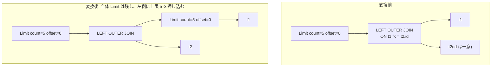

# push_limit_through_left_join

- 状態: done   /   執筆基準リビジョン: `3880673` (2026-09-12)
- 定義位置: `plan/cascades.cpp` の `RuleSet::Default()`(`built.Add(Rule("push_limit_through_left_join", …)`)
  登録式。右側結合キーの一意性判定には `LogicalProperties::IsUniqueOn`
  (第 1 部 20 章)を使う

## 概要

`Limit` の下に LEFT OUTER JOIN があり、**右側の結合キーが右側の一意キー
(候補キー)である**とき、`count + offset` 行の Limit を左側へ押し込む Rule
です。登録前のコメント「Limit over LeftOuterJoin where right join keys form
a candidate key on the right side」が条件を一言で述べています。

## 変換前後の関係

`t1 LEFT JOIN t2 ON t1.fk = t2.id`(`t2.id` は PRIMARY KEY)で
`LIMIT 5` の例です。



## 適用条件

パターンは `Limit(Any("input"))`、`target = kLimit` です。変換ラムダのガードは
次のとおりです。

(1) 式が `kLimit` で子を 1 個持ち、`total_limit = count + offset > 0`。

```cpp
          if (expression.operation != LogicalOperator::kLimit ||
              expression.children.size() != 1) {
            return;
          }
          const GroupId input_id = bindings.at("input");
          const Group& input_group = memo.Get(input_id);
          const size_t total_limit =
              expression.limit_count + expression.limit_offset;
          if (total_limit == 0) {
            return;
          }
```

(2) 入力グループに LEFT OUTER JOIN(`kOuterJoin` かつ `join_type == 0` = LEFT)
の代替があり、ON 条件を持つこと。

```cpp
            if (ojoin.operation != LogicalOperator::kOuterJoin ||
                ojoin.join_type != 0 || ojoin.children.size() != 2 ||
                !ojoin.predicate.has_value() || !*ojoin.predicate) {
              continue;
            }
```

(3) 左側が既に `total_limit` 以下の Limit を持てば発火しません(冪等性)。
判定は `limit_count <= total_limit` の比較だけで、`limit_count == 0`
(上限なしの意味)の Limit や Limit のオフセットは考慮しません。現状こう
なっています。

(4) ON 条件の等式から**右側に属する列**を集め、それが右側グループの
一意キーになっていること。

```cpp
            if (right_join_cols.empty() ||
                !memo.Get(right_id).logical_properties.IsUniqueOn(
                    right_join_cols)) {
              continue;
            }
```

(5) 派生グループ(`ojoin_limit_left:<total>` と `ojoin_limited_left`)が
循環を作る形(自分自身・入力・左側そのもの)ならスキップします。

発火しないケース: 右側キーの一意性が証明できない / ON 条件に等式が無い /
join_type が LEFT 以外 / 左側が既に切られている、です。

## 意味論的根拠と一意キー制約

LEFT OUTER JOIN は「左側の行を 1 行も落とさず、各行につきマッチした右側の
行の数だけ(無マッチなら NULL 埋めの 1 行)出力する」演算子です。右側の
結合キーが一意なら、**各左側行につき出力は高々 1 行**になります。すると
出力の並びが左側の行の並びと 1:1 に対応するので、

> 全体の出力の先頭 `total_limit` 行は、左側の先頭 `total_limit` 行だけから
> 構成される

が言え、左側に `Limit(total_limit, 0)` を押し込んでも生存行は 1 行も失われ
ません。全体 Limit は上に残すので、オフセットと最終行数の意味も保たれます。

この条件を外したときの反例が、無効化済み Rule `push_down_limit_through_join`
の監査記録(docs/cascades_optimizer.md の D5 表)に正確に書かれています。
右キーの一意性だけでは「左側の各行のマッチ数が高々 1」ことしか言えず、
「全ての左側行がマッチする」ことは言えません。内部結合では、マッチしない
左側行が Limit の接頭辞に入っていると、押し込んだ側の出力が元のプランより
**少なく**なり、意味が変わります。LEFT JOIN では非マッチ行も NULL 埋めで
必ず 1 行出力されるため、この反例が成立せず、押し込みが許される — という
対比です。この Rule は「LEFT に限定する」ことで、証明できない前提
(referential integrity)を要求しない設計になっています。

一意性の証明材料は `LogicalProperties`(カタログの PK / UNIQUE 制約から
派生される。第 1 部 20 章)です。証明できない場合は発火しません。「証明
できないなら適用しない」という本プロジェクトの基本姿勢(第 1 部 60 章)の
実例です。

## 実装の詳細

右側結合キーの収集は、ON 条件を連言に分解し、等式の左右どちらかの辺が右側
グループのリレーションに属する列であるものを集めます。

```cpp
            std::unordered_set<std::string> right_join_cols;
            const auto& right_rels = memo.Get(right_id).relations;
            for (const auto& conjunct : SplitConjuncts(*ojoin.predicate)) {
              if (!conjunct || conjunct->Type() != TypeTag::kBinaryExp) {
                continue;
              }
              const auto& bin = conjunct->AsBinaryExpression();
              if (bin.Op() != BinaryOperation::kEquals) {
                continue;
              }
```

集まった列に対して `IsUniqueOn` で一意性を確認したあと、左側 Limit と
書き換えた LEFT JOIN を構築し、外側グループには元と同じ count/offset の
Limit を被せます。枝側のタグ `ojoin_limit_left:<total>` は Limit 値を
指紋に含みます(違う total_limit の押し込みが同じグループに混線しないため)。
ON 条件と join_type は元の式からそのまま写されるため、NULL 補完の意味は
変わりません(`Memo::NewOuterJoin` の「WHERE の連言を ON に折り込まない」
規律はここでは関係しません。条件の移動は行わないためです)。

## 最適化効果

- 左側の読み出しが `total_limit` 行で打ち切られ、結合の左入力が小さく
  なります。
- 全体 Limit が残るため `LIMIT/OFFSET` の意味は不変です。
- 左側がさらに結合・UNION ALL を含む場合、下位の押し込み Rule と連鎖
  できます。

## 関連 Rule との相互作用

- 無効化済み `push_down_limit_through_join` / `topn_push_through_inner_join`:
  同じ「右キー一意性」の証明で内部結合へ Limit を押す試みは、D5 監査で
  無効化されています(反例テスト `PushDownLimitThroughJoinSkipsNonUniqueJoin`,
  `TopNPushThroughInnerJoinOnForeignKey`)。本 Rule は LEFT JOIN 限定で
  同じ問題を回避します。
- `merge_limits` / `push_limit_through_union_all`: 押し込んだ先での Limit
  の合成・枝への再押し込み。
- `foreign_key_outer_join_elimination`: 同じ「右キー一意性 + 外部結合」の
  文脈で外部結合そのものを除去する Rule(こちらは LEFT 側の NOT NULL も
  要求します)。

## 検証テスト

- `plan/cascades_test.cpp` の `CascadesTest.PushLimitThroughLeftJoin` —
  `t2.id` を PRIMARY KEY にした LEFT JOIN の上の `Limit(5)` が、左側に
  `count=5` の Limit を押し込んだ代替を生むことを検証します。
- `CascadesTest.DefaultRulesIncludePredicateAndProjectionTransforms` が
  本 Rule の登録を確認します。
