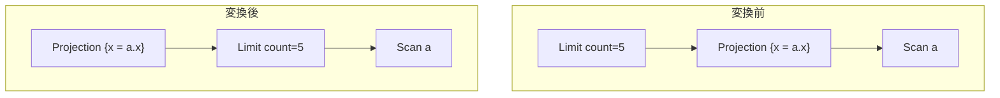
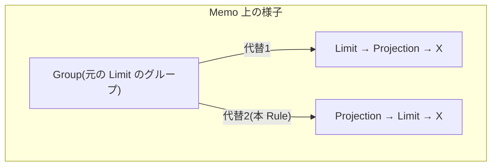

# push_limit_through_projection

- 状態: done   /   執筆基準リビジョン: `3880673` (2026-09-12)
- 定義位置: `plan/cascades.cpp` の `RuleSet::Default()`(`built.Add(Rule("push_limit_through_projection", …)`)
  登録式

## 概要

`Limit(Projection(X))` を `Projection(Limit(X))` に反転させる Rule です
(ProjectLimitTranspose / LimitProjectTranspose)。射影は行数を変えない 1:1 変形
なので Limit と交換でき、先に Limit をかけることで下のスキャンや結合が
作る行を減らせます。登録直前のコメントが意図を述べています。

```cpp
    // Limit(Projection(X)): project after the cut so the scan/join below
    // produces fewer rows (ProjectLimitTranspose / LimitProjectTranspose).
```

## 変換前後の関係



出力(列の値・行数・順序)はどちらも同じです。変わるのは「いつ行を切るか」
だけで、切ったあとに射影する形へ変わります。

## 適用条件

パターンは `Limit(Projection(Any(), "proj"))`、`target = kLimit` です。
変換ラムダ内のガードは次のとおりです。

```cpp
          for (const LogicalExpression& projection :
               memo.Get(bindings.at("proj")).expressions) {
            if (projection.operation != LogicalOperator::kProjection) {
              continue;
            }
            const GroupId input = projection.children[0];
            const GroupId limited = memo.EnsureDerivedGroup(
                memo.Get(input).relations,
                "lim-below-proj:" + std::to_string(expression.limit_count) +
                    ":" + std::to_string(expression.limit_offset));
            if (limited == group || limited == input) {
              continue;
            }
```

- 子グループの代替のうち実際に `kProjection` のものだけを相手にします
  (パターンはグループを束縛するだけなので、式レベルでの再確認が必要です)。
- 新しい派生グループのタグ `lim-below-proj:<count>:<offset>` が Limit の値を
  指紋に含めます。count や offset が違う Limit が同じタグを共有すると、
  別の行数制限を表すグループが混線するためです(D5 の「派生グループの
  タグは意味の指紋であるべき」に対応)。
- `limited == group || limited == input` のときはスキップ — 自分自身や
  入力そのものを下に置く再帰的ループの自衛です。

発火しないケース: 子グループに kProjection の代替が無い、派生グループが
循環を生む、の 2 つです。

## 意味論的根拠と単射射影の行数保存

この Rule の意味保存の根拠は「**射影は行を増やさず減らさない**」という
演算子の性質そのものです。射影が 1 行を 1 行に写す限り、

- `Projection(X)` の先頭 5 行 ≡ `X` の先頭 5 行を射影したもの
- 逆に `X` の先頭 5 行を射影すれば、全体の射影結果の先頭 5 行と一致

が成り立ちます。ここを崩すのが危険なのは行数を変える演算子です。フィルタ
(Selection)や集約、DISTINCT は行数を変えるため、同じ転置はできません
(フィルタは `push_filter_through_sort` 系が、集約は `push_selection_through_aggregation`
が別の条件で扱います)。

もう 1 つの要点は「射影を上に残す」ことです。射影の `target_list`
(出力列の定義)はそのままに、子を Limit 済みグループへ付け替えるだけで、
出力列の名前と定義は変わりません。なお新しく追加される上側の射影式には
`output_schema` を設定していません(元の射影の `output_schema` も引き継ぎ
ません)。列の名前と定義は `target_list` が担うためです。

## 実装の詳細

変換部は「Limit を下に置いた派生グループを作り、その上に元の射影を被せる」
2 つの `AddExpression` からなります。

```cpp
            memo.AddExpression(
                limited,
                LogicalExpression{.operation = LogicalOperator::kLimit,
                                  .children = {input},
                                  .limit_count = expression.limit_count,
                                  .limit_offset = expression.limit_offset});
            memo.AddExpression(
                group,
                LogicalExpression{.operation = LogicalOperator::kProjection,
                                  .children = {limited},
                                  .target_list = projection.target_list});
```

- 1 つ目の式は「`X` を count/offset で切る Limit」を新グループへ追加。
- 2 つ目の式は外側グループへの等価な代替 `Projection(Limit(X))` の登録です。
  元の `Limit(Projection(X))` も残るので、探索は両方をコスト比較します。
- タグに Limit 値を含める理由は適用条件で述べたとおりです。`Memo::
  EnsureDerivedGroup` は「同じタグ + 同じリレーション集合なら既存グループを
  再利用」する(第 1 部 20 章)ので、異なる Limit 値は必ず別グループに隔離
  されます。

## 最適化効果



- 射影の計算量が「全入力行 × 1 行あたり計算」から「Limit 後の行 × 同」に
  減ります(特に計算式の重い射影で効きます)。
- 物理化の際、Limit の下のスキャンが `limit_hint` を受け取り、行数上限を
  見込んだコスト見積りと早期打ち切りが効きます(第 1 部 50 章)。
- UNION ALL や結合の下にさらに押し込む可能性が生まれます。

## 関連 Rule との相互作用

- `merge_limits`: 押し込んだ先に既存の Limit があると二重 Limit になり、
  `merge_limits` が合成します。
- `topn_push_through_projection`: TopN 版の兄弟 Rule です。TopN はソート
  キーを射影の出力から入力側へ翻訳できる場合にのみ押し込めます(Limit は
  キーを気にしないので無条件に押せる、という対比になります)。
- `eliminate_identity_projection`: 射影が恒等写像ならまず消えるため、
  本 Rule の出番は「実質的な計算をする射影」に限られます。

## 検証テスト

- `plan/cascades_test.cpp` の
  `CascadesTest.PushLimitThroughProjectionAddsLimitBelow` — `Limit(5)` の下の
  射影の下に `count=5` の Limit が現れることを検証します。
- `CascadesTest.DefaultRulesIncludePredicateAndProjectionTransforms` が
  `push_limit_through_projection` の登録を確認します。
