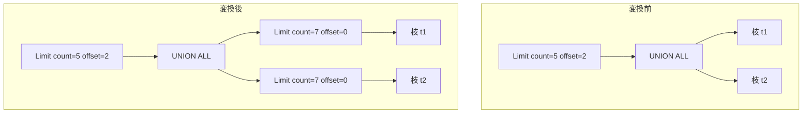

# push_limit_through_union_all

- 状態: done   /   執筆基準リビジョン: `3880673` (2026-09-12)
- 定義位置: `plan/cascades.cpp` の `RuleSet::Default()`(`built.Add(Rule("push_limit_through_union_all", …)`)
  登録式(直前のコメントで `push_down_limit_through_join` が無効化済みである
  ことが触れられている領域に隣接して登録)

## 概要

`Limit(count, offset)` の下に UNION ALL があるとき、**各枝に
`count + offset` 行の Limit を押し込み、書き換えた UNION ALL の上に元と同じ
Limit を被せ直す** Rule です。後段の `union_all_push_limit` と同じ変換を、
「枝が既に小さい Limit を持っていれば発火しない」という冪等性チェックつきで
行います。

```cpp
    // push_limit_through_union_all: Push Limit(N + offset) into each branch of
    // UnionAll.
```

## 変換前後の関係

`LIMIT 5 OFFSET 2`(合計必要行数は 2+5=7)の例です。



## 適用条件

パターンは `Limit(Any("input"))`、`target = kLimit` です。変換ラムダのガードは
次のとおりです。

(1) 式が `kLimit` で子を 1 個持つこと。`total_limit = count + offset` が 0
(上限もオフセットもない)なら発火しません。

```cpp
          if (expression.operation != LogicalOperator::kLimit ||
              expression.children.size() != 1) {
            return;
          }
          const size_t total_limit =
              expression.limit_count + expression.limit_offset;
          if (total_limit == 0) {
            return;
          }
```

(2) 入力グループに、子を 2 つ以上持つ `kUnionAll` の代替があること。

```cpp
            if (union_expr.operation != LogicalOperator::kUnionAll ||
                union_expr.children.size() < 2) {
              continue;
            }
```

(3) **全ての枝が既に total_limit 以下の Limit を持つなら発火しない**
(冪等性チェック。押し込む価値のない形での再適用を止めます)。

```cpp
            bool already_limited = true;
            for (const GroupId child_id : union_expr.children) {
              const Group& cg = memo.Get(child_id);
              bool child_has_limit = false;
              for (const auto& cexpr : cg.expressions) {
                if (cexpr.operation == LogicalOperator::kLimit &&
                    cexpr.limit_count <= total_limit) {
                  child_has_limit = true;
                  break;
                }
              }
              if (!child_has_limit) {
                already_limited = false;
                break;
              }
            }
            if (already_limited) {
              continue;
            }
```

(4) 枝ごとの派生グループ(`union_limit_child:<total>`)や書き換えた UNION
ALL のグループ(`union_all_limited`)が、自分自身・入力・枝そのものと一致
したら `cycle` を立てて諦めます(循環自衛)。

## 意味論的根拠と袋の直和

意味保存の論拠は UNION ALL が袋の連結であることです。全体の `offset` 行を
飛ばして `count` 行取るには、どの枝も先頭 `offset + count` 行以内の行だけで
足りるため、枝に `Limit(total_limit, 0)` を押し込んでも生存行は 1 行も
失われません。書き換えた UNION ALL の上に**元の Limit を被せ直す**ので、
オフセットのスキップと最終的な行数制限は正確に保たれます。

- 各枝に既に `total_limit` 以下の Limit がある場合は押し込んでも枝の評価が
  短縮されない(すでに枝が切れている)ため、(3) のチェックが発火を止めます。
  このチェックがないと、同じ形の代替が式上限(4096)を消費しながら何度も
  再生成されます。なお判定は `cexpr.limit_count <= total_limit` の比較だけ
  で、`limit_count == 0`(上限なしの意味)の枝 Limit や枝 Limit のオフセット
  は考慮しません。現在の実装仕様です。
- DISTINCT のある UNION には適用しません。重複排除は枝をまたいで効くため、
  枝を切ると生存行が変わります。相手を `kUnionAll` に限定しているのはこの
  ためです。
- なお `total_limit` の加算にオーバーフロー対策はありません(兄弟 Rule の
  `union_all_push_limit` には明示チェックがあります)。現在の実装仕様です。

## 実装の詳細

枝 Limit は「`union_limit_child:<total>` というタグの派生グループに、各枝の
上の `Limit(total_limit, 0)` を積む」だけで、あとは元の UNION ALL のコピー
(`LogicalExpression new_union = union_expr;` に `children` を差し替え)を
`union_all_limited` グループへ置き、外側グループに元と同じ count/offset の
Limit を被せます。ただし `new_union_group == group || new_union_group ==
input_id` のときは `continue` で諦めます。

```cpp
            memo.AddExpression(
                group,
                LogicalExpression{.operation = LogicalOperator::kLimit,
                                  .children = {new_union_group},
                                  .limit_count = expression.limit_count,
                                  .limit_offset = expression.limit_offset});
```

書き換え後の UNION ALL のグループのタグは固定文字列 `"union_all_limited"`
で Limit 値を含みませんが、子側のタグが `total_limit` を分離するため、
実用上の混線は子のグループで吸収される構造です。ただし固定タグのため、
異なる `total_limit` での適用は同じ `union_all_limited` グループに式を
追加し得ます(子グループ側のタグで区別されるため、意味の混線にはなりません
が、タグだけでは適用元を区別できません)。現在の実装仕様です。

なおガードの `already_limited` 判定は、パターンにマッチした UNION ALL の
特定の代替(式)の枝だけを見ます。入力グループ内の別の UNION ALL 代替が
ある場合、その代替ごとに判定と書き換えが繰り返されます。

## 最適化効果

- 各枝の実行が `total_limit` 行で打ち切られ、UNION ALL の中間結果が
  「枝数 × total_limit」行に収まります。
- 全体の Limit が残るため、`LIMIT/OFFSET` の意味は変わりません。
- 元の形(枝を切らない UNION ALL)も代替として残り、コスト比較で選ばれます。

## 関連 Rule との相互作用

- `union_all_push_limit`: 同一目的の兄弟 Rule。こちらは入力グループのタグ
  (`union-limit-setop:` 接頭辞)で再適用を止め、`union_all_push_limit` は
  枝の Limit 有無で止めます。探索は両方の代替を受けます。
- `merge_limits`: 枝側に既存 Limit があった場合、押し込まれた Limit との
  合成が起こり得ます。
- 無効化済みの `push_down_limit_through_join`(結合の左側への押し込み)との
  対比が D5 監査(docs/cascades_optimizer.md)で述べられています。UNION ALL
  では「枝を切っても全体から必要な行が失われない」ことを静的に証明できる
  のに対し、結合では「左側の各行が右側にマッチする保証」が無いため押せません。

## 検証テスト

- `plan/cascades_test.cpp` の `CascadesTest.PushLimitThroughUnionAll` —
  `Limit(5, offset=2)` の下の各枝に `count=7`(= total_limit)の Limit が
  現れることを検証します。なおこの断言は `union_all_push_limit` の出力形状
  (cap = offset+count = 7)とも合致するため、テスト単体ではどちらの Rule の
  成果かは区別できません。
- 本ルール単体の登録確認テストは個別には定義されていません。
