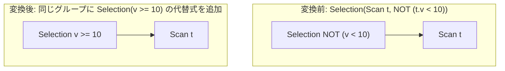

# push_not_through_expression

- 状態: done   /   執筆基準リビジョン: `3880673` (2026-09-12)
- 定義位置: `plan/cascades.cpp` の `RuleSet::Default()`(`built.Add(Rule("push_not_through_expression", …)`)
  登録式。依存ヘルパなし(ラムダ内部の自己再帰ラムダ `normalize_not`)。

## 概要

Selection の述語の中の `NOT` を、比較の否定・二重否定・ド・モルガン則の
3 種の書き換えで内側へ押し込む Rule です。`NOT (a = b)` を `a <> b` へ、
`NOT NOT x` を `x` へ、`NOT (p AND q)` を `NOT p OR NOT q` へ変換し、
述語を「NOT が葉にしかない正規形」に近づけます。

## 変換前後の関係



## 適用条件

パターンは `Selection(Any("input"))` で、対象演算子は
`LogicalOperator::kSelection` です。登録コメントは

```cpp
    // push_not_through_expression: Push NOT operators through comparisons,
    // double negations, and De Morgan's laws (AND / OR) into canonical form.
```

guard は次の 2 つだけです。

- 式が `kSelection` で、子 1 個と述語(`optional` と中身の二重チェック)
  を持つこと。
- 正規化の結果が元の述語と **文字列表現が異なる**こと
  (`normalized->ToString() != (*expression.predicate)->ToString()`)。
  変化がなければ新しい式を追加しません。

再帰ラムダ `normalize_not` が行う書き換えは次の 3 族です。

1. **二重否定**: `NOT (NOT x)` → `x`(中身を再帰的に正規化して返す)。
2. **比較の否定**(6 種の対応):
   `NOT (a = b)` → `a <> b`、`NOT (a <> b)` → `a = b`、
   `NOT (a > b)` → `a <= b`、`NOT (a >= b)` → `a < b`、
   `NOT (a < b)` → `a >= b`、`NOT (a <= b)` → `a > b`。
3. **ド・モルガン**: `NOT (a AND b)` → `NOT a OR NOT b`、
   `NOT (a OR b)` → `NOT a AND NOT b`。

それ以外の形(`kLike` などの対応のない二項演算、`IS NULL` などの
単項、`IN` 式)は `default: break;` で **そのまま**残します。

## 意味論的根拠と三値論理恒等性

比較の否定の対応表は、3 値論理で成立することを確認して初めて
安全になります。SQL の比較は NULL を含むと UNKNOWN を返し、
フィルタは TRUE だけを通します。このとき `x op y` と
`NOT (x neg_op y)` の関係を見ると:

- 両辺が非 NULL なら `op` と `neg_op` は標準的な否定関係
  (たとえば `<` の否定は `>=`)を満たすので真偽が一致します。
- どちらかの辺が NULL なら **両方とも** UNKNOWN になり、フィルタは
  どちらも同じ行を落とします。

つまり UNKNOWN が UNKNOWN を写す限り、比較の否定は行集合を変えません。
ド・モルガンもクリーネ論理(NOT UNKNOWN = UNKNOWN、
`T AND U = U`、`F OR U = U` など)で検算すると恒等式です。
二重否定は `NOT UNKNOWN = UNKNOWN` により安全に消せます。

一方、対応表にない演算(`LIKE` など)を誤って「否定の等価形」へ
変換すると意味を壊すため、`default: break;` で無変換が正解です。
なお `IS NULL` の否定は `IS NOT NULL` に相当しますが、これは本 Rule では
扱わず(`default: break;` で無変換)、式書き換え層(`expression/rewrite.cpp`)の
`not_is_null` 等の Rule の担当です — 論理 Rule は Memo 内の述語に現れた形だけを
処理します。`expression/rewrite.cpp` に `de_morgan` / `not_comparison` /
`not_is_null` の登録があることは確認できましたが、本 Rule との適用順の
規定はコードからは読み取れませんでした。現状こうなっている、という点に
留意してください。

「ToString が変わったときだけ追加する」という変化検出は、Cascades が
「等価な代替の追加」を無限に繰り返して式数上限(`Memo::Degraded()`)
を浪費しないための不動点 guard です。

## 実装の詳細

再帰の核は自己適用 `self(self, …)` で書かれたラムダです。
二重否定の部分は次のとおりです。

```cpp
            if (expr->Type() == TypeTag::kUnaryExp) {
              const auto& un = expr->AsUnaryExpression();
              if (un.Op() == UnaryOperation::kNot && un.Child()) {
                const auto& child = un.Child();
                if (child->Type() == TypeTag::kUnaryExp) {
                  const auto& inner_un = child->AsUnaryExpression();
                  if (inner_un.Op() == UnaryOperation::kNot &&
                      inner_un.Child()) {
                    return self(self, inner_un.Child());
                  }
                } else if (child->Type() == TypeTag::kBinaryExp) {
```

二重否定の中身を再帰に渡して**結果をそのまま返す**ため、
`NOT NOT NOT x` のような奇数重ねは外側 2 つを消して `NOT x` に
落ち着きます。比較の否定の switch は 6 ケースで、代表を引用します。

```cpp
                    case BinaryOperation::kGreaterThan:
                      return BinaryExpressionExp(
                          self(self, l), BinaryOperation::kLessThanEquals,
                          self(self, r));
```

両辺を再帰的に正規化してから否定後の演算子で組み立てるのが
一貫した作法です。ド・モルガン側は `kAnd` → `kOr` の組合せで、
左右に明示的な `UnaryExpressionExp(l, UnaryOperation::kNot)` を
作ってから再帰に渡します。

変換の発火は最後に 1 回だけです。

```cpp
          Expression normalized =
              normalize_not(normalize_not, *expression.predicate);
          if (normalized &&
              normalized->ToString() != (*expression.predicate)->ToString()) {
            memo.AddExpression(
                group,
                LogicalExpression{.operation = LogicalOperator::kSelection,
                                  .children = expression.children,
                                  .predicate = normalized});
          }
```

- 元の Selection も残るため、正規形と非正規形が同じグループに並び、
  コスト比較で選べます。実用上は正規形が後続 Rule の前提に合うため
  選ばれます。

## 最適化効果

適用後の Group には「NOT を含む述語」と「正規形の述語」の 2 代替が並びます。
正規化のコスト上の意味は主に **他の Rule への効き目**です。

- `NOT (v = 5)` が `v <> 5` になると、スキャンフィルタの押し込み先や
  index レンジ抽出が比較として直接解釈できる形になります。
- ド・モルガンで AND の連言が表に出ると、連言単位の押し込み
  (`split_selection_over_join` など)が 1 枝ずつ降ろせるようになります。
- 二重否定の除去は式サイズの純減です。

## 関連 Rule との相互作用

- `merge_selections` / `merge_adjacent_filters`: 合成後の述語が
  本 Rule の入力になります。
- `push_selection_into_scan` / `push_selection_through_join`:
  正規形になった連言を下流へ押し込みます。
- `expression/rewrite.cpp` の式書き換え(`de_morgan` / `not_comparison` /
  `not_is_null` など): スカラー式の層で同種の正規化を行う Rule 群です。
  登録名の存在は確認できましたが、本 Rule との適用順の規定はコードからは
  読み取れませんでした。現状の実装構成です。

## 検証テスト

- `plan/cascades_test.cpp` の `CascadesTest.PushNotThroughExpression` —
  `NOT (t.v < 10)` を探索すると、`kGreaterThanEquals` の述語を持つ
  Selection 代替が現れることを検証します。
- `CascadesTest.DefaultRulesIncludePredicateAndProjectionTransforms` —
  `rules.Contains("push_not_through_expression")` による既定セットへの
  登録確認。
