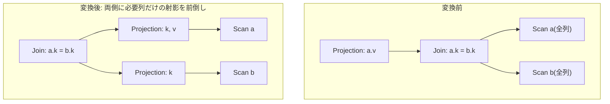

# push_projection_below_join_width_control

- 状態: done / 執筆基準リビジョン: `3880673` (2026-09-12)
- 定義位置: `plan/cascades.cpp` の `RuleSet::Default()`(登録名
  `"push_projection_below_join_width_control"`)

## 概要

`Projection(Join(L, R))` の入力に、結合条件と外側の射影が必要とする列だけを
出す「幅削減(width control)の射影」を両側に挟みます。行数は減らさず、
結合に入る行幅だけを減らす Rule です。

## 変換前後の関係

`SELECT a.v FROM a JOIN b ON a.k = b.k` の例です。



## 適用条件

パターンは `Projection(Join(Any("left"), Any("right"), "join"))` です。guard は
次のとおりです。

1. この式が `kProjection` で子と target list を持つ。
2. 結合グループが自分自身でない(`join_id != group`)。
3. マッチした `kJoin` 式が**結合条件(述語)を持つ**。述語なしの
   `kJoin` では発火しません。
4. 左右の子グループが `group` / `join_id` と一致しない(循環防止)。
5. **両側にすでに射影がある場合は発火しない**(`left_has_proj &&
   right_has_proj` なら `continue`)。片側だけなら発火します。
6. 結合条件と外側 target list が触れる列を左右に振り分けた結果、
   どちらかの側が空(`left_cols.empty() || right_cols.empty()`)なら発火
   しません。

登録部のコメントは次の 2 行です。

```cpp
    // push_projection_below_join_width_control: Push projection below join to
    // minimize row width before join operations.
```

## 意味論的根拠と必要属性の閉包性

条件 3 の「述語必須」は、この Rule が作る下流射影の列集合を「結合条件 +
外側 target list が触れる列」に限定しているためです。述語がなければ列集合は
外側射影の列だけになり、その形は `push_projection_through_join` の守備
範囲という立ち位置です。

条件 5 の「両側に射影が既にある」は、射影を何重にも挟む無意味な式の
連鎖(Join の下に射影、その下にさらに射影…)を止める抑制です。メモは
等価式を追記するので、幅削減済みの結合の下にさらに幅削減を挟む式は
コスト評価でも選ばれませんが、探索の式数予算の無駄になるため
発火段階で止めます。

条件 6 は、片側に必要列がない(＝その側を細くする必要がない)ケースを
除外します。

なお、列の振り分けは `col.schema` が左右どちらのリレーション集合に
属するかで行われ、**未修飾の列名やどちらにも属さない列は無言で収集対象に
入りません**(if / else if の連鎖で、どちらにも一致しなければどこにも
追加しない)。`push_projection_through_join` が未修飾列を `safe = false` で
拒否したのに対し、この Rule は保守的に無視する点が異なります。

## 実装の詳細

列の収集は、まず結合条件、次に外側 target list について行います。

```cpp
            std::vector<ColumnName> left_cols;
            std::vector<ColumnName> right_cols;
            for (const auto& col : (*join_expr.predicate)->TouchedColumns()) {
              if (std::ranges::find(left_relations, col.schema) !=
                  left_relations.end()) {
                if (std::ranges::find(left_cols, col) == left_cols.end()) {
                  left_cols.push_back(col);
                }
              } else if (std::ranges::find(right_relations, col.schema) !=
                         right_relations.end()) {
                if (std::ranges::find(right_cols, col) == right_cols.end()) {
                  right_cols.push_back(col);
                }
              }
            }
```

target list についても同じ振り分けを繰り返します。あとは列集合ごとに
`width_proj_left:` / `width_proj_right:` タグの派生グループを作り、必要列だけの
`kProjection` 式を追加し、**子を射影済みグループに差し替えた `Join` 式を
`group` 自身に追加**します。

```cpp
            const GroupId proj_left = memo.EnsureDerivedGroup(
                left_relations,
                "width_proj_left:" + TargetListFingerprint(left_targets));
            if (proj_left != left_id) {
              memo.AddExpression(
                  proj_left,
                  LogicalExpression{.operation = LogicalOperator::kProjection,
                                    .children = {left_id},
                                    .target_list = std::move(left_targets)});
            }
```

`push_projection_through_join` との違いは、上の `Projection` を残さず
`Join` だけを group に置く点です。下に置く射影の各出力は、必要列の列参照
そのものです(`NamedExpression` の列参照コンストラクタで作られ、出力名は
空で式が素の列参照になります)。結合後の出力から外側の射影が列を拾うのに
支障がない設計になっています。

## 最適化効果

適用後は上図のとおり、結合の両入力が必要列だけの幅になります。ハッシュ結合
のハッシュ表・ネステッドループのコピー幅が減る点は
`push_projection_through_join` と同じです。行幅は減るが行数は変わらない
(射影は行ごとの関数で、結合のマッチングに影響しないため)ので、
結合の選択率が悪く行数を削れない場合にも確実に効きます。

## 関連 Rule との相互作用

- `push_projection_through_join`: 同じ幅削減をより厳格な条件
  (未修飾列の拒否、外側射影の維持)で行う Rule。どちらの式が選ばれるかは
  コスト評価に委ねられます。
- `merge_projections` / `merge_adjacent_projections`: 前倒し射影が下流の
  入力側の既存射影と隣接した場合に合成されます。
- `merge_selections` 系: 幅削減とは独立に発火して構いません。

## 検証テスト

- `plan/cascades_test.cpp` の `PushProjectionBelowJoinWidthControl` —
  結合の下に幅削減の射影を挟んだ等価式が生まれることを検査します。
