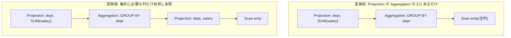

# push_projection_through_aggregation

- 状態: done / 執筆基準リビジョン: `3880673` (2026-09-12)
- 定義位置: `plan/cascades.cpp` の `RuleSet::Default()`(登録名
  `"push_projection_through_aggregation"`)

## 概要

`Projection(Aggregation(X))` について、集約の入力 `X` の上に「集約が必要とする
列だけを出す射影」を挟んだ `Aggregation(Projection(X))` 形を作る Rule です。
集約の前に行幅を削るのが目的で、外側の射影は元の出力を維持します。

## 変換前後の関係

`SELECT dept, SUM(salary) FROM emp GROUP BY dept` で、`emp` に無関係な幅広い
列がある例です。



## 適用条件

パターンは `Projection(Aggregation(Any(), "agg"))` です。guard は次のとおり
です。

1. 外側の target list が空でない。
2. 外側の target list の**すべての出力が素の列参照**
   (`Type() == TypeTag::kColumnValue`)である。式 1 つでも混ざれば発火しない。
3. 集約グループが自分自身でない(`agg_id != group`)。
4. 集約グループ内の `kAggregation` 式が子を持ち、その子が集約グループや
   `group` 自身でない(循環防止)。
5. 作る派生グループ `proj_below` / `new_agg` が特定の既存グループと
   一致しない(`proj_below != agg_child && proj_below != group &&
   new_agg != agg_id && new_agg != group`)。

なおループ末尾に `return` があるため、集約グループ内の最初の
`kAggregation` 代替だけが対象です。複数の集約代替がある場合も 1 形だけ
試します。

登録部のコメントに、この Rule の保守性が書かれています。

```cpp
    // push_projection_through_aggregation: Projection(Aggregate(X)) ->
    //   Aggregate(Projection(X)) when projection only references grouping
    //   keys and aggregate results. This is a conservative version that
    //   only fires when all projection targets are simple column references.
```

## 意味論的根拠と集約引数保存

条件 2 が核心です。下に置く射影は「集約への入力行から必要列を選ぶ」だけの
素の列射影でなければなりません。外側の target list に `a + b` や
`SUM(x) + 1` のような式があると、その式は集約の**結果**の上で評価されるべき
もので、集約の前(行ごと)に評価すれば値が変わります。たとえば
`SUM(salary) + 1` を集約の下に押し込めば、行ごとの `salary + 1` の合計という
別の計算になります。この Rule が作るのは「必要列だけを選ぶ素の射影」に限定
した形なので、式を含む target list では発火を禁止しています。

条件 4・5 の循環チェックを外すと自分自身を子に持つ式がメモに入り、
`Memo::AddExpression` の契約検査(CHECK 失敗)に到達します。

## 実装の詳細

集約が必要とする列(下の射影の出力)は、grouping sets と集約 target list の
両方から集めます。

```cpp
            std::unordered_set<ColumnName> needed_cols;
            for (const auto& g : agg.grouping_sets) {
              if (g) {
                for (const auto& c : g->TouchedColumns()) {
                  needed_cols.insert(c);
                }
              }
            }
            for (const auto& t : agg.target_list) {
              if (t.expression) {
                for (const auto& c : t.expression->TouchedColumns()) {
                  needed_cols.insert(c);
                }
              }
            }
```

グルーピングキーと集約引数が触れる列は全部下に残す、というのがこの Rule の
剪定方針です。派生グループのタグには外側と集約の両方の target list を
指紋化した文字列を使います。

```cpp
            // The derived-group tag must identify the meaning, not just the
            // rule: a bare count-style tag would collide across distinct
            // (outer, aggregation) target lists over the same relations and
            // pollute one group with another site's projection.
```

タグが意味(両 target list)を識別するのは、第 20 章の D1(1 グループ 1 意味)
の実践です。タグが曖昧だと、別のクエリ部位が作った「同じリレーション集合の
別の中間結果」グループに式が混入します。実際に追加される式は 3 個です。

1. `proj_below` グループに `Projection(agg_child, below_targets)`
   — 必要列だけの前倒し射影。
2. `new_agg` グループに `Aggregation(proj_below)` — 集約の target list、
   `output_schema`、`partition_by`、`grouping_sets` を元の集約から
   そのまま引き継ぐ。
3. `group` に `Projection(new_agg, expression.target_list)` —
   外側の射影を維持。

## 最適化効果

適用後は上図のとおり、集約に入る前に必要列だけの行幅になります。集約の
ハッシュ表・グループ化バッファは 1 行あたりの幅がそのままメモリに効くため、
幅の広いテーブルの GROUP BY で効果が大きい Rule です。行数は集約後も
変わりません(射影は行ごとの関数で、グルーピングキーと集約引数を落とさない
ため集約結果も不変です)。

## 関連 Rule との相互作用

- `merge_projections`: 適用後に外側射影と下流の射影が隣接すれば合成されます。
- `aggregate_projection_merge`: 隣接する射影を集約に**吸収**して 1 演算に
  する Rule。本 Rule とは逆方向(演算数を減らす)の整理で併用されます。
- `push_selection_through_aggregation`: フィルタを集約の下へ押し込む兄弟
  Rule です。

## 検証テスト

- `plan/cascades_test.cpp` の
  `PushProjectionThroughAggregationMovesProjectionBelow` — 射影が集約の下へ
  移動した等価式が生まれることを検査します。
