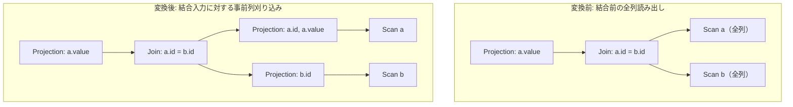

# push_projection_through_join

- 状態: draft / 執筆基準リビジョン: `3880673` (2026-09-12)
- 定義位置: `plan/cascades.cpp` の `RuleSet::Default()`（登録名 `"push_projection_through_join"`）

## 概要

結合演算の上に位置する射影 $\Pi(\Join(L, R))$ に対し、射影のターゲットリストおよび結合述語の評価に必要な列のみを左右の入力関係へ事前に射影する $\Pi(\Join(\Pi(L), \Pi(R)))$ を生成する論理 Rule です（列刈り込み、Column Pruning）。

結合演算子に入力されるタプルの行幅（ペイロードサイズ）を最小化することで、ハッシュ結合におけるハッシュテーブル占有メモリや、ネステッドループ結合・マージ結合におけるタプル複製コストを削減します。

## 変換前後の関係

例として、クエリ `SELECT a.value FROM a JOIN b ON a.id = b.id` におけるプラン変形を示します。関係 `b` は結合述語 `b.id` のみを必要とし、他の属性は結合前に刈り込まれます。



## 適用条件

パターンは `Projection(Any("input"))` であり、入力グループ内に論理結合演算子（`kJoin`）が存在することを検査します。適用判定（guard）は以下の 4 条件から成ります（`plan/cascades.cpp`）。

```cpp
    // Projection(Join(L, R)): retain only columns needed by the projection
    // and the join predicate on each side.  The top projection remains in
    // place because its expressions still define the output schema.  This is
    // deliberately limited to qualified columns and inner joins; resolving
    // ambiguous names or null-rejection for outer joins belongs to the
    // analyzer rather than to this conservative memo rewrite.
```

1. **修飾列名の完全性**: 射影リストおよび結合述語で参照されるすべての列名がテーブル修飾子（`schema`）を保持していること（未修飾列名が存在する場合は `safe = false`）。
2. **所属関係の一意性**: 各列の修飾子が左右どちらか一方の関係集合のみに存在すること（`in_left == in_right` となる曖昧な参照を拒否）。
3. **両側必要列の存在**: 左右双方の必要列集合が空でないこと（`!required[0].empty() && !required[1].empty()`）。
4. **内部結合限定**: 対象の結合が内部結合（Inner Join）であること（外部結合は除外）。

## 意味論的根拠と安全性制約

### 1. 内部結合における列集合の分離
関係代数において、属性集合 $A$ のみを要求する射影 $\Pi_A$ の下にある内部結合 $\Join_p$ は、結合述語 $p$ で参照される属性集合 $\text{attrs}(p)$ と $A$ の和集合 $U = A \cup \text{attrs}(p)$ を保持していれば、結合結果および最終射影結果は不変です。

左右の入力関係 $L, R$ に対し、$U_L = U \cap \text{schema}(L)$ および $U_R = U \cap \text{schema}(R)$ を定義すると、以下の代数同値性が成立します。

$$\Pi_A (L \Join_p R) \equiv \Pi_A (\Pi_{U_L}(L) \Join_p \Pi_{U_R}(R))$$

### 2. 外部結合の除外理由
左外部結合や完全外部結合では、不一致行に対する NULL 補完が発生します。結合述語の評価属性と出力属性のライフサイクルが一致しない場合や、上位の射影が NULL 依存の式（例: `COALESCE` や `IS NULL`）を含む場合、結合前での射影の挿入が意味論に影響を与えるリスクを排除するため、本 Rule では保守的に内部結合のみを対象とします。

### 3. 未修飾名の排除理由
テーブル修飾子を欠く列参照（例: `col`）は、クエリスキーマの完全な名前解決なしには左右どちらの関係に帰属するかを Memo 書き換え段階で一意決定できません。誤った側への列割り当ては不正なプランを生成するため、安全側に倒して発火を拒否します。

## 実装の詳細

必要列の収集は、射影の `target_list` および結合述語 `join.predicate` を走査して実施されます。

```cpp
            const auto collect = [&](const Expression& item) {
              if (!item) return;
              for (const ColumnName& column : item->TouchedColumns()) {
                if (column.schema.empty()) { safe = false; return; }
                const bool in_left = std::ranges::find(left.relations, column.schema) != left.relations.end();
                const bool in_right = std::ranges::find(right.relations, column.schema) != right.relations.end();
                if (in_left == in_right) { safe = false; return; }
                auto& side = required[in_left ? 0 : 1];
                if (std::ranges::find(side, column) == side.end()) {
                  side.push_back(column);
                }
              }
            };
```

収集された列集合に基づき、`EnsureDerivedGroup` により列指紋（`signature`）を付与した派生グループを作成します。左右の事前射影ノード、結合ノード、および最上位の元射影ノードを順に構築して Memo へ登録します。最上位の射影を残す理由は、クエリ全体の出力スキーマ（エイリアスや計算列の最終定義）を確定させる責任を維持するためです。

## 最適化効果

行数自体は変化しませんが、結合演算子を通過するタプルあたりのバイトサイズが大幅に圧縮されます。
- **ハッシュ結合**: ビルド側のハッシュテーブル消費メモリが削減され、キャッシュ局所性が向上します。
- **ソートマージ結合**: ソート実行時の一時バッファ使用量および I/O コストが低減します。
- **パイプライン転送**: Morsel-driven 実行におけるワーカースレッド間のデータ転送帯域を節約します。

## 関連 Rule との相互作用

- `push_projection_below_join_width_control`: 結合下の幅制御を行う補完的な Rule です。
- `merge_adjacent_projections` / `merge_projections`: 事前射影が既存のスキャン射影等と隣接した場合に、多段射影を 1 段に折り畳みます。
- `push_selection_through_join`: 述語の先行評価と並行して適用され、行数と行幅の双方を削減します。

## 検証テスト

- `plan/cascades_test.cpp`:
  - `ProjectionIsPushedThroughInnerJoinWithRequiredColumns`:
    内部結合に対して必要列のみを含む事前射影が正しく生成されることを確認します。
  - `ProjectionThroughOuterJoinIsConservativelySkipped`:
    外部結合に対して本 Rule が発火せず、プランが保守的に温存されることを確認します。
