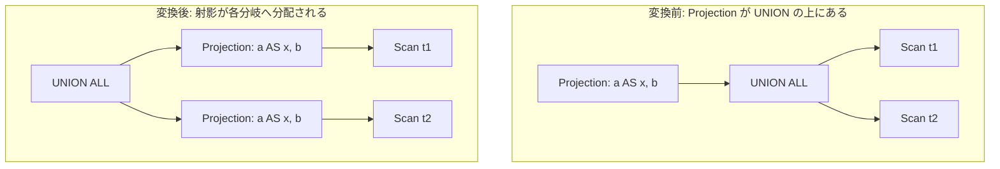

# push_projection_through_union

- 状態: done / 執筆基準リビジョン: `3880673` (2026-09-12)
- 定義位置: `plan/cascades.cpp` の `RuleSet::Default()`(登録名
  `"push_projection_through_union"`)

## 概要

`Projection(UNION[...])` の射影を集合演算の各入力へ分配します。
`π_f(UNION(R1, R2, ...)) = UNION(π_f(R1), π_f(R2), ...)` という分配則で、
各分岐が互いに独立に小さい行幅で処理できるようになります。

## 変換前後の関係



## 適用条件

パターンは `Projection(Any("input"))` で、子グループ内の集合演算式を
ラムダが調べます。guard は次のとおりです。

1. 集合演算が `kUnion` または `kUnionAll` であること。
   `kIntersect` / `kExcept` では**発火しません**。
2. 各分岐につくった射影グループが分岐自身(`projected == child`)か
   このグループ自身(`projected == group`)と同一にならない
   (循環防止、コード内では `cycle` フラグで処理)。

コメントに、UNION 系に限る理由が明記されています。

```cpp
    // Projection(UNION[X]) distributes to both branches.  Keep this rule
    // limited to UNION/UNION ALL: projection is not distributive over
    // INTERSECT/EXCEPT when the expression is non-injective.
```

## 意味論的根拠と分配可能性

条件 1 の INTERSECT / EXCEPT への禁止は、**射影が非単射(non-injective)な
ときに分配則が壊れる**からです。反例を小さなテーブルで示します。

- `t1` に `(1, 'a')`、`t2` に `(1, 'b')` の 1 行ずつ。射影は 2 列目を捨てる
  非単射なもの `π_a` とします。
- 変換前の形 `π_a(t1 ∩ t2)`: 行として共通なのはどちらもないので
  `t1 ∩ t2 = {}`、射影しても **0 行**。
- 分配した形 `π_a(t1) ∩ π_a(t2)`: `π_a(t1) = {(1)}`、`π_a(t2) = {(1)}` なので
  共通行が現れ **1 行**。

つまり射影を INTERSECT の下に押し込むと、射影が行を潰したことで
「違う行だったもの」が「同じ行」に化け、共通判定が誤って一致してしまいます。
EXCEPT(差)でも同様に、潰れによって残るべき行が消えます。UNION(重複排除
あり)/ UNION ALL(連結)は「各行に独立に式を適用してから集合演算する」形が
厳密に同値なので分配できますが、共通・差の意味論では安全側に倒して
発火しない設計です。

条件 2 の循環チェックがないと、自分自身を子に持つ式を追加しかねず、
`Memo::AddExpression` の契約検査(CHECK 失敗)に到達します。

## 実装の詳細

変換は 3 段階です。まず分岐ごとに射影グループを用意します。

```cpp
            std::vector<GroupId> projected_children;
            projected_children.reserve(setop.children.size());
            bool cycle = false;
            for (const GroupId child : setop.children) {
              const GroupId projected = memo.EnsureDerivedGroup(
                  memo.Get(child).relations,
                  "setop-projection:" +
                      TargetListFingerprint(expression.target_list));
```

派生グループのタグに `TargetListFingerprint(expression.target_list)`
(出力名と式の文字列を連結した指紋)を含めるので、**同じ分岐に違う target
list の射影が来れば別グループに隔離**されます。次に各分岐の射影式を追加し、
最後に集合演算の子を差し替えた式を元のグループへ加えます。

```cpp
              memo.AddExpression(
                  projected,
                  LogicalExpression{.operation = LogicalOperator::kProjection,
                                    .children = {child},
                                    .target_list = expression.target_list});
              projected_children.push_back(projected);
            }
            if (cycle) {
              continue;
            }
            LogicalExpression rewritten = setop;
            rewritten.children = std::move(projected_children);
            memo.AddExpression(group, std::move(rewritten));
```

メモは追記型なので、元の「射影が上にある形」と「射影を分配した形」が
等価式として並び、コスト評価が安い方を選びます。

## 最適化効果

適用後は上図のとおり各分岐が射影済みになります。分岐ごとの行幅が減るため、
分岐のスキャン・フィルタの転送量と、集合演算へ渡す列数が減ります。
重複排除付き UNION でも分配は同値です。射影は行ごとの関数なので袋(バッグ)
としての和集合の上で分配でき、`π_f(R1 ∪ R2) = π_f(R1) ∪ π_f(R2)` が袋として
成り立ち、その後に重複排除を掛けても両辺は一致するためです。

## 関連 Rule との相互作用

- `merge_projections` / `merge_adjacent_projections`: 分岐内の射影が
  分岐側の既存射影と隣接した場合に合成されます。
- `union_all_merge`: 隣接する UNION ALL を 1 つにまとめ、分配後の
  多分岐形を正規化します。
- `push_filter_past_setop`: 述語を集合演算の下へ押し込む兄弟 Rule です。

## 検証テスト

`plan/cascades_test.cpp`、`plan/optimizer_test.cpp`、`plan/plan_test.cpp`、
`plan/plan_extra_test.cpp` を検索しましたが、本 Rule 名・`setop-projection`
タグに対応する個別テストは確認できませんでした。
