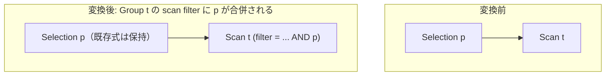

# push_selection_into_scan

- 状態: draft / 執筆基準リビジョン: `3880673` (2026-09-12)
- 定義位置: `plan/cascades.cpp` の `RuleSet::Default()`（登録名 `"push_selection_into_scan"`）

## 概要

`push_selection_into_scan` は、単一表スキャンノードの直上に位置する選択演算 `Selection(Scan(t), p)` の述語 `p` を、スキャングループの `scan filter` にマージする論理変換Ruleです。メモ構造内のグループ属性（`Group.filter`）を更新することにより、物理実装段階で `index_scan` や範囲スキャン（RangeScan）などの効率的なアクセスパスを選択可能にします。

## 変換前後の関係

論理プランのノードトポロジそのものを破棄するのではなく、スキャングループが保持するフィルタ述語を更新します。



変換後もメモ内には元の `Selection(Scan, p)` が維持されます。物理計画生成時にスキャン側で述語が完全に消費されたと証明できれば選択演算子は省略され、未消費の述語が残る場合は残差フィルタ（residual Selection）として評価されます。

## 適用条件

パターン照合にはDSLヘルパー `SelectionWithin(0, Scan("scan"))` を用います（`plan/cascades.hpp`）。

```cpp
// Matches a Selection whose predicate only touches the relations of child
// group `predicate_within_child`.
inline Pattern SelectionWithin(size_t predicate_within_child,
                               Pattern child = Any(),
                               std::string capture = {}) {
  PayloadConstraint payload;
  payload.requires_predicate = true;
  payload.predicate_within_child = predicate_within_child;
  return Pattern::Op(LogicalOperator::kSelection, {std::move(child)},
                     std::move(capture), payload);
}
```

適用条件は以下の3点です。

1. **述語の存在**: `requires_predicate = true` により、有効な述語を持つ `Selection` にのみマッチします。
2. **参照関係のスコープ閉包**: `predicate_within_child = 0` により、述語内で参照される全列が修飾名ベースで0番目の子ノード（スキャングループ）の関係内に収まっている必要があります。未修飾の列名は帰属関係を静的に証明できないため、照合失敗として扱われます。
3. **子ノードの演算子**: 子Groupに `LogicalOperator::kScan` を持つ式が存在すること。

さらに変換ラムダ内で、外部結合由来のフィルタに関するガード条件を判定します（`plan/cascades.cpp`）。

```cpp
          // A derived filter that only limits one *input* of an outer join
          // (push_filter_through_left_join_left_side) must stay a distinct
          // Selection node: merging it into the shared scan group's filter
          // would also constrain every other alternative that reuses that
          // scan (e.g. the AntiJoin branch of a FULL decomposition), dropping
          // rows the outer join must preserve.
          if (memo.Get(group).tag.starts_with("left-join-filter:")) {
            return;
          }
          memo.MergeScanFilter(bindings.at("scan"), *expression.predicate);
```

親Groupのタグが `left-join-filter:` で始まる場合、処理を中断します。これは、`push_filter_through_left_join_left_side` によって導出された外部結合の入力側限定フィルタを共有スキャングループにマージすると、同一スキャンを共有する他の代替ブランチ（完全外部結合の分解によるAntiJoin枝など）にも制約が波及し、外部結合で保持すべき行が脱落するためです。

## 意味論的根拠とガードレール

単一関係Groupにおいては、スキャンフィルタが実行時に評価される唯一の述語評価点となります。

```cpp
    // Selection(Scan(t), p): annotate the scan group's filter so
    // implementation rules can choose IndexScan/RangeScan. Guard rail: never
    // push through outer joins (null-rejection analysis does not exist yet).
```

単一表に対するスキャンフィルタの変更は、単なる最適化ではなく結果行の正しさに直結します。本Ruleが安全である理由は、`SelectionWithin(0)` によって「スキャン結果に対して適用しても結果集合が変わらない、当該表に閉じた述語」のみを対象としているためです。また、子ノード制約を `Scan` に限定することで、NULL補完行の破棄判定（null-rejection）が未確立な外部結合を誤って透過することを構造的に遮断しています。

## 実装の詳細

フィルタのマージ処理は `Memo::MergeScanFilter`（`plan/cascades.cpp`）が担当します。

```cpp
void Memo::MergeScanFilter(GroupId group, const Expression& predicate) {
  Group& target = Get(group);
  if (target.relations.size() != 1) {
    CHECK_MSG(false, "scan filter requires a single-relation group");
  }
  const Expression next = CanonicalizeConjuncts(
      target.filter
          ? BinaryExpressionExp(target.filter, BinaryOperation::kAnd, predicate)
          : predicate);
  target.filter = next;
}
```

- 対象Groupが単一関係であることを表明（`CHECK_MSG`）します。
- 既存のフィルタが存在する場合は論理積（AND）で結合し、`CanonicalizeConjuncts` により連言のソート、重複排除、矛盾検出に基づく恒偽化を行います。これにより、同一述語を複数回マージしてもフィルタ式が膨張しない冪等性が保証されます。

## 最適化効果

スキャングループにフィルタ述語が統合されることで、以下の2点において実行コストが低減します。

1. **インデックススキャンの誘発**: 物理実装Rule（`index_scan`）が `Group.filter` を参照可能となり、SARG可能な述語（探索引数化可能な条件）が存在する場合にフルスキャンからインデックスシークへと物理計画を切り替えます。
2. **早期のデータ削減**: スキャン段階でフィルタリングが行われるため、上位の結合演算や集約演算へ入力されるデータ行数が最小化されます。

## 関連Ruleとの相互作用

- `merge_selections` / `merge_adjacent_filters`: 多段の選択演算を1段に集約し、述語を一括して `SelectionWithin` の検査対象とします。
- `push_selection_through_join` / `split_selection_over_join`: 結合ノードの上位にある選択演算を分解し、各表のスキャングループへ述語を押し込みます。最終的には本Ruleと同様に `MergeScanFilter` を経由してスキャンに付与されます。
- `extract_year_sargable` / `cast_pushdown_on_comparison`: スキャンフィルタに登録された述語をSARG可能な形式へと書き換えます。

## 検証テスト

- `plan/cascades_test.cpp`:
  - `CascadesTest.PushSelectionIntoScanAnnotatesGroupFilter`: Selectionノード配下のスキャングループを探索した際、`Group.filter` が正しく更新されることを検証。
  - `CascadesTest.SelectionWithinPatternMatchesOnlyCoveredPredicates`: 参照関係が子ノードに閉じていない述語に対し、パターン照合が正しく不成立となることを検証。

