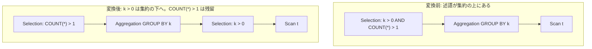

# push_selection_through_aggregation

- 状態: done   /   執筆基準リビジョン: `3880673` (2026-09-12)
- 定義位置: `plan/cascades.cpp` の `RuleSet::Default()`(登録式。ヘルパは
  `GroupingOutputs` / `RewriteThroughOutputs` / `ContainsAggregate`)

## 概要

`Selection(Aggregation(X), p)` のうち **GROUP BY キーだけに触れる連言** を
集約の下へ押し込む Rule です(登録コメントの FilterAggregateTranspose)。
集約に入る行が減る一方、HAVING 相当の集約後にしか評価できない連言は
上に残します。

## 変換前後の関係

`SELECT k, COUNT(*) FROM t GROUP BY k HAVING k > 0` のような形です
(HAVING は Aggregation の述語として表現されます)。



## 適用条件

パターンは `Selection(Aggregation(Any(), "agg"))` で、`target` は
`kSelection` です。変換ラムダ内の条件は次のとおりです。

1. 子グループに実際に `kAggregation` の代替があること。
2. 連言を分解し、各連言について:
   - `RewriteThroughOutputs(conjunct, grouping)` で「grouping 出力への
     列参照」を下の式に書き換えられること。`grouping` は
     `GroupingOutputs` が集めた「集約関数を含まない出力」(GROUP BY
     キー)です。
   - 書き換え結果に集約関数が含まれないこと(`!ContainsAggregate(*rewritten)`)。
   - この 2 つを満たす連言だけが `pushed` に入り、そうでないものは
     `residual` に残ります。
3. `pushed` が空なら発火しない(押せるものが無い)。
4. 派生グループ(`sel-below-agg:`、`agg-after-sel-push:`)が自分自身・
   既存の子と一致しないこと(循環防止)。

```cpp
            for (const Expression& conjunct :
                 SplitConjuncts(*expression.predicate)) {
              std::optional<Expression> rewritten =
                  RewriteThroughOutputs(conjunct, grouping);
              if (rewritten && !ContainsAggregate(*rewritten)) {
                pushed.push_back(*rewritten);
              } else {
                residual.push_back(conjunct);
              }
            }
```

## 意味論的根拠とグループキー保存

登録直前のコメントに条件と残留の意味が書かれています。

```cpp
    // Selection(Aggregation(X), p) for conjuncts that only mention grouping
    // keys: push them below the aggregate (FilterAggregateTranspose). Residual
    // HAVING conjuncts stay above.
```

- **GROUP BY キーだけの連言に限る理由**。GROUP BY キー `k` の値は、
  グループ内のどの行も同一である(グループの定義)ため、
  「グループ単位の条件 `k > 0`」は「入力行単位の条件 `k > 0`」に等価に
  前倒しできます。逆に `COUNT(*) > 1` のような集約関数を含む条件は、
  集約結果を見ないと評価できません。下に押すと評価材料が存在しない時点の
  判定となり、結果が変わります(1 行しかないグループを、集約前に消して
  `COUNT(*) = 0` にしてしまう等の反例)。これが
  `ContainsAggregate` チェックの理由です。
- **出力名を書き換える理由**。Selection の述語は集約の出力列(別名)を
  参照します。下に置くには GROUP BY キーの元の式への参照に張り替える
  必要があり、これが `RewriteThroughOutputs` の役割です。書き換えに
  失敗した連言(対応する group key が無い列参照)は押せないため
  `residual` 行きです。
- **residual を捨てない理由**。押せない連言を落とすとフィルタが甘く
  なります。`residual` が空なら新しい Aggregation をそのまま外側グループ
  に置き、空でなければ「集約 → Selection(residual)」という 2 式を
  作って元の意味を完全に保ちます。

## 実装の詳細

押し込み先と、residual の扱い(`plan/cascades.cpp` の変換ラムダ)です。

```cpp
            memo.AddExpression(
                filtered,
                LogicalExpression{.operation = LogicalOperator::kSelection,
                                  .children = {input},
                                  .predicate = CombineConjuncts(pushed)});
            if (residual.empty()) {
              memo.AddExpression(
                  group,
                  LogicalExpression{.operation = LogicalOperator::kAggregation,
                                    .children = {filtered},
                                    .target_list = aggregation.target_list});
              continue;
            }
            // ...(省略: residual 用に集約を再作成し、その上に Selection(residual) を置く 2 つの AddExpression)...
```

- `filtered` は `sel-below-agg:` + 押し込み述語の指紋をタグに持つ派生
  グループで、その下には集約の入力 `input` が直接繋がります。
- `residual` が空でない場合、集約をもう一度(今度は `filtered` を子に)
  `agg-after-sel-push:` タグの派生グループに作り、その上に
  `Selection(residual)` を載せた式を外側グループに追加します。target list
  はどちらの集約も元のままなので、出力スキーマは変わりません。

## 最適化効果

適用後は集約の入力行が「GROUP BY キーの条件を通った行」に減り、
グループ形成・集約関数の累算コストが下がります。HAVING のうちキーに
関する部分だけでも下に落とせるのがこの Rule の価値で、完全な
HAVING(集約条件)は上に残ります。SQL フロントエンドが
`WHERE` / `HAVING` をどう論理プランに載せるかにかかわらず、
「集約の上の Selection」という形に正規化されていれば適用できる、
メモ上の書き換えとして独立性が高い Rule です。

## 関連 Rule との相互作用

- `having_to_filter_rewrite`: Aggregation が述語を自分の payload として
  持つ形を「集約 + 上位 Selection」の形にする Rule。この Rule の
  上流で発火すると、本 Rule が押し込める形になります。
- `push_selection_through_projection`: 同じ `RewriteThroughOutputs` を
  使う出力名の張り替え。
- `group_by_functional_dependency_reduction`: GROUP BY キーの縮約。本
  Rule で押し込まれた述語が参照するキーが縮約の影響を受ける点に注意が
  要ります(コード上の自動追従ではなく、等価な代替としてメモに並ぶ形での
  相互作用です)。

## 検証テスト

- `plan/cascades_test.cpp` の
  `CascadesTest.PushSelectionThroughAggregationFiltersGroupingKeys` —
  出力名 `k` を参照する述語が、下の列 `a.x` を参照する述語に張り替えられ、
  集約の入力側の Selection として現れることを検証します。
- `CascadesTest.DefaultRulesIncludePredicateAndProjectionTransforms` が
  既定 Rule セットへの登録を確認します。このテストの `Contains` 一覧には
  `push_selection_through_aggregation` が明示的に含まれています。
