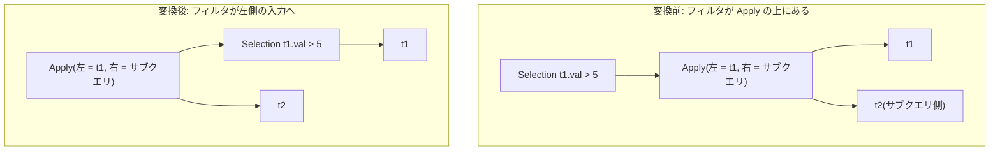

# push_selection_through_apply

- 状態: done   /   執筆基準リビジョン: `3880673` (2026-09-12)
- 定義位置: `plan/cascades.cpp` の `RuleSet::Default()`(`built.Add(Rule("push_selection_through_apply", …)`)
  登録式

## 概要

Apply の上のフィルタ(Selection)が**左側のリレーションの列だけを触る**とき、
フィルタを Apply の下(左側の入力)へ押し込む Rule です。登録前のコメント
「Push Selection(Apply(Left, Right)) below Apply when predicate touches only
Left relation」のとおり、左側だけに閉じた条件の下押し込みです。

## 変換前後の関係

`WHERE t1.val > 5`(Apply の左側が `t1`)の例です。



## 適用条件

パターンは `Selection(Any("input"))`、`target = kSelection` です。ガードは
次のとおりです。

(1) 述語を持ち、入力グループに `kApply`(子 2 個)の代替があること。

```cpp
          if (expression.operation != LogicalOperator::kSelection ||
              expression.children.size() != 1 || !expression.predicate ||
              !*expression.predicate) {
            return;
          }
```

```cpp
            if (apply_expr.operation != LogicalOperator::kApply ||
                apply_expr.children.size() != 2) {
              continue;
            }
```

(2) 述語が触れる列が**すべて左側グループのリレーション**に属すること。
1 つでも外れたら(右側の列、あるいは証明できない非修飾名)発火しません。
列に触れない定数述語(`TouchedColumns()` が空)の場合はループが何も拒否
しないため `only_left` が真のままになり、左側へ押し込まれます。

```cpp
            const auto& left_rels = memo.Get(left_id).relations;
            bool only_left = true;
            for (const auto& col : (*expression.predicate)->TouchedColumns()) {
              if (std::ranges::find(left_rels, col.schema) == left_rels.end()) {
                only_left = false;
                break;
              }
            }
            if (!only_left) {
              continue;
            }
```

(3) 左側のフィルタを載せる派生グループ(`sel_apply_left`)が、左側そのものや
自分自身と一致したらスキップします(循環自衛)。

発火しないケース: 述語が無い / Apply の代替が無い / 述語が右側(または
非修飾名)を触る、です。

## 意味論的根拠と相関スコープ

Apply は「左側の行ごとに右側を実行する」演算で、各左側行の出力への寄与は
独立しています。フィルタが左側の列だけを触るなら、「フィルタを通った左側行
について Apply を実行した結果」と「Apply を実行してからフィルタした結果」は
行の組として一致します(右側の実行結果にフィルタ条件は依存しないため)。
適用される回数が減るだけで、各行の判定は同じです。

- **右側の列を触る述語は押せません。** 右側の列は Apply の実行結果(または
  相関の結果)として初めて値が決まるため、下(左側の入力)には存在しません。
  押し込むと列が解決できず、意味も変わります。
- **非修飾名(`col` だけ)の列は押しません。** 列の所属は `col.schema`(修飾名)
  が左側リレーションに含まれるかで判定しており、スキーマ名が空の列は
  「左側に属する」と証明できません。第 1 部 30 章の
  `SelectionWithin` / `predicate_within_child` と同じ「証明できないものは
  適用しない」厳格解釈です。
- Apply の `join_type`(LeftOuter や Semi/Anti を含む)によらず成立します。
  LEFT で NULL 補完された行の左側部分は元の左側行の値を保つため、左側列
  へのフィルタの判定は変わりません。

## 実装の詳細

変換部は、左側フィルタの Selection を派生グループへ置き、新しい Apply を
外側グループへ追加する 2 つの `AddExpression` です。

```cpp
            memo.AddExpression(
                sel_left_group,
                LogicalExpression{.operation = LogicalOperator::kSelection,
                                  .children = {left_id},
                                  .predicate = expression.predicate});
            memo.AddExpression(
                group,
                LogicalExpression{.operation = LogicalOperator::kApply,
                                  .children = {sel_left_group, right_id},
                                  .predicate = apply_expr.predicate,
                                  .target_list = expression.target_list,
                                  .join_type = apply_expr.join_type,
                                  .output_schema = expression.output_schema});
```

- 新しい Apply は、元の Apply の条件・`target_list`・`join_type`・
  `output_schema` をそのまま引き継ぎ、左側の子だけをフィルタ済みグループへ
  付け替えます。
- 派生グループのタグ `sel_apply_left` は述語の指紋を含まない固定文字列です
  (`push_filter_through_sort` などの `filter-before-sort:<述語>` とは
  異なります)。複数の述語の押し込みが同じタグを使うと同じグループに
  式が追加されることになりますが、`Memo::AddExpression` の指紋による
  重複排除が働くため、同じ述語の再追加は抑えられます。異なる述語が同じ
  グループに別式として並ぶのは、どちらも「左側をフィルタした同じリレー
  ション集合」であるため契約上問題ありません(現状こうなっています)。

## 最適化効果

- Apply の反復回数が「フィルタ通過後の左側行数」に減ります。選択率の高い
  フィルタで効果が大きく、相関サブクエリを含むクエリの実行回数そのものを
  減らします。
- 押し込まれた Selection は、スキャンフィルタ統合(`push_selection_into_scan`)
  やインデックス選択の対象になります。

## 関連 Rule との相互作用

- `hoist_correlated_selection_to_apply`: 内側から条件へ相関を上げる Rule。
  こちらは外側(上)から左側へ条件を下ろす Rule です。
- `push_apply_through_join`: Apply を結合の下へ押し込む Rule。両方が
  成立する形では、左側フィルタの下押し込みと Apply 自体の移動が連鎖
  し得ます。
- `apply_to_join`: Apply が結合になったあとは、結合に対する標準的な
  プッシュダウン Rule(`push_selection_through_join` など)が役割を引き
  継ぎます。

## 検証テスト

- `plan/cascades_test.cpp` の `CascadesTest.PushSelectionThroughApply` —
  `t1.val > 5` の Selection が Apply の左側の子グループ内の Selection と
  して現れることを検証します。
- 右側の列を参照する述語に対する適用抑止テストは現行テストスイートには含まれていません。
