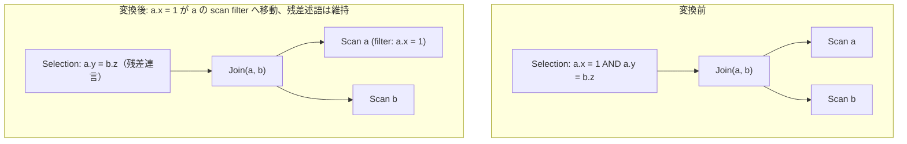

# push_selection_through_join

- 状態: draft / 執筆基準リビジョン: `3880673` (2026-09-12)
- 定義位置: `plan/cascades.cpp` の `RuleSet::Default()`（登録名 `"push_selection_through_join"`）

## 概要

`push_selection_through_join` は、内部結合ノードの直上に位置する選択演算 `Selection(Join(L, R), p)` の述語 `p` のうち、左オペランド（$L$）に属する単一関係のみを参照する連言を抽出し、該当するスキャングループの `scan filter` へ押し込む論理変換Ruleです。結合処理に入力されるデータ行数を削減し、結合の実行負荷を軽減します。

## 変換前後の関係

結合の上位にある述語から左辺単一表の条件をスキャンフィルタへと移動し、複数表を跨ぐ結合条件や右辺の述語は残差フィルタとして保持します。



## 適用条件

パターンは `Selection(Join(Any(), Any(), "input"))` です。DSL定義により `LogicalOperator::kJoin`（内部結合）にのみマッチし、`kOuterJoin`（外部結合）にはマッチしません。変換ラムダ内での判定手順は以下のとおりです（`plan/cascades.cpp`）。

```cpp
          std::unordered_set<std::string> left_relations;
          for (const LogicalExpression& join :
               memo.Get(bindings.at("input")).expressions) {
            if (join.operation != LogicalOperator::kJoin) {
              continue;
            }
            const std::vector<std::string>& relations =
                memo.Get(join.children[0]).relations;
            left_relations.insert(relations.begin(), relations.end());
          }
          PushSingleRelationConjuncts(
              memo, *expression.predicate, [&](const std::string& relation) {
                return left_relations.contains(relation);
              });
```

1. **子結合ノードの特定**: `input` Groupに属する式の中から、2つの子ノードを持つ `kJoin` ノードを探索します。
2. **左辺関係集合の収集**: 左子ノード（0番目の子）に含まれる関係名一覧を収集し、押し込み対象の許可リストとします。
3. **単一関係連言の抽出**: ヘルパー関数 `PushSingleRelationConjuncts` を呼び出し、左辺関係のみに閉じた連言をスキャンフィルタへ転送します。

押し込み対象となる連言の条件は以下のとおりです。

- 連言が参照する列のうち、スキーマ名で修飾された関係名の集合が単一であり、かつ左辺関係許可リストに含まれること。未修飾の列名を含む連言は帰属が未確定であるため、押し込みを行わず残差として保持します。
- 複数表を参照する `OR` 式に対しては、`PushOrLocalConditions` を用いて表ごとの局所条件の抽出を試みます。抽出に成功した場合でも、元の `OR` 連言自体は残差として上位Selectionに残します。

## 意味論的根拠と安全性

本Ruleの設計根拠は登録コードのコメントに明記されています。

```cpp
    // Selection(Join(L, R), p) with p touching only relations of L: move the
    // single-relation conjuncts of p into the scan groups of that side. The
    // Selection keeps applying whatever could not be pushed (idempotent).
    // Guard rail: no outer-join pushdown until null-rejection analysis.
```

内部結合においては、片側の入力行を事前にフィルタリングしても結合結果の集合は変化しません。たとえば `a.x = 1` は結合前後で同一の行を絞り込むため、スキャン段階で評価しても安全です。一方、`a.y = b.z` のように両表を参照する述語を事前にスキャンへ適用することは不可能です。

未修飾の列名を押し込み対象から除外するのは、同名列が存在する場合に誤った表へ述語が割り当てられるリスクを排除するためです。また、本Ruleは左側入力への押し込みに特化しており、右側を含む双方向の一般化押し込みは `split_selection_over_join` が担当します。

外部結合ノードに対して本Ruleが適用されない構造となっているのは、NULL補完行の破棄特性（null-rejection）に関する静的解析が未実装であるためです。左外部結合において左辺の述語を不用意にスキャンへ押し込むと、保持すべき外部結合行が消失する危険があります。

## 実装の詳細

押し込みの中核処理は `PushSingleRelationConjuncts`（`plan/cascades.cpp`）に実装されています。

```cpp
std::vector<Expression> PushSingleRelationConjuncts(
    Memo& memo, const Expression& predicate,
    const std::function<bool(const std::string&)>& relation_enabled) {
  std::vector<Expression> residual;
  for (const Expression& conjunct : SplitConjuncts(predicate)) {
    std::unordered_set<std::string> touched;
    for (const ColumnName& column : conjunct->TouchedColumns()) {
      if (!column.schema.empty()) {
        touched.insert(column.schema);
      }
    }
    if (touched.size() == 1 && relation_enabled(*touched.begin())) {
      memo.MergeScanFilter(memo.EnsureGroup({*touched.begin()}), conjunct);
      continue;
    }
    // ...(複数表 OR の局所条件抽出 PushOrLocalConditions)...
    residual.push_back(conjunct);
  }
  return residual;
}
```

- `SplitConjuncts` により述語を連言単位に分割し、単一の許可関係に閉じる連言を `MergeScanFilter` によりスキャングループへマージします。
- 本Ruleは `PushSingleRelationConjuncts` の戻り値（残差述語）を破棄し、既存のSelectionノードをそのまま維持します。スキャンフィルタと上位Selectionで同一の述語が重複評価されたとしても、フィルタ演算は冪等であるため論理的矛盾は生じません。

## 最適化効果

左側のスキャン段階でフィルタが適用されるため、結合ノードへ供給される入力タプル数が早期に削減されます。これにより、ハッシュ結合におけるプローブ処理やネステッドループ結合の反復回数が大幅に削減され、クエリ実行全体のレイテンシが改善されます。また、押し込まれた述語によってスキャン側でのインデックスアクセスが誘発されます。

## 関連Ruleとの相互作用

- `split_selection_over_join`: 左右両方の入力に対して連言を分解・押し込みを行う一般化Rule。同一の `MergeScanFilter` ロジックを共有します。
- `push_selection_into_scan`: スキャンノードの直上に位置するSelectionをマージするRule。本Ruleによって生成された中間状態を最終的なスキャン属性へと統合します。
- `merge_selections` / `merge_adjacent_filters`: 述語の正規化と単一化を行い、連言分解の効率を向上させます。

## 検証テスト

- `plan/cascades_test.cpp`:
  - `CascadesTest.PushSelectionThroughJoinMovesSingleRelationConjuncts`: 単一表連言 `a.x = 1` がスキャンフィルタにマージされ、結合条件 `a.y = b.z` が残差として上位Selectionに残ることを検証。

