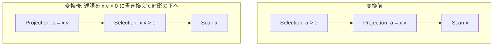

# push_selection_through_projection

- 状態: done   /   執筆基準リビジョン: `3880673` (2026-09-12)
- 定義位置: `plan/cascades.cpp` の `RuleSet::Default()`(登録式。述語の書き換えは
  ヘルパ `RewriteThroughOutputs` / `OutputMatchesColumn` に委譲)

## 概要

`Selection(Projection(X), p)` の述語 `p` を「射影の出力名 → X の下の式」へ
書き換えて、`Projection(Selection(X, p'))` に置き換える Rule です
(登録コメントの FilterProjectTranspose)。フィルタを射影の下に移すことで、
射影の式評価・出力行コピーの前に不要行を弾けます。

## 変換前後の関係

`SELECT v AS a FROM x WHERE a > 0` のような形(x の下に列 v があると
します)。



Memo 上では `sel-below-proj:` タグの派生グループに書き換え済みの
Selection を追加し、外側グループには元の target list を維持した
`Projection` を追加します。

## 適用条件

パターンは `Selection(Projection(Any(), "proj"))` で、`target` は
`kSelection` です。変換ラムダ内の条件は次のとおりです。

1. 子グループに実際に `kProjection` の代替があること。
2. 述語全体が `RewriteThroughOutputs` で書き換え可能なこと
   (`std::nullopt` なら発火しない)。述語中の列参照がすべて、射影の
   出力と「修飾名で一致」する必要があります。
3. 派生グループ(`sel-below-proj:` + 書き換え後の述語の指紋)が外側
   グループ自身でも射影の子でもないこと(循環防止)。

```cpp
            std::optional<Expression> rewritten = RewriteThroughOutputs(
                *expression.predicate, projection.target_list);
            if (!rewritten) {
              continue;
            }
```

## 意味論的根拠と式の参照透過性

書き換えを担う `RewriteThroughOutputs` の列照合は、
`OutputMatchesColumn`(`plan/cascades.cpp`)で行われます。ここに
guard の理由がコメントで書かれています。

```cpp
  // Qualified-name matching only.  A bare-name fallback (output "a" vs
  // predicate column t2.a) rewrites the predicate onto the FIRST output
  // named "a" -- possibly a different relation's column -- and pushes the
  // filter below the projection against the wrong data.
  if (!output.name.empty() && output.name == column.ToString()) {
    return true;
  }
  if (output.expression && output.expression->Type() == TypeTag::kColumnValue) {
    const ColumnName& source =
        output.expression->AsColumnValue().GetColumnName();
    return source == column;
  }
  return false;
```

- **曖昧な名前で一致させない理由**。出力名 `a` と述語の列 `t2.a` を
  「名前が同じだから」と緩く照合すると、別のリレーションの列を指す
  1 番目の出力に述語を張り替え、**誤ったデータに対するフィルタ** を
  射影の下に押し込む事故になります。照合は(1) 出力の別名が列参照の
  `ToString()` と完全一致、または(2) 出力式が列参照で、その
  `ColumnName` が完全一致、の 2 つの厳密なケースだけです。
- **書き換えに失敗したら発火しない理由**。`RewriteThroughOutputs` は
  再帰的に子式を書き換え、どれか 1 つでも対応する出力が見つからなければ
  `std::nullopt` を返します。部分的な書き換え(見つからない列をそのまま
  残す)は「下に届かない列参照を含む述語」を下に置くことになり、評価時に
  列が見つからない破綻を生みます。全か無か(all-or-nothing)です。
- **循環防止**。派生グループが自分自身・射影の子と一致する場合は
  無限再適用・自己参照になるため拒否します(transposition 系 Rule の
  共通自衛)。

## 実装の詳細

述語の書き換えコアは `RewriteThroughOutputs`(`plan/cascades.cpp`)です。

```cpp
std::optional<Expression> RewriteThroughOutputs(
    const Expression& expression,
    const std::vector<NamedExpression>& outputs) {  // NOLINT(misc-no-recursion)
  if (!expression) {
    return expression;
  }
  if (expression->Type() == TypeTag::kColumnValue) {
    const ColumnName& column = expression->AsColumnValue().GetColumnName();
    for (const NamedExpression& output : outputs) {
      if (OutputMatchesColumn(output, column)) {
        return output.expression;
      }
    }
    return std::nullopt;
  }
  // ...(省略: 子式への再帰適用。1 つでも nullopt なら全体を nullopt)...
  return WithExpressionChildren(expression, std::move(rewritten));
}
```

列参照は「対応する出力式で置換」されます。つまり出力が計算式
(`a = x.v * 2` など)でも、述語はその式そのもので書き換えられます。
この点が本 Rule の「意味保存」の要です — 述語は**射影後の値**を参照して
いたので、下に置くなら**同じ値を生む式**に張り替える必要があります。

変換の残り半分は新しい Projection を作る部分です。

```cpp
            memo.AddExpression(
                group,
                LogicalExpression{.operation = LogicalOperator::kProjection,
                                  .children = {filtered},
                                  .target_list = projection.target_list});
```

外側グループには**元の target list をそのまま**持つ Projection を追加し
ます。グループの出力スキーマ(列名)を変えないため、上位の式は何も
気がつかず等価な代替として選べます。

## 最適化効果

適用後は `Projection(Selection(X, p'))` が選べます。射影の式評価(計算
列)と出力行の組立を、フィルタで減った行にだけ行えばよくなります。
計算コストの高い射影式ほど効果が大きく、`p'` が SARG 可能なら
`push_selection_into_scan` を通じて scan filter に合流し、インデックス
走査にも繋がります。逆に言うと、フィルタの行数がほぼ減らない(選択率が
悪い)場合は、式を含む述語を何度も評価する形になり得るため、これは
コスト比較に委ねられる「もう 1 つの等価代替」です。

## 関連 Rule との相互作用

- `push_selection_into_scan`: 書き換え後の Selection がスキャン直下に
   来れば filter へ合流します。
- `merge_projections` / `merge_adjacent_projections`: 本 Rule が作った
  Projection と既存 Projection が隣接した場合に統合します。
- `push_selection_through_aggregation`: 同じ `RewriteThroughOutputs` を
  使う隣接ルール(集約の出力名から group key への書き換え)。
- `push_projection_through_join`: 射影をさらに下へ動かす列剪定 Rule と
  連鎖します。

## 検証テスト

- `plan/cascades_test.cpp` の
  `CascadesTest.PushSelectionThroughProjectionRewritesPredicate` —
  出力別名を参照する述語が、下の列を参照する述語に張り替えられた
  Selection を子に持つ代替が作られることを検証します。
- `CascadesTest.DefaultRulesIncludePredicateAndProjectionTransforms` が
  既定 Rule セットへの登録を確認します。このテストの `Contains` 一覧には
  `push_selection_through_projection` が明示的に含まれています。
