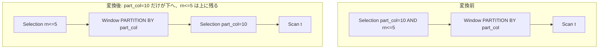

# push_selection_through_window

- 状態: done   /   執筆基準リビジョン: `3880673` (2026-09-12)
- 定義位置: `plan/cascades.cpp` の `RuleSet::Default()`(`built.Add(Rule("push_selection_through_window", …)`)
  登録式

## 概要

Window の上のフィルタ(Selection)の連言のうち、**PARTITION BY 列だけを触る
ものを Window の下へ押し込む** Rule です。登録前のコメントが条件を述べて
います。

```cpp
    // push_selection_through_window: Push Selection conjuncts that reference
    // only PARTITION BY columns below the Window operator.
```

フィルタの一部だけ押せる場合は、押せる部分だけ下へ置き、残りは上に
Selection として残す部分押し込みに対応しています。

## 変換前後の関係

`WHERE part_col = 10 AND rn <= 5`(`part_col` は PARTITION BY 列、`rn` は
ウィンドウ出力)の例です。



全連言が押せる場合(残りなし)は、上の Selection は消えて
`Window(Selection(X))` だけになります。

## 適用条件

パターンは `Selection(Any("input"))`、`target = kSelection` です。ガードは
次のとおりです。

(1) 述語を持ち、入力グループに `kWindow`(子 1 個、**PARTITION BY が空で
ない**)の代替があること。

```cpp
            if (win_expr.operation != LogicalOperator::kWindow ||
                win_expr.children.size() != 1 ||
                win_expr.partition_by.empty()) {
              continue;
            }
```

(2) PARTITION BY 式が**単純な列参照**(`kColumnValue`)であるものだけを
パーティション列の集合に加えます。式(例: `p + 1`)は列集合に寄与しません。
列参照が 1 つも集まらなければ発火しません。

```cpp
            std::unordered_set<std::string> partition_cols;
            for (const auto& p : win_expr.partition_by) {
              if (p && p->Type() == TypeTag::kColumnValue) {
                const auto& c = p->AsColumnValue().GetColumnName();
                partition_cols.insert(c.ToString());
                partition_cols.insert(c.name);
              }
            }
```

(3) 連言の各項は次の全てを満たすとき「押せる」になります。

```cpp
              bool can_push = true;
              auto touched = conjunct->TouchedColumns();
              if (touched.empty()) {
                can_push = false;
              }
              for (const auto& col : touched) {
                if (window_outputs.contains(col.name) ||
                    (!partition_cols.contains(col.ToString()) &&
                     !partition_cols.contains(col.name))) {
                  can_push = false;
                  break;
                }
              }
```

- 触れる列が 1 つもない(定数述語など)場合は押しません。
- 触れる列が 1 つでも**ウィンドウの出力名**(`rn` など)であれば押しません。
- 触れる列が 1 つでもパーティション列(修飾名・非修飾名のどちらでも)に
  含まれなければ押しません。

(4) 押せる項が 1 つもなければ発火しません。派生グループ
(`win_part_push:<押せる連言>`)の循環チェックもあります。

## 意味論的根拠とパーティション独立性

ウィンドウ関数の値は「同じパーティション内の行たち」だけで決まります。
PARTITION BY 列でフィルタしても**パーティションの構成員が変わらない**
(1 つのパーティションの中から条件を満たす行が抜けるだけ)ため、下で
フィルタしても上のウィンドウ関数の値は 1 つも変わりません。これが意味保存の
論拠です。

- **ウィンドウ出力列(`rn` 等)でのフィルタは押せません。** `rn <= 5` は
  ウィンドウ関数の計算結果があって初めて評価できる条件で、下に押すと
  その列が存在しないためです(押してしまうと結果が変わる、というより評価
  自体が不能です)。`window_outputs` チェックがこれを遮ります。
- **非パーティション列でのフィルタは押せません。** `WHERE v > 10` を下へ
  押すと、パーティション内の行の一部が欠け、ウィンドウ関数の値(例:
  `SUM(v) OVER (PARTITION BY p)`)が変わります。行数制限と同じく、ウィンドウ
  は「全パーティション行」を見る演算子なので、下押し込みは一般に意味を
  変えます。
- 定数述語(`1 = 1` など、列を触らない)は押していません。押しても無害
  ですが、価値もないためです(現状こうなっています)。

部分押し込みの残差処理の正確さにも注意が必要です。押せなかった項は
**元の意味のまま上に残る**ため、全体として元のフィルタと同じ行集合です。

## 実装の詳細

押せる項だけを下に置く部分です。

```cpp
            memo.AddExpression(
                win_child_filtered,
                LogicalExpression{.operation = LogicalOperator::kSelection,
                                  .children = {win_child},
                                  .predicate = CombineConjuncts(pushable)});

            if (remaining.empty()) {
              LogicalExpression new_win = win_expr;
              new_win.children = {win_child_filtered};
              memo.AddExpression(group, std::move(new_win));
            } else {
              const GroupId new_win_group = memo.EnsureDerivedGroup(
                  memo.Get(input_id).relations, "win_pushed");
```

- `remaining` が空なら、Window をそのままフィルタ済みの子に付け替えた式を
  外側グループへ追加します(上の Selection はこの代替では消えます)。
- `remaining` が空でなければ、Window を載せた派生グループ(`win_pushed`)を
  経由して、残りの連言を上に被せた形を外側グループへ追加します
  (`memo.AddExpression(group, …)` で `Selection(new_win_group, remaining)`)。
- 派生グループのタグ `win_part_push:<連言>` は押し込む述語を指紋に含むため、
  別の述語の押し込みが同じ下位グループに混線しません。

なお、兄弟 Rule `window_after_filter_partition_pushdown` は同じ「パーティ
ション列へのフィルタの下押し込み」を、(a) PARTITION BY 式の `TouchedColumns()`
から列を集める(式 `p+1` も列 `p` を供給する)、(b) 全連言が押せるときだけ
全体を押す、という異なる切り口で実装されています。どちらも代替として追加
されるため、探索に併存します。

## 最適化効果

- パーティション列のフィルタ選択率が高い場合、ウィンドウ計算の入力行が
  減り、パーティション構築の成本が下がります。
- 押し込まれた Selection は、スキャンフィルタへの統合
  (`push_selection_into_scan`)やインデックス選択の材料にもなります。

## 関連 Rule との相互作用

- `window_after_filter_partition_pushdown`: 同方向の兄弟 Rule(列の集め方と
  部分押し込みの扱いが違う。上記参照)。
- `rank_row_number_to_topn`: ウィンドウ出力(`rn`)でのフィルタは下に押せない
  代わりに、条件が揃えば TopN への変換で処理されます。
- `no_op_window_elimination`: フィルタとウィンドウの組み合わせの簡約の
  うち、ウィンドウ結果自体が不要な場合を扱います。

## 検証テスト

- `plan/cascades_test.cpp` の
  `CascadesTest.PushSelectionThroughWindowOnPartitionColumns` —
  `part_col = 10 AND rn <= 5` のうち `part_col = 10` が Window の下の
  Selection として現れる(部分押し込み)ことを検証します。
- 本ルールの単体登録確認テストは個別には定義されていません。
