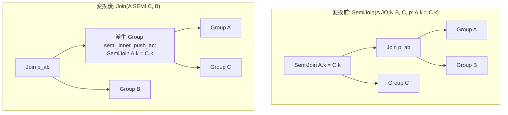

# push_semi_join_through_inner_join

- 状態: done   /   執筆基準リビジョン: `3880673` (2026-09-12)
- 定義位置: `plan/cascades.cpp` の `RuleSet::Default()`(`built.Add(Rule("push_semi_join_through_inner_join", …)`)
  登録式。ヘルパは `UnionRelations` / `EnsureDerivedGroup`。

## 概要

`(A JOIN B ON p_ab) SEMI JOIN C ON p_semi` という形で、semi join の条件
`p_semi` が片側の入力(A または B)と C だけに触るとき、semi join を
内部結合の下へ押し込みます。`p_semi` が A と C だけに触れるなら
`A SEMI JOIN C` を先に済ませてから B と結合しても、通過する (A, B) ペアは
同じだからです。

## 変換前後の関係



`p_semi` が B と C だけに触れる場合は対称に、
`A JOIN (B SEMI JOIN C)` が作られます。

## 適用条件

パターンは `SemiJoin(Any("inner_join"), Any("c"))` で、対象演算子は
`LogicalOperator::kSemiJoin` です。登録コメントが 2 つの変換先を列挙します。

```cpp
    // push_semi_join_through_inner_join: (A JOIN B ON p_ab) SEMI JOIN C ON
    // p_semi -> (A SEMI JOIN C ON p_semi) JOIN B ON p_ab (if p_semi touches
    // only A and C) or A JOIN (B SEMI JOIN C ON p_semi) ON p_ab (if p_semi
    // touches only B and C).
```

guard の列挙は次のとおりです。

- 式が `kSemiJoin` で子 2 個であること。
- `inner_join` グループ内の式のうち `kJoin`(子 2 個)だけが候補。
- semi 側の述語 `p_semi` が存在すること。
- `p_semi` が触れるすべての列が A・B・C のいずれかに属すること
  (`touches_only_valid`。範囲外の列があれば不発)。
- 分類結果が「A のみ + C」(`touches_a && !touches_b`)か
  「B のみ + C」(`touches_b && !touches_a`)のときだけ変換します。
  **A と B の両方に触れる述語はどちらの分岐にも入らず不発**です。
  C の列だけに触れる述語(`touches_a` も `touches_b` も偽)も同様に
  どちらの分岐にも入らず不発します。
- 派生グループ(`"semi_inner_push_ac"` または `"semi_inner_push_bc"`)が
  自グループ・片側の入力グループと同一でないこと(`continue`)。

## 意味論的根拠と準結合の結合律

semi join の意味は「C にマッチする行だけを probe 側から残す」です。
`p_semi` が A の列だけに触れるとき、ある (a, b) ペアが semi を通過できるか
は b に依存しません — a のマッチ有無だけで決まります。したがって
「(A JOIN B) の行を残すか」は「A の行を残すか」と一致し、semi を A の下に
押し込んでも通過するペア集合は変わりません。

逆に `p_semi` が A と B の **両方**に触れるとき、行の生存がペア全体の値に
依存するため、片側だけへの押し込みは意味を変えます。例えば
`p_semi = (A.k = C.k AND B.k = C.k)` を `A SEMI C` に落とすと、
「A だけが C にマッチして B がしないペア」が誤って生き残ります。
両方に触れるケースが分岐から漏れているのはこのためで、guard が
暗黙の不発として機能しています。

範囲外の列チェック(`touches_only_valid`)は防御的な gate です。
接続した Memo では通常起きませんが、列の修飾が解決できない等で
所属が不明なときに発火すると、押し込んだ先で述語が評価できなくなります。

## 実装の詳細

列の所属分類は次のループで行います。

```cpp
            bool touches_b = false;
            bool touches_a = false;
            bool touches_only_valid = true;
            for (const auto& col : (*expression.predicate)->TouchedColumns()) {
              bool in_a = std::ranges::find(a_rels, col.schema) != a_rels.end();
              bool in_b = std::ranges::find(b_rels, col.schema) != b_rels.end();
              bool in_c = std::ranges::find(c_rels, col.schema) != c_rels.end();
              if (in_a) {
                touches_a = true;
              }
              if (in_b) {
                touches_b = true;
              }
              if (!in_a && !in_b && !in_c) {
                touches_only_valid = false;
                break;
              }
            }
```

「A のみ」側の変換は、派生グループに `SemiJoin(A, C)` を入れ、
自グループには元の内部結合条件 `p_ab` を使った `Join(ac_group, B)` を
追加します。

```cpp
            if (touches_a && !touches_b) {
              const GroupId ac_group = memo.EnsureDerivedGroup(
                  UnionRelations(a_rels, c_rels), "semi_inner_push_ac");
              if (ac_group == group || ac_group == a_id || ac_group == c_id) {
                continue;
              }
              memo.AddExpression(
                  ac_group,
                  LogicalExpression{.operation = LogicalOperator::kSemiJoin,
                                    .children = {a_id, c_id},
                                    .predicate = expression.predicate,
                                    .target_list = expression.target_list,
                                    .output_schema = expression.output_schema});
```

「B のみ」側は対称です(`"semi_inner_push_bc"` に `SemiJoin(B, C)`、
自グループに `Join(A, bc_group)`)。

- 自グループに追加されるのは `kJoin` で、述語は **内部結合の**
  `join_expr.predicate` です。semi 側の述語 `p_semi` は派生グループの
  semi join に移動するため、述語の適用回数が 2 重化・消失しません。
- 派生グループのキーは `UnionRelations(a_rels, c_rels)`(関係集合の和) +
  タグなので、同じ (A, C) への別の semi join 式も 1 つの派生グループに
  集約されます。

## 最適化効果

適用後の Group には「結合の上の semi」と「押し込んだ semi」の 2 代替が
並びます。押し込み側は、C とのマッチ判定を A(または B)の行数分だけで
済ませ、内部結合の入力を先に間引けます。中間の (A, B) ペアが大きい
(たとえば B が増幅する)ケースでは、B との結合前に A を間引けることが
大きな利得になります。一方で semi join が深くなる分、C 側の build が
複数回必要になるなどの不利もあり、選択はコスト比較に委ねられます。

## 関連 Rule との相互作用

- `semi_join_commutativity` / `semi_join_inner_join_reorder`:
  semi join の probe / build の入替や、内部結合との順序交換を行う
  兄弟 Rule です。本 Rule と合わせて「semi join を含む結合木の順序探索」
  を構成します。
- `apply_to_join`: 相関サブクエリが `EXISTS` 等から semi join に
  デコレーションされる経路で、生成された semi join が本 Rule の
  入力になります。
- `unique_semi_to_inner` / `semijoin_to_inner_plus_distinct`:
  押し込まれた semi join がさらに内部結合へ降格できる局面を拾います。

## 検証テスト

- `plan/cascades_test.cpp` の `CascadesTest.PushSemiJoinThroughInnerJoin` —
  `(t1 JOIN t2) SEMI t3`(述語は t1 と t3 に触れる)を探索し、
  `SemiJoin(t1, t3)` を左子に持つ `kJoin` 代替が現れることを検証します。
- `CascadesTest.DefaultRulesIncludePredicateAndProjectionTransforms` —
  `rules.Contains("push_semi_join_through_inner_join")` による既定
  セットへの登録確認。
