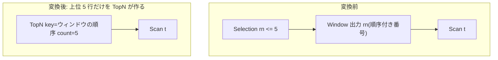

# rank_row_number_to_topn

- 状態: done   /   執筆基準リビジョン: `3880673` (2026-09-12)
- 定義位置: `plan/cascades.cpp` の `RuleSet::Default()`(`built.Add(Rule("rank_row_number_to_topn", …)`)
  登録式。D5 ゲートつき Rule で、反例テストが `plan/cascades_test.cpp` と
  docs/cascades_optimizer.md の D5 監査表に記録されています

## 概要

`Selection(Window(X), rn <= N)` — ウィンドウ関数で振った番号によるフィルタ —
を、**ウィンドウが PARTITION BY を持たず、フィルタがそのウィンドウ自身の
出力列に掛かっているときに限り** `TopN(X)` へ変換する Rule です。全行に番号を
振ってから絞り込む代わりに、並べ替えながら上位 N 行だけを作ればよくなり
ます。

```cpp
    // rank_row_number_to_topn: Transform Selection(Window(X), col <= N) into
    // TopN when ordering matches window order.
```

## 変換前後の関係

`WHERE rn <= 5`(`rn` は `row_number() OVER (ORDER BY ...)` の出力)の例です。



`WHERE rn = 3` の場合は `TopN(count=1, offset=2)` になります(3 番目の行だけ、
先頭 2 行を飛ばす)。

## 適用条件

パターンは `Selection(Any("input"))`、`target = kSelection` です。ガードは
変換ラムダ内に連なります。

(1) 入力グループに `kWindow`(子 1 個)の代替があり、**PARTITION BY が空**
であること。コードコメントが D5 ゲートであることを明示しています。

```cpp
            // D5 gate: TopN is only valid for row_number/rank without
            // PARTITION BY. A partitioned window requires per-partition
            // numbering which a single TopN cannot provide.
            if (!win_expr.partition_by.empty()) {
              continue;
            }
```

(2) ウィンドウの順序仕様が TopN として複写可能であること。`target_list` が
空でなく、キー数と昇降フラグ数が一致(`target_list.size() ==
sort_ascending.size()`)しなければ発火しません。コードコメントが D5 ゲート
であることを明示しています。

```cpp
            // D5 gate (sort keys): the TopN below copies the window's ORDER
            // BY as its own keys. The optimizer builds kWindow nodes with a
            // target list of window calls and no per-key directions, so a
            // mismatched (or empty) sort_ascending must refuse the rewrite:
            // AddExpression CHECK-fails on the size mismatch, and TopN
            // cannot evaluate a WindowFunctionCall target row-at-a-time.
            if (win_expr.target_list.empty() ||
                win_expr.target_list.size() != win_expr.sort_ascending.size()) {
              continue;
            }
```

(3) フィルタが触れる列が**ウィンドウ自身の出力列**に含まれること。これも
コメントつきの D5 ゲートです。

```cpp
            // D5 gate ("列出自を検証する"): the TopN limit is only sound
            // when the Selection filters on the window's OWN output column
            // (e.g. rn).  A predicate on any other column would truncate
            // rows the window ranking never counted on.
```

具体的には、述語全体が単一の連言(`SplitConjuncts` の結果が 1 項)で、その
1 項が `col(列) <op> 定数`(`<=` / `<` / `=`)であり、列名がウィンドウの
`target_list` の出力名に一致し、定数が `kInt64` であることを見ます。
複数連言の述語では発火しません(残差の再適用は行わず、述語全体がちょうど
1 つの番号 bound であるときだけ置き換える設計です)。

(3) 定数が正でない場合の防御。`rn <= 0` や `rn < 1` は 1 行も残さないのに、
`size_t` への変換で巨大な上限に化けるのを防ぎます。

```cpp
                    // A non-positive bound means the Selection keeps no row
                    // (or is unsatisfiable): converting it through size_t
                    // would wrap into a limit of SIZE_MAX and emit every
                    // row.  Refuse the rewrite; the runtime predicate still
                    // applies the exact semantics.
```

`<=` は定数 > 0、`<` は定数 > 1、`=` は定数 >= 1 のときだけ変換します。
最終的に `limit_val > 0` のときのみ TopN を追加します。

## 意味論的根拠と順序・境界条件

- **PARTITION BY 禁止**: パーティション付きウィンドウの番号は
  「パーティションごとの 1 からの連番」です。全体を 1 個の TopN で切り詰めると
  各パーティションの番号付けに必要な行が失われ、`rn <= N` を満たすべき
  パーティション内の行が落ちます。反例テスト
  `RankRowNumberToTopNSkipsPartitionedWindow` が不発を固定しています。
- **出力列へのフィルタ限定**: フィルタがウィンドウの出力でない列(たとえば
  元テーブルの `salary`)に掛かっている場合、切り詰めは「番号で切る」のでは
  なく「別の属性で切る」ことになり、番号付けが前提とした行集合を壊します。
  反例テスト `RankRowNumberToTopNSkipsNonWindowColumn` が不発を固定しています
  (D5 表では「window has no PARTITION BY and the Selection filters the
  window's own output column」が必須前提として記載)。
- **非正境界の拒否**: `rn <= 0` の Selection は空を返しますが、誤って
  `size_t` に丸めると `SIZE_MAX` 行の TopN(全行出力)になり、正反対の結果に
  なります。テスト `RankRowNumberToTopNRejectsNonPositiveBounds` が固定して
  います。
- `rn = k` は「k 番目の行ちょうど 1 行」なので `TopN(limit=1, offset=k-1)` に
  なります。過去の実装では `limit=1, offset=0`(1 番目を返す誤り)があった
  ことがテスト `RankRowNumberToTopNEqualsUsesOffsetForKthRow` のコメントに
  記録されています。

なお、述語が複数の連言を持つ場合や、番号 bound 以外の連言が混ざる場合は
発火しません。置き換えは Selection 全体を TopN 1 個に替える形なので、残差の
連言を引き継がない以上、単一 bound の述語だけが対象です(元の Selection も
代替として残るため、探索は両方を比較します)。

## 実装の詳細

境界の読み取りと変換です。演算子ごとに limit/offset を決めます。

```cpp
                    const bool positive =
                        binary.Op() == BinaryOperation::kLessThanEquals
                            ? val.value.int_value > 0
                        : binary.Op() == BinaryOperation::kLessThan
                            ? val.value.int_value > 1
                            : val.value.int_value >= 1;
                    if (binary.Op() == BinaryOperation::kEquals) {
                      // rn = k keeps exactly 1 row (the k-th ranked row),
                      // skipping k-1.
                      limit_val = 1;
                      limit_offset =
                          static_cast<size_t>(val.value.int_value - 1);
                    } else if (positive) {
```

生成される TopN は、ウィンドウの順序仕様(`target_list`・`sort_ascending`・
`sort_nulls_first`)と `limit_count` / `limit_offset` を引き継ぎ、ウィンドウの
**子**に直接繋がります。

```cpp
            if (limit_val > 0) {
              memo.AddExpression(
                  group, LogicalExpression{
                             .operation = LogicalOperator::kTopN,
                             .children = {child_id},
                             .target_list = win_expr.target_list,
                             .sort_ascending = win_expr.sort_ascending,
                             .sort_nulls_first = win_expr.sort_nulls_first,
                             .limit_count = limit_val,
                             .limit_offset = limit_offset,
                             .output_schema = expression.output_schema});
            }
```

## 最適化効果

- 全行へのウィンドウ評価(番号付け)がなくなり、上位 N 行の探索
  (物理 `topn`)に置き換わります。メモリと時間の両方が大幅に減ります。
- ウィンドウは全入力を材料化して順序付ける必要があるのに対し、TopN は
  k 行のヒープで済みます。

## 関連 Rule との相互作用

- `split_window` / `merge_adjacent_windows`: ウィンドウの形状を整える
  Rule。複数スペックのウィンドウが分割・融合された後の出力名に対して
  本 Rule の出力列チェックが働きます。
- `no_op_window_elimination`: ウィンドウ結果が不要なら Window を消す
  Rule。本 Rule は「結果が必要だが、目的が上位 N 行」の場合に Window を
  TopN へ置き換えます。
- `limit_push_through_sort`: こちらは明示的な ORDER BY + LIMIT から TopN を
  作る Rule。本 Rule は WHERE の rn フィルタから作る点が異なります。

## 検証テスト

- `plan/cascades_test.cpp` の `CascadesTest.RankRowNumberToTopNRewrite` —
  `rn <= 5` が `count=5` の TopN になる正面ケース。
- `CascadesTest.RankRowNumberToTopNSkipsPartitionedWindow` /
  `CascadesTest.RankRowNumberToTopNSkipsNonWindowColumn` — D5 反例テスト
  (docs/cascades_optimizer.md の D5 監査表に記載)。
- `CascadesTest.RankRowNumberToTopNRejectsNonPositiveBounds` — 非正境界で
  TopN が生成されないことを 3 パターンで検証。
- `CascadesTest.RankRowNumberToTopNEqualsUsesOffsetForKthRow` —
  `rn = 3` が `limit=1, offset=2` になることを検証。
