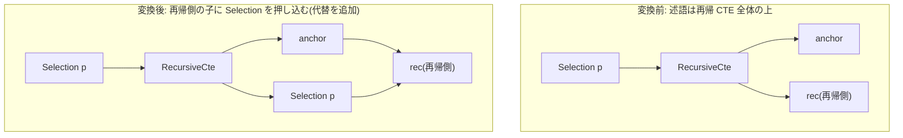

# recursive_termination_predicate_pushdown

- 状態: done   /   執筆基準リビジョン: `3880673` (2026-09-12)
- 定義位置: `plan/cascades.cpp` の `RuleSet::Default()`(登録式。登録コメントは
  "Push monotonic termination condition into recursive CTE child")

## 概要

`Selection(RecursiveCte(anchor, rec), p)` の述語 `p` を、**再帰側の
子(rec)** に押し込む Rule です。再帰 CTE の繰り返しが生む中間行を、
各反復の時点でフィルタしてしまえるため、再帰の打ち切り条件
(termination condition)を早く効かせる効果があります。

## 変換前後の関係



## 適用条件

パターンは
`Selection(RecursiveCte(Any("anchor"), Any("recursive"), "cte"))` で、
`target` は `kSelection` です。変換ラムダ内の条件は次のとおりです。

1. 述語を持つこと。
2. `cte` グループが自分自身のグループでないこと(循環防止)。
3. グループ内の式のうち、実際に `kRecursiveCte` で子 2 個の代替を探す。
4. anchor・rec のどちらのグループも自分自身のグループでないこと。
5. 派生グループ `rec_sel`(`sel_rec_child` タグ)が rec のグループでも
   自分自身でもないこと。

```cpp
            const GroupId rec_sel = memo.EnsureDerivedGroup(
                memo.Get(rec_id).relations, "sel_rec_child");
            if (rec_sel != rec_id && rec_sel != group) {
              // ...(省略: rec_sel への Selection 追加と子を差し替えた RecursiveCte の追加)...
            }
            return;
```

## 意味論的根拠と不動点計算

- **押し込み先が「再帰側」だけの理由**。再帰 CTE の評価は anchor の
  初期化と、rec(前回の出力を読む worktable を含む再帰本体)の反復です。
  anchor に述語を押し込むと「初期集合の一部を消す」ことになり、その
  分の行が再帰に一切参加しなくなります。一方 anchor 全体の上の
  Selection と再帰側だけへの押し込みを比べると: 最終結果は
  「anchor ∪ rec の不動点」のうち `p` を通る行です。anchor の出力に
  直接 `p` を効かせる必要は(最終 Selection がそれを行うため)
  押し込まなくても満たされ、rec 側に押し込めば反復の中間行が減ります
  (中間行は最終 Selection の前に何度も増殖するため、削減効果が大きい)。
  anchor を削らない限り最終行集合は不変です。
- **本 Rule が前提とする正しさの注意**: 登録コメントは「Push
  **monotonic** termination condition」と述べます。再帰の各ステップで
  単調に振る舞わない述語(反復を重ねると「一度は満たすが後で満たさなく
  なる」値域を作るもの)では、反復途中で行を消すことが不動点の計算を
  変え得るため、押し込みは単調な打ち切り条件に限るのが安全です。
  ただしコードレベルでは単調性の解析は行われておらず、構造的な
  guard(述語の有無・循環防止)だけが実装された現状です
  (実装されている guard はグループの循環防止までで、述語の単調性チェックは
  確認できませんでした)。この点は適用条件の節に列挙した guard の範囲として
  読んでください。
- **`kEmpty` 化しない理由**: この Rule は行を消すのではなく、評価点を
  rec の内側に移すだけの transposition です。最終 Selection は元の
  グループに残り、二重評価は冪等です。

## 実装の詳細

変換本体です(`plan/cascades.cpp` の登録ラムダ)。

```cpp
              memo.AddExpression(
                  rec_sel,
                  LogicalExpression{
                      .operation = LogicalOperator::kSelection,
                      .children = {rec_id},
                      .predicate = expression.predicate,
                      .output_schema = memo.Get(rec_id).expressions.empty()
                                           ? Schema()
                                           : memo.Get(rec_id)
                                                 .expressions.front()
                                                 .output_schema});
              LogicalExpression new_cte = cte;
              new_cte.children = {anchor_id, rec_sel};
              memo.AddExpression(group, std::move(new_cte));
```

- 派生グループ `rec_sel` に `Selection(rec, p)` を追加します。
  `output_schema` は rec の先頭式から借用し(空なら空スキーマ)、
  再帰本体の出力列構成を維持します。
- `new_cte` は元の `RecursiveCte` 式のコピーで、**第 2 子だけ** を
  `rec_sel` に差し替えます(anchor は不変)。これが「再帰側だけに
  押し込む」の実装です。
- `return` があるため、対象は最初に見つかった `kRecursiveCte` 代替の
  1 つだけです。

## 最適化効果

適用後の代替では、再帰の各反復で新たに生成される行が直ちに `p` で
フィルタされます。`p` が再帰の深まりとともに条件を厳しくする
(例: `depth < 10`、`path の長さ < N`)典型的な打ち切り条件では、
反復の早期に空集合に到達してループが止まり、中間行の総数が激減します。
最終行集合は、最終 Selection が同じ `p` を再度適用するため同一です。

## 関連 Rule との相互作用

- `unnest_filter_pushdown`: 「行を増やす/繰り返し生む演算子の入力・本体へ
  フィルタを押し込む」系の兄弟 Rule。安全性の議論(生成行・反復行は
  入力の値を保つ)が共通します。
- `push_filter_through_sort` / `push_filter_through_distinct`:
  transposition 系フィルタ移動の他の例。
- `recursive_cte`(実装 Rule): 再帰 CTE の物理実装。worktable と反復の
  実行方法は第2部 implementation 章で扱います。

## 検証テスト

- `plan/cascades_test.cpp` の
  `CascadesTest.RecursiveTerminationPredicatePushdown` — RecursiveCte 上の
  Selection を探索すると、再帰側グループに Selection を持つ
  RecursiveCte 代替が作られることを検証します。
