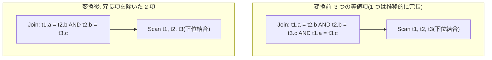

# redundant_join_predicate_elimination

- 状態: done / 執筆基準リビジョン: `3880673` (2026-09-12)
- 定義位置: `plan/cascades.cpp` の `RuleSet::Default()`(登録名
  `"redundant_join_predicate_elimination"`)

## 概要

結合条件の連言の中に、等値の推移律で他の項から導ける「冗長な等値項」が
あれば取り除きます。`t1.a = t2.b AND t2.b = t3.c AND t1.a = t3.c` の
3 項目は、前 2 項から導かれるので 2 項に削れます。評価する述語の数が
減り、下流の述語配置 Rule の扱いも軽くなります。

## 変換前後の関係



## 適用条件

パターンは `Join()`(演算子ヒントが `kJoin`)です。guard は次のとおりです。

1. 結合条件(述語)を持つ。
2. 連言分解 `SplitConjuncts` の項数が **3 以上**(`conjuncts.size() < 3`
   なら発火しない)。
3. 冗長と判定された項が 1 つ以上あり(`removed == true`)、かつ残る項が
   空でない(`!kept.empty()`)。

判定は和集合探索(Union-Find)で行います。等値項の左右の列名(完全修飾の
文字列)を同じクラスタに併合していき、**すでに同じクラスタに属する列同士を
結ぶ項**を冗長とみなして落とします。

```cpp
    // redundant_join_predicate_elimination: Eliminate redundant join conditions
    // already satisfied by transitivity.
```

## 意味論的根拠と同値関係の推移律

- **3 項以上の条件**: 冗長な項が現れる最小の形がサイクル、つまり
  `a = b ∧ b = c ∧ a = c` の 3 項です。2 項では推移的に重複する項は
  作れません(`a = b ∧ b = c` には重複項がなく、導かれる `a = c` は
  どこにも書かれていない)。2 項以下で走っても何も除けないので、
  早期 return は純粋な手間の節約です。
- **等値だけが対象**: この Rule が削ってよいのは等値項だけです。
  等値の TRUE は推移的なので、`a = b` と `b = c` が成り立つ行では
  `a = c` も必ず成り立ちます(SQL の 3 値論理でも TRUE ∧ TRUE には
  NULL が絡まないため `a = c` は TRUE)。ところが不等号
  (`a < c` など)は推移性が成り立たないか(演算子による)、成り立っても
  削除の根拠にできる形が違います。非等値項は `kept` にそのまま残ります。
- **同名列の文字列一致**: 併合のキーは列名の文字列(`ColumnName::ToString`)
  です。`t1.a` と `t2.a` のように同名だが所属表が違う列同士は
  同じキーとして併合されます(文字列が `t1.a` と `t2.a` で異なるため、
  実際に同じクラスタに入るのは等値項で結ばれた場合に限ります)。
  推移律は「同じ 2 列間の等値の重複」にしか適用しない、保守的な設計です。
  なお実装は `kJoin` の述語だけが対象で、コードは非等値項も含めて
  順序どおりに `kept` へ残します。

## 実装の詳細

Union-Find の構築と項の選別です。

```cpp
          std::vector<Expression> kept;
          bool removed = false;
          for (const auto& conj : conjuncts) {
            if (conj && conj->Type() == TypeTag::kBinaryExp) {
              const auto& bin = conj->AsBinaryExpression();
              if (bin.Op() == BinaryOperation::kEquals &&
                  bin.Left()->Type() == TypeTag::kColumnValue &&
                  bin.Right()->Type() == TypeTag::kColumnValue) {
                const std::string u =
                    bin.Left()->AsColumnValue().GetColumnName().ToString();
                const std::string v =
                    bin.Right()->AsColumnValue().GetColumnName().ToString();
                if (unite(u, v)) {
                  kept.push_back(conj);
                } else {
                  removed = true;
                }
                continue;
              }
            }
            kept.push_back(conj);
          }
```

`unite` が `false` を返す(= 2 列がすでに同じクラスタ)のが冗長検出です。
**最初に現れた項だけを残す**ので、どの項が残るかは連言内の順序で決まり
ます(意味は変わらず、評価の安い順に並んでいる前提を活かす設計です)。
書き戻しは正規化を通して行います。

```cpp
          if (removed && !kept.empty()) {
            LogicalExpression rewritten = expression;
            rewritten.predicate = CanonicalizeConjuncts(CombineConjuncts(kept));
            memo.AddExpression(group, std::move(rewritten));
          }
```

## 最適化効果

適用後のグループには、冗長項を除いた結合条件の等価式が加わります。
結合の各行候補について評価する式の数が減るほか、`infer_join_predicates`
や `push_selection_through_join` など「連言を項ごとに分析する」Rule の
入力が細り、以降の探索全体が軽くなります。等値クラスタの情報自体は
`LogicalProperties::equivalence_classes`(第 20 章)に残るので、
項を削っても推論能力は失われません。

## 関連 Rule との相互作用

- `infer_join_predicates` / `join_predicate_transitivity`:
  推移律から**新しい**項を導入する Rule で、本 Rule は**冗長な**項を除去
  する Rule です。導入と除去が飽和ループの中で交互に走るため、
  同じ形の式が何度も生まれないように本 Rule が刈り込む役目を担います。
- `infer_filter_from_equivalence_class`: 等値クラスタからフィルタを
  導出します(クラスタ情報は削除の影響を受けません)。
- `merge_selections` など述語正規化系: 連言の形を整える仲間です。

## 検証テスト

- `plan/cascades_test.cpp` の `RedundantJoinPredicateElimination` —
  推移的に冗長な等値項が除去されることを検査します。
