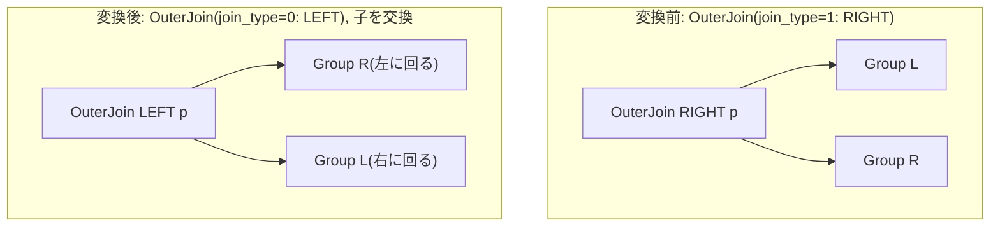

# right_to_left_outer_join

- 状態: done   /   執筆基準リビジョン: `3880673` (2026-09-12)
- 定義位置: `plan/cascades.cpp` の `RuleSet::Default()`(`built.Add(Rule("right_to_left_outer_join", …)`)
  登録式。依存ヘルパなし。

## 概要

`RightOuterJoin(L, R, p)` を、子を入れ替えた `LeftOuterJoin(R, L, p)` に
正規化する Rule です。「RIGHT OUTER JOIN は左右を交換した LEFT OUTER
JOIN と等価」という恒等式を Memo の中で 1 方向(L 形)に潰すことで、
outer join を扱う後続の Rule と実装が LEFT 形だけを考えればよいように
します。

## 変換前後の関係



## 適用条件

パターンは `OuterJoin(Any("left"), Any("right"))` で、対象演算子は
`LogicalOperator::kOuterJoin` です。guard は次の 2 つだけです。

- 式が `kOuterJoin` で子 2 個であること。
- `join_type == 1`(RIGHT)であること。LEFT(`0`)と FULL(`2`)には
  何もしません。

登録コメントは変換そのものを 2 行で述べます。

```cpp
    // right_to_left_outer_join: Normalize RightOuterJoin(L, R, p) ->
    // LeftOuterJoin(R, L, p).
```

## 意味論的根拠と外部結合の対称性

RIGHT OUTER JOIN は「右側の行をすべて保存し、マッチしない左側を NULL
パディングする」演算です。子を入れ替えて LEFT OUTER JOIN にすると、今度は
「左側(元の右)をすべて保存し、マッチしない右側(元の左)を NULL
パディングする」になり、出力される行の集合・NULL の付き方は完全に一致
します。つまりこの変換は結合条件と出力契約を保ったまま成立する恒等式で、
追加の guard を必要としません。

逆方向(LEFT → RIGHT)への正規化を作らないことにも意味があります。
LEFT 形に揃えることで:

- outer join を対象とする他の Rule(`push_filter_through_left_join_left_side`
  や `outer_join_associativity` など)が `join_type == 0` だけを
  考慮すればよくなる
- 実装側も outer join 専用形を LEFT 用に用意すれば済む
  (`docs/cascades_optimizer.md` は実装 Rule `outer_nested_loop` について
  「LEFT non-equi; RIGHT normalizes to LEFT」と記述しています)

という重複の排除ができます。LEFT のまま発火しないのは、変換しても
同一形に戻るだけで無意味だからです。FULL は左右どちらも保存するため、
この「入れ替え」では表現できません(代わりに
`full_outer_join_decomposition` が分解を担います)。

## 実装の詳細

変換本体は次のとおりです(登録ブロックの変換ラムダ)。

```cpp
          if (expression.join_type == 1) {  // 1 = RightOuter
            const GroupId left_id = bindings.at("left");
            const GroupId right_id = bindings.at("right");
            memo.AddExpression(
                group,
                LogicalExpression{.operation = LogicalOperator::kOuterJoin,
                                  .children = {right_id, left_id},
                                  .predicate = expression.predicate,
                                  .target_list = expression.target_list,
                                  .join_type = 0,  // 0 = LeftOuter
                                  .output_schema = expression.output_schema});
          }
```

- `children` を `{right_id, left_id}` と入れ替え、`join_type` を `0` に
  変えるのが変換の全部です。結合条件 `p` はそのままです。`p` の中の列は
  修飾名(`r.id` など)で書かれているため、子の並びが変わっても意味は
  変わりません。
- `target_list` / `output_schema` を元の式から引き継ぐため、上の演算子から
  見た出力の列名・型・並びは不変です。
- 元の RIGHT 形の式も同じ Group に残るため、実装が RIGHT 形を直接
  扱える場合でも損はありません(等価な 2 形をコスト比較できる)。

## 最適化効果

適用後の Group には RIGHT 形と LEFT 形の 2 つの代替が並びます。探索が
進むと LEFT 形経由で outer join 用の pushdown / associativity /
実装 Rule の候補がすべて開くのに対し、RIGHT 形は候補が大きく絞られます。
その結果、コスト比較は自然に LEFT 形側の計画を選びやすくなり、
「outer join の正規形は LEFT」という探索の単純さを保ったまま
 RIGHT JOIN を含むクエリも同じ最適化パイプラインに乗ります。

## 関連 Rule との相互作用

- `push_filter_through_left_join_left_side` /
  `push_limit_through_left_join` / `outer_join_associativity` など:
  いずれも `join_type == 0`(LEFT)を前提とする Rule で、本 Rule が
  RIGHT を先に LEFT に潰しておくことで間接的に効く範囲が広がります。
- `full_outer_join_decomposition`: FULL OUTER JOIN は入れ替えでは
  正規化できないため、代わりに `LeftOuter + AntiJoin` への分解を行います。
- `outer_to_inner_join_on_null_rejecting_filter`:
  `join_type == 1` の分岐を自前で持っており、RIGHT 形のままでいても
  inner join 化は可能です(本 Rule との前後関係はどちらでもよい)。

## 検証テスト

- `plan/cascades_test.cpp` の `CascadesTest.RightToLeftOuterJoinRewrite` —
  `join_type = 1` の outer join を探索すると、子が `{right, left}` の順に
  入れ替わり `join_type == 0` になった代替が同じ Group に現れることを
  検証します。テストは子の順序まで検査しており、述語は元の式のものを
  そのまま引き継ぎます。
