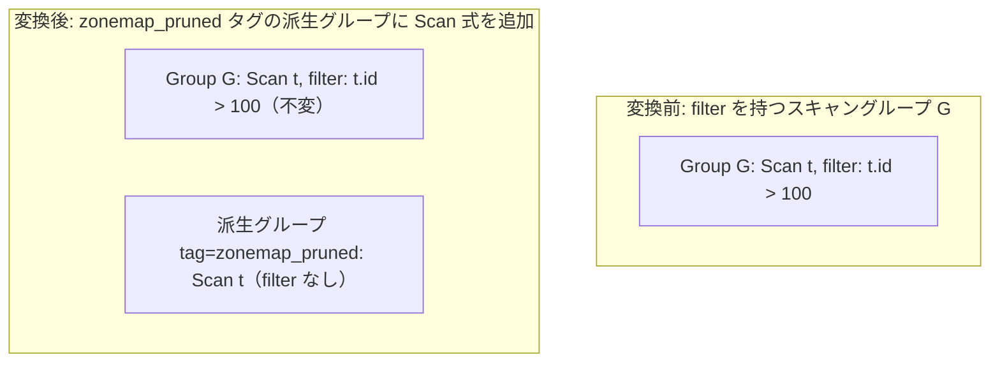

# scan_zone_map_filter_integration

- 状態: draft / 執筆基準リビジョン: `3880673` (2026-09-12)
- 定義位置: `plan/cascades.cpp` の `RuleSet::Default()`（登録式。パターンは `Pattern::Op(LogicalOperator::kScan, {})` を直接使用）

## 概要

`scan_zone_map_filter_integration` は、述語（scan filter）を保持するスキャングループに対し、`zonemap_pruned` タグを持つ派生グループを生成して同一表・同一出力スキーマの `kScan` 論理式を登録する Rule である。

ブロック統計（min/max）に基づくデータブロックの範囲剪定（Zone Map プルーニング）の受け皿となるタグ付きグループを Memo 探索空間に明示的に導入し、物理実装側でゾーンマップ評価経路の選択を可能にすることを目的とする。

## 変換前後の関係



## 適用条件

パターンは `Pattern::Op(LogicalOperator::kScan, {})` であり、対象演算子は `LogicalOperator::kScan` である。変換ラムダ内で次のガード条件を検証する。

```cpp
          if (expression.operation != LogicalOperator::kScan ||
              expression.table.empty()) {
            return;
          }
          if (memo.Get(group).tag.find("zonemap") != std::string::npos) {
            return;
          }
          if (memo.Get(group).filter) {
            const GroupId zm_group = memo.EnsureDerivedGroup(
                memo.Get(group).relations, "zonemap_pruned");
            if (zm_group != group) {
              memo.AddExpression(
                  zm_group,
                  LogicalExpression{.operation = LogicalOperator::kScan,
                                    .table = expression.table,
                                    .target_list = expression.target_list,
                                    .output_schema = expression.output_schema});
            }
          }
```

発火条件および非発火条件は以下の通りである。

1. 論理式が `LogicalOperator::kScan` であり、`table` 名が空でないこと。
2. 現在のグループのタグに `"zonemap"` 部分文字列が含まれていないこと（再帰的自己適用の抑止）。
3. 現在のグループが非空の scan filter（`memo.Get(group).filter`）を保持していること。
4. `EnsureDerivedGroup` により得られた派生グループ ID が元のグループ ID と一致しないこと。

## 意味論的根拠と物理実行の契約

本 Rule が生成する論理式は、元のスキャン式と同一の表・射影・出力スキーマを持つため、関係代数の観点で行集合の定義を変更しない。意味論および探索の健全性は次の設計規律に担保されている。

- **filter 存在の必須性**: ゾーンマップ剪定は、探索述語の範囲とブロックごとの最小値・最大値メタデータが交差しない場合に I/O をスキップする最適化である。フィルタ述語が存在しない全件走査ではプルーニングが発生し得ないため、派生グループの作成は無意味であり探索空間を浪費する。したがって `memo.Get(group).filter` の存在を必須とする。
- **タグによる再入抑止**: 派生グループに登録された `kScan` 式に対しても探索エンジンは規則適用を試みる。グループのタグに `"zonemap"` を含むものを除外することで、同一関係集合に対する派生グループの無限連鎖を防ぎ、探索の不動点収束を保証する。
- **派生グループへの filter 不伝播の契約**: `EnsureDerivedGroup` で新規作成された派生グループは、tinylamb の Group 属性設計に従い空の filter を保持する。本 Rule は元グループの filter 式を派生グループの属性として複製しない。現行実装における本 Rule の役割は「ゾーンマップ剪定対象であることを示すタグ付き派生グループと論理式の足場を登録する」ことに限定されており、述語を直接埋め込む `dynamic_filter_pushdown_join` とは責務が異なる。

## 実装の詳細

変換処理の中核は `plan/cascades.cpp` の登録ラムダにある。

1. `memo.EnsureDerivedGroup(memo.Get(group).relations, "zonemap_pruned")` により、同一関係集合と `"zonemap_pruned"` タグをキーとする派生グループを取得または新規登録する。同一関係集合に対して複数回 Rule が評価されても同一の派生グループに集約される。
2. 派生グループ ID が元グループと異なることを確認した上で、元の `LogicalExpression` の `table`, `target_list`, `output_schema` を複製した `kScan` 式を 1 つ登録する。追加の述語ペイロードは持たない。
3. 基準リビジョン時点において、`plan/implementation_rules.cpp` 側で `"zonemap_pruned"` タグを参照して特化した物理スキャン演算子を選択する実装は未配備であり、本 Rule は論理探索空間における選択肢の表現として機能している。

## 最適化効果

論理プランが表現する関係多重度およびスキーマは不変である。

期待される物理実行上の最適化効果は、filter を保持するスキャン処理がゾーンマップ剪定候補としてタグ付けされ、実行器（`executor/` 配下のゾーンマップ機能）と連携した際にディスクブロック単位での I/O 読み取り量を削減することにある。

## 関連 Rule との相互作用

- `push_selection_into_scan` / `split_selection_over_join` / `merge_selections`: 単一関係に対する選択述語をグループの scan filter へ集約する。本 Rule の前提条件である `memo.Get(group).filter` を満たす供給元として機能する。
- `dynamic_filter_pushdown_join`: 結合構築側からプローブ側スキャンへ動的フィルタ（Bloom filter）を適用するため、派生グループ（`"bloom_probe"`）を生成する同系統のタグ付き探索拡張 Rule である。
- `cast_pushdown_on_comparison` / `extract_year_sargable`: 述語を sargable（探索可能）な定数比較形式に正規化し、ゾーンマップやインデックスによる範囲判定の精度を高める。

## 検証テスト

- `plan/cascades_test.cpp` の `CascadesTest.ScanZoneMapFilterIntegration`: scan filter を持つスキャングループを Memo 探索に投入した際、タグに `"zonemap"` を含む派生グループが正常に生成され、その中に `kScan` 式が登録されることを検証する。

