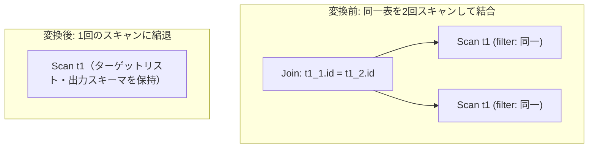

# self_join_elimination

- 状態: draft / 執筆基準リビジョン: `3880673` (2026-09-12)
- 定義位置: `plan/cascades.cpp` の `RuleSet::Default()`（登録名 `"self_join_elimination"`）

## 概要

`self_join_elimination` は、同一の実表に対する自己結合 `Join(T AS t1, T AS t2)` において、左右の適用フィルタが同値であり、かつ結合条件が一意キー列同士の厳密な等値結合である場合に、重複する一方のスキャンを削除して単一の `Scan` ノードへと簡約する論理変換Ruleです。

## 変換前後の関係

同一テーブルに対する2回のスキャンと結合処理を、1回のスキャン式へと縮退させます。



## 適用条件

パターンは `Join(Any("left"), Any("right"))` です。以下の5つのガード条件をすべて満たす必要があります（`plan/cascades.cpp`）。

```cpp
    // self_join_elimination: When Join(T1, T2) joins the same table on its
    // primary key / unique key with identical predicates and schema projection,
    // eliminate redundant scan.
```

```cpp
          // Require an exact table match here, not the alias-stripping
          // IsSameTable: distinct real tables such as `orders` and
          // `orders_1` must never be conflated (the alias forms t1_1/t1_2
          // still match because both scans name the same real table).
          if (t1 != t2) {
            return;
          }
```

1. **単一関係性**: 左右の子Groupがそれぞれ単一の関係（テーブル）のみを含むこと。
2. **実表の完全一致**: 左右のスキャン対象テーブル名が完全一致すること（`t1 == t2`）。エイリアスを除去して比較する緩和一致（`IsSameTable`）ではなく、実表名レベルでの完全一致を要求します。
3. **フィルタの等価性**: 左右のGroupが保持するスキャンフィルタが同値であること（`AreFiltersEquivalent`）。両者ともフィルタを持たない場合も合致とみなされます。エイリアス名のみが異なる同一述語は正規化（`$T` への置換）により同値と判定されます。
4. **一意キー等値結合**: 結合述語が、カタログスキーマ上で主キーまたは一意制約（PRIMARY KEY / UNIQUE）を持つ同一列名同士の等値比較1つのみであること（`SingleUniqueKeyEquality`）。
5. **右オペランド列の非参照**: 結合ノードの出力ターゲットリスト（`target_list`）が、削除対象となる右側関係の修飾列を参照していないこと。

## 意味論的根拠と制約の必然性

自己結合の削除は行の重複度（multiplicity）を変化させるリスクを伴うため、極めて厳格なガードが設定されています。

- **フィルタ不一致の排除**: 左右で異なるフィルタ（例: `a.k = 1` と `b.k = 2`）が適用されている場合、結合結果は両条件の積集合（通常は空）となるため、単一スキャンへの置き換えは結果集合を破壊します。
- **一意キー制約の証明**: 結合キーが一意でない場合、1対多のマッチングによって結果行数が増加する可能性があります。結合を削除しても行数が保存されることを担保するため、カタログに記録された物理スキーマ制約から一意性が証明できなければ適用されません。単に列名が `id` であるといった推測は排除されます。
- **実表名の厳密照合**: `orders` と `orders_1` のように接尾辞が異なる実表を誤認することを防ぐため、厳密な文字列一致を要求します。
- **出力列の整合性**: 射影において右オペランド側の列値が出力される場合、右側のスキャンを削除すると列のデータソースが失われるため、変形を中断します。

## 実装の詳細

一意キー等値性の検査は `SingleUniqueKeyEquality`（`plan/cascades.cpp`）が担います。述語が単一の等値比較であり、左右の列名が一致し、左辺関係のカタログスキーマにおいて主キーまたは一意キー制約が存在することを確認します。

```cpp
  // The predicate must be EXACTLY the key equality: eliminating a join whose
  // condition carries additional conjuncts would drop them.
```

条件を満たした場合、左側実表を対象とする単一の `kScan` 式を生成して親Groupに登録します。

```cpp
          memo.AddExpression(
              group,
              LogicalExpression{.operation = LogicalOperator::kScan,
                                .table = t1,
                                .target_list = expression.target_list,
                                .output_schema = expression.output_schema});
```

結合ノードからターゲットリストと出力スキーマ（`output_schema`）をそのまま引き継ぐため、上位演算子に対する出力インターフェースは完全に保持されます。

## 最適化効果

同一テーブルに対する重複スキャンと結合演算（ハッシュテーブル構築や行比較）が完全に排除されます。テーブルスキャンのI/O回数が半減し、クエリ処理速度が大幅に向上します。自己結合を用いた冗長な整合性チェックやビュー展開後の重複結合に対して絶大な効果を発揮します。

## 関連Ruleとの相互作用

- `unused_join_elimination` / `fk_join_elimination`: 行の重複度保存を証明して不要な結合を除去する結合簡約Rule群。
- `push_selection_into_scan`: 左右のスキャンフィルタをスキャングループへ統合し、`AreFiltersEquivalent` による同一性判定の基礎を提供します。
- `join_commutativity`: 本Ruleが成立した場合、結合ノードそのものがスキャン式へ置換されるため、結合順序探索の対象から除外されます。

## 検証テスト

- `plan/cascades_test.cpp`:
  - `SelfJoinEliminationReplacesJoinWithSingleScan`: 自己結合が単一のScan式に置き換わることを検証。
  - `SelfJoinEliminationRequiresProvenUniqueKey`: カタログ上の一意キー制約が存在しない場合に適用が拒否されることを検証。
  - `SelfJoinEliminationRejectsDistinctRealTables`: 異なる実表名に対する自己結合適用が正しく排除されることを検証。

