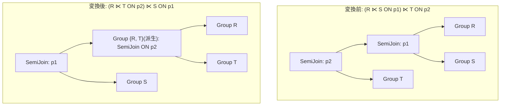

# semi_join_commutativity

- 状態: draft / 執筆基準リビジョン: `3880673` (2026-09-12)
- 定義位置: `plan/cascades.cpp` の `RuleSet::Default()`（登録名 `"semi_join_commutativity"`）

## 概要

連続する半結合演算 $(R \ltimes_{p_1} S) \ltimes_{p_2} T$ を $(R \ltimes_{p_2} T) \ltimes_{p_1} S$ へと並べ替える論理 Rule です（半結合の交換則）。

半結合は右側の属性を出力せず、左側タプルの存在判定フィルタとして機能するため、述語の依存属性が閉塞している限りフィルタリング順序を交換しても同一のタプル多重集合（Multiset）を返します。選択率の高い半結合を先行評価させることで、後続結合の処理負荷を削減します。

## 変換前後の関係



## 適用条件

パターンは `SemiJoin(Any("inner_semi"), Any("t"))` です（`plan/cascades.cpp`）。

```cpp
    // semi_join_commutativity: (R SEMI JOIN S ON p1) SEMI JOIN T ON p2 ->
    // (R SEMI JOIN T ON p2) SEMI JOIN S ON p1.
    built.Add(Rule(
        "semi_join_commutativity", SemiJoin(Any("inner_semi"), Any("t")),
```

適用判定（guard）は以下の条件により構成されます。

1. **二重半結合の合致**: 外側ノードが `kSemiJoin`（子ノード数 2）であり、左側子グループ内に別の `kSemiJoin` 式（$R \ltimes_{p_1} S$）が存在すること。
2. **述語属性の局所性**: 外側の結合述語 $p_2$ が参照するすべての属性が、$R$ または $T$ の関係集合のみに閉じており、$S$ の属性を一切参照していないこと（`touches_only_rt` 検査）。
3. **サイクル防止**: 派生グループ `memo.EnsureDerivedGroup(UnionRelations(r_rels, t_rels), "semi_comm_rt")` が現在のグループ自身や $R, T$ のグループと一致しないこと。

## 意味論的根拠と安全性制約

### 1. 半結合の代数特性
関係代数において、半結合 $X \ltimes_p Y$ の定義は $\Pi_{\text{schema}(X)}(X \Join_p Y)$ であり、出力スキーマおよび出力タプルの重複度は完全に $X$ に支配されます。

連続する半結合 $(R \ltimes_{p_1} S) \ltimes_{p_2} T$ において、述語 $p_2$ が $S$ の属性に依存しない（$\text{attrs}(p_2) \subseteq \text{schema}(R) \cup \text{schema}(T)$）ならば、各タプル $r \in R$ に対する $p_2$ の充足性は $S$ との結合状態に左右されません。したがって、以下の代数同値性が厳密に成立します。

$$(R \ltimes_{p_1} S) \ltimes_{p_2} T \equiv (R \ltimes_{p_2} T) \ltimes_{p_1} S$$

### 2. 述語配置における属性到達可能性
もし $p_2$ が $S$ の属性を参照している場合（例: $p_2 \equiv (s.id = t.id)$）、変換後の内部結合 $R \ltimes_{p_2} T$ の評価時点では関係 $S$ がスコープ外となり、述語が評価不能となります。そのため、`touches_only_rt` ガードによる属性の静的検証が不可欠です。

```cpp
            if (expression.predicate && *expression.predicate) {
              bool touches_only_rt = true;
              for (const auto& col :
                   (*expression.predicate)->TouchedColumns()) {
                if (std::ranges::find(r_rels, col.schema) == r_rels.end() &&
                    std::ranges::find(t_rels, col.schema) == t_rels.end()) {
                  touches_only_rt = false;
                  break;
                }
              }
              if (!touches_only_rt) continue;
            }
```

## 実装の詳細

派生グループ `"semi_comm_rt"` を生成し、そこに先行する半結合式 $R \ltimes_{p_2} T$ を登録します。その後、現在のルートグループに対して外側半結合 $(R \ltimes T) \ltimes_{p_1} S$ を登録します。

```cpp
            const GroupId rt_group = memo.EnsureDerivedGroup(
                UnionRelations(r_rels, t_rels), "semi_comm_rt");
            if (rt_group == group || rt_group == r_id || rt_group == t_id) {
              continue;
            }
            memo.AddExpression(
                rt_group,
                LogicalExpression{.operation = LogicalOperator::kSemiJoin,
                                  .children = {r_id, t_id},
                                  .predicate = expression.predicate,
                                  .target_list = expression.target_list,
                                  .output_schema = expression.output_schema});
            memo.AddExpression(
                group,
                LogicalExpression{.operation = LogicalOperator::kSemiJoin,
                                  .children = {rt_group, s_id},
                                  .predicate = semi_expr.predicate,
                                  .target_list = expression.target_list,
                                  .output_schema = expression.output_schema});
```

外側結合の述語は、内側にあった $p_1$（`semi_expr.predicate`）へと正しく引き継がれます。

## 最適化効果

- **選択性の早期活用**: $T$ による絞り込み効率（選択率）が $S$ よりも高い場合、$R$ のタプル数を早期に削減できるため、二段目の半結合におけるハッシュテーブル探索回数やマージ結合の走査コストを低減できます。
- **インデックス半結合の誘発**: $T$ 側に利用可能な B+Tree インデックスが存在する場合、先行してインデックス検索を実行することで処理パイプライン全体のレイテンシを短縮できます。

## 関連 Rule との相互作用

- `semi_join_inner_join_reorder`: 半結合と内部結合が混在するケースにおいて、同様の属性局所性ガードを用いて結合順序を再構成します。
- `apply_to_join` / `in_list_to_semi_join`: サブクエリ展開により生成された連続する半結合に対して本交換則が作用します。
- `join_commutativity`: 通常の内部結合（`kJoin`）を対象とする交換則であり、半結合演算子は本 Rule によって独立して順序探索されます。

## 検証テスト

`plan/cascades_test.cpp` における以下のテストケースで検証されています。

- `CascadesTest.SemiJoinCommutativity`:
  $(R \ltimes S) \ltimes T$ の入力に対して、右側関係が $S$ である交換済み半結合式がルートグループに生成されることを確認します。
