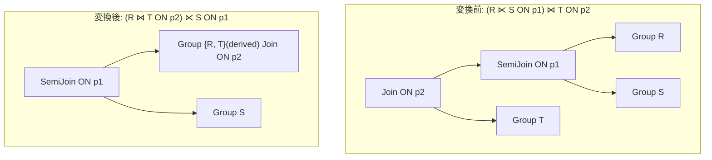

# semi_join_inner_join_reorder

- 状態: draft / 執筆基準リビジョン: `3880673` (2026-09-12)
- 定義位置: `plan/cascades.cpp` の `RuleSet::Default()`（登録名 `"semi_join_inner_join_reorder"`）

## 概要

`semi_join_inner_join_reorder` は、`(R SEMI JOIN S ON p1) JOIN T ON p2` の結合順序を `(R JOIN T ON p2) SEMI JOIN S ON p1` へ再結合（reorder）する論理等価 Rule である。

半結合が内側結合の左入力に配置されているとき、内側結合を先行して評価した後に半結合を適用する別経路を探索空間に導入する。これにより、結合順序の選択肢を増やし、インデックス利用や早期フィルタリングのコスト比較を可能にする。

## 変換前後の関係



## 適用条件

パターンは `Join(Any("semi_child"), Any("t"))` であり、対象演算子は `LogicalOperator::kJoin` である。以下のガード条件をすべて満たす場合にのみ発火する。

1. 外側の式が `LogicalOperator::kJoin` であり、子ノード数が 2 であること。
2. 左の子グループ（`semi_child`）内に、子ノード数 2 の `LogicalOperator::kSemiJoin` 式 `(R ⋉ S ON p1)` が存在すること。
3. 外側の結合述語 `p2`（`expression.predicate`）が存在する場合、`p2` が参照する列がすべて `R` または `T` の関係に属すること（`S` の列を参照しないこと）。
4. 派生グループ（`semi_inner_reorder_rt` タグ）が、探索対象グループ、`R`、`T` のいずれとも一致しないこと（自己参照ループ防止）。

```cpp
          if (expression.operation != LogicalOperator::kJoin ||
              expression.children.size() != 2) {
            return;
          }
          // 左の子 Group 内から kSemiJoin 式を走査
          if (expression.predicate && *expression.predicate) {
            bool touches_only_rt = true;
            for (const auto& col :
                 (*expression.predicate)->TouchedColumns()) {
              if (std::ranges::find(r_rels, col.schema) == r_rels.end() &&
                  std::ranges::find(t_rels, col.schema) == t_rels.end()) {
                touches_only_rt = false;
                break;
              }
            }
            if (!touches_only_rt) {
              continue;
            }
          }
```

外側の結合述語 `p2` が `S` の列を参照している場合、組み替え後の内側結合 `(R JOIN T ON p2)` のスコープ内で `S` の属性が未解決となるため、本 Rule は発火を中止する。

## 意味論的根拠と多重度保存

半結合と内側結合の再結合が等価性を保つ根拠は、半結合の「多重度不変なフィルタ特性」と述語評価スコープの一致にある。

- **行の一致と多重度保存**: `(R ⋉ S)` の出力は、述語 `p1` を満たす `S` 行が存在する `R` の行のみで構成される。半結合は `S` の行を複製せず、`R` の属性のみを射影する。したがって、`(R ⋉ S) ⋈ T` で得られるタプルの多重度は、各 `R` 行と `T` 行のマッチ数によってのみ決定される。先行して `(R ⋈ T)` を評価した後に `S` と半結合 `⋉ S` を適用しても、最終的に残るタプルの多重度は同一である。
- **述語参照スコープの厳密性**: 組み替え後の下位結合 `R ⋈ T` で述語 `p2` を評価するためには、`p2` の参照列が `{R, T}` に閉じていなければならない。仮に `p2` が `S` の列を参照している場合（例: `p2 = (s.id = t.id)`）、`(R ⋉ S)` の出力スキーマに `S` の列は存在しないため本来のプラン木でも無効な式であるか、評価不能な式となる。本 Rule はガードレールとして `touches_only_rt` を強制し、不正な式が Memo に投入されることを完全に遮断する。

## 実装の詳細

`plan/cascades.cpp` における変換処理は、派生グループの生成と多重登録の 2 段階で構成される。

1. `memo.EnsureDerivedGroup(UnionRelations(r_rels, t_rels), "semi_inner_reorder_rt")` により、`R` と `T` の関係集合を持つ中間グループ `rt_group` を確保する。
2. `rt_group` に対して、子を `{r_id, t_id}`、述語を `expression.predicate`（`p2`）とする `LogicalOperator::kJoin` 式を登録する。
3. ルートグループ（元の結合グループ）に対して、子を `{rt_group, s_id}`、述語を半結合の述語 `semi_expr.predicate`（`p1`）とする `LogicalOperator::kSemiJoin` 式を登録する。
4. `target_list` および `output_schema` は元の式から忠実に継承され、グループの出力スキーマ契約を維持する。

## 最適化効果

元の結合順序と組み替え後の結合順序が Memo 内に並存し、コストエンジンによる比較が可能となる。

- `T` との結合述語 `p2` にインデックスが存在し、`R` と `T` を先に結合した方がコストが低い場合、あるいは `S` による半結合の選択度が高くなく先行評価の恩恵が小さい場合に、組み替え後のプランが有利となる。
- 逆に `S` の半結合が極めて高い選択度（大半の `R` を除外する）を持つ場合は元のプランが選択される。探索空間に両方の選択肢を提供することが最適化の本質である。

## 関連 Rule との相互作用

- `semi_join_commutativity`: 半結合同士の交換可能性を探索する Rule であり、同様に参照列の局所性検査と派生グループ生成を用いる。
- `push_semi_join_through_inner_join`: `(A JOIN B) SEMI JOIN C` を `(A SEMI JOIN C) JOIN B` などへ組み替える逆方向の移動を担う。本 Rule と組み合わさることで、半結合演算子のプラン木上下移動が対称的に探索される。
- `in_list_to_semi_join` / `apply_to_join`: `IN` サブクエリ等から半結合を導出する Rule であり、導出された半結合が内側結合と隣接することで本 Rule の適用契機となる。

## 検証テスト

- `plan/cascades_test.cpp` の `SemiJoinInnerJoinReorder`: `(r ⋉ s) ⋈ t` の論理式を探索した際、ルートグループに右の子を `s` とする `kSemiJoin` 代替式（`(r ⋈ t) ⋉ s`）が正常に生成されることを検証する。
