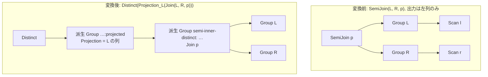

# semijoin_to_inner_plus_distinct

- 状態: draft / 執筆基準リビジョン: `3880673` (2026-09-12)
- 定義位置: `plan/cascades.cpp` の `RuleSet::Default()`（登録名 `"semijoin_to_inner_plus_distinct"`）

## 概要

`semijoin_to_inner_plus_distinct` は、`SemiJoin(L, R, p)` を `Distinct(Projection_L(Join(L, R, p)))` へ変換する論理等価 Rule である。

右側の結合キーが一意であると証明できない場合でも、内部結合でマッチを全列挙した後に射影と DISTINCT を適用することで、半結合と同一の多重集合へ重複を折りたたむ。これにより、半結合に対して内部結合の実装（Hash Join、Merge Join、Index Join）や結合順序探索の自由度を適用可能にする。

## 変換前後の関係



## 適用条件

パターンは `SemiJoin(Any("left"), Any("right"))` であり、対象演算子は `LogicalOperator::kSemiJoin` である。変換ラムダ内で以下のガード条件を検証する。

```cpp
    // semijoin_to_inner_plus_distinct: SemiJoin(L, R, p) ->
    // Distinct(Projection_L(Join(L, R, p))). The inner join enumerates every
    // match, the projection keeps left rows, and DISTINCT collapses duplicate
    // matches back to the semi multiset (match evaluation happens before the
    // projection in both shapes, so NULL semantics agree). Complements
    // unique_semi_to_inner, which covers the cheaper plain-inner case when
    // the right keys are unique; costing picks the winner. Sound only when
    // the projection distinguishes left ROWS: a semi emits one row per
    // qualifying left row, while DISTINCT dedupes projected VALUES, so every
    // target must be a bare left column and the column set must be provably
    // unique on the left side (SELECT l.x with two l rows at x = 1 would
    // otherwise lose a row).
```

発火条件および非発火条件は以下の通りである。

1. 式が `LogicalOperator::kSemiJoin` であり、子ノード数が 2、`target_list` が空でないこと。
2. 左右の子グループが現在のグループ自身でないこと（自己参照防止）。
3. `target_list` のすべての要素が素の列参照（`kColumnValue`）であり、その修飾子（`schema`）が左側グループの関係集合に解決されること。1 つでも計算式や右側参照が混在する場合は発火しない。
4. 射影される列集合に対し、左側グループの論理特性において `left_group.logical_properties.IsUniqueOn(projected_cols)` が成立すること。すなわち、左側入力がこの射影列集合上で一意であることが証明可能であること。
5. 派生グループ（`"semi-inner-distinct:" + TargetListFingerprint + ":" + 述語` および `":projected"`）が、既存グループと循環衝突しないこと。

## 意味論的根拠と多重度保存

半結合は「条件を満たす左行を 1 行出力する（行の同一性）」演算であるのに対し、DISTINCT は「射影後の値が等しい行を 1 行に統合する（値の一致）」演算である。この 2 つは一般には一致しない。

- **値重複と行重複の乖離防止**: 仮に左表 `L` に `x = 1` を持つ行が 2 行存在する場合、`SemiJoin(L, R, L.x = R.x)` は左側の各行を保持して 2 行を出力する。しかし、射影列 `x` に対して無条件に `Distinct` を適用すると、値 `1` が 1 行に圧縮されてしまい、多重集合の意味論が破壊される。したがって、射影列集合が左側テーブルにおいて行を一意に識別できること（`IsUniqueOn(projected_cols)`）が意味論的必須条件となる。
- **三値論理と NULL 意味論の一致**: 内部結合および半結合のいずれにおいても、結合条件 `p` のマッチ評価は射影の前に行われる。三値論理において `NULL` 同士の比較は `UNKNOWN` となり除外されるため、内部結合後の射影と重複排除を行っても NULL 評価の意味論は完全に一致する。
- **フィンガープリントによる識別**: 派生グループのタグには関係集合・ターゲットリストに加え、結合述語の文字列を含めている。同一関係集合かつ同一ターゲットであっても述語が異なる半結合が同一の派生結合グループを共有することを防止している。

## 実装の詳細

`plan/cascades.cpp` における変換処理は 3 段階の階層構造を構築する。

1. **内部結合の登録**:
   ```cpp
   memo.AddExpression(
       join_group, LogicalExpression{.operation = LogicalOperator::kJoin,
                                     .children = {left_id, right_id},
                                     .predicate = expression.predicate});
   ```
2. **射影の登録**:
   結合グループの上に元の `target_list` と `output_schema` を持つ射影ノードを配置する。
   ```cpp
   memo.AddExpression(
       projected,
       LogicalExpression{.operation = LogicalOperator::kProjection,
                         .children = {join_group},
                         .target_list = expression.target_list,
                         .output_schema = expression.output_schema});
   ```
3. **重複排除の登録**:
   ルートグループに対して射影ノードを子とする `LogicalOperator::kDistinct` を追加する。
   ```cpp
   memo.AddExpression(
       group, LogicalExpression{.operation = LogicalOperator::kDistinct,
                                .children = {projected}});
   ```

## 最適化効果

右側キーの一意性が証明できないケースにおいて、半結合専用の物理アルゴリズム（SemiHashJoin や SemiMergeJoin）に縛られず、汎用の Inner Join アルゴリズムと DISTINCT の組み合わせをコスト比較の候補に加える。

重複排除の追加オーバーヘッドを上回る結合アルゴリズムの高速化や、後続の DISTINCT が既存のソート順・インデックスにより安価に処理できる状況において、大幅な性能向上が得られる。

## 関連 Rule との相互作用

- `unique_semi_to_inner`: 右側キーが一意であると証明できる場合の最適化を担当する。DISTINCT を伴わない純粋な内部結合を生成するため、証明可能な場合はそちらがコスト面で優位に立つ。
- `pk_unique_distinct_elimination` / `distinct_over_distinct`: 本 Rule が生成した `Distinct` に対し、さらなる重複排除の削除を試みる。
- `semi_join_commutativity` / `semi_join_inner_join_reorder`: 半結合の形式を維持したまま結合順序の探索を行う競合・代替経路となる。

## 検証テスト

- `plan/cascades_test.cpp` の `CascadesTest.SemijoinToInnerPlusDistinct`: 左表の主キーを含む射影を持つ半結合に対し、カタログの一意性制約が存在する場合にのみ `kDistinct` の代替式が生成されることを検証する。カタログ制約が存在しない場合には発火しない安全設計も併せて確認される。
