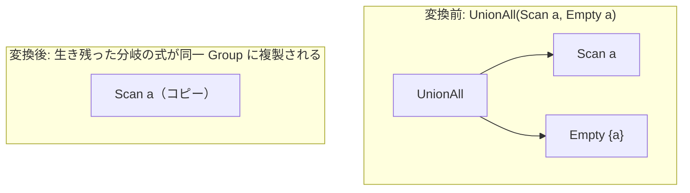
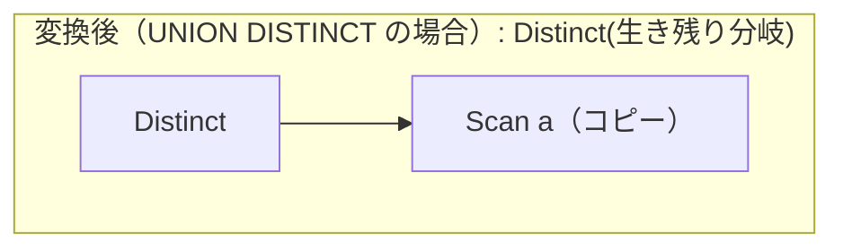

# setop_empty_identity

- 状態: draft / 執筆基準リビジョン: `3880673` (2026-09-12)
- 定義位置: `plan/cascades.cpp` の `RuleSet::Default()`（登録名 `"setop_empty_identity"`）

## 概要

`setop_empty_identity` は、集合演算における空集合（Empty）が単位元として機能する性質を利用し、空分岐を除去した等価な論理式を登録する Rule である。

`UNION ALL(空, X) = X` や `X EXCEPT ALL 空 = X` のように、演算結果に寄与しない空分岐を取り除き、残存した分岐そのもの、または縮小された n 項集合演算式を Memo に追加する。DISTINCT 系の集合演算（UNION, EXCEPT）に対しては、重複排除の契約を保つために論理 `Distinct` 演算子を補完して変換を行う。

## 変換前後の関係

`UNION ALL(Scan a, Empty a)` の例:



`UNION(Scan a, Empty a)`（DISTINCT 版）の例:



## 適用条件

パターンは `Pattern::Any()` であり、対象演算子は動的に判定される。変換ラムダ内で以下の条件を検証する。

```cpp
          if (expression.children.size() < 2) {
            return;
          }
          const bool has_empty =
              std::ranges::any_of(expression.children, is_empty);
          if (!has_empty) {
            return;
          }
```

発火条件および非発火条件は以下の通りである。

1. 子ノード数が 2 以上であり、少なくとも 1 つの子グループが `LogicalOperator::kEmpty` 式を保持していること。
2. **UNION ALL**: 空でない残存分岐（survivors）の関係集合の和集合が、ルートグループの関係集合と一致すること。残存分岐数が 1 の場合はその分岐の式をルートへ複製（`copy_child`）し、2 以上の場合は空分岐を除去した `kUnionAll` を登録する。全分岐が空の場合は発火しない。
3. **UNION（DISTINCT）**: 残存分岐数が 1 の場合はその分岐の上に `kDistinct` を配置した式を登録し、2 以上の場合は派生グループ（`"setop-empty-union-all"`）に空除去後の `kUnionAll` を作成した上で `kDistinct` を被せる。
4. **EXCEPT ALL**: 末尾の子（右側の減算対象）が空であり、先頭分岐（左入力）の関係集合がルートグループと一致する場合に限り、先頭分岐の式をルートへ複製する。先頭（左側）が空の場合は本 Rule の対象外である。
5. **EXCEPT（DISTINCT）**: 右側が空の場合に限り、先頭分岐の上に `kDistinct` を配置した式を登録する。

## 意味論的根拠と多重度保存

集合演算ごとの代数法則と多重度（重複度）の保存要件がガード条件の基礎となっている。

- **UNION ALL の単位元性**: 空多重集合に対して加算を行っても元の多重集合は不変であるため、空分岐の完全な除去が可能である。
- **EXCEPT ALL の右単位元性**: 空多重集合を差し引いても元の多重集合は変化しない。一方、左辺が空の場合は減算結果自体が空集合となるため、本 Rule ではなく `setop_empty_simplification` が担当する。
- **DISTINCT 演算における重複排除契約**: `X UNION 空` の出力は重複を排除した `X` であり、`X` そのものではない。仮に `X = {1, 1}` である場合、結果は `{1}` でなければならない。本 Rule は単に空分岐を捨てるのではなく、残存分岐の上に `Distinct` を挿入することで、重複排除の契約（duplicate-elision contract）を厳密に順守する。
- **関係集合の一致検査**: 複製元の関係集合がルートグループの関係集合と一致しない場合、スキーマの不整合や未解決属性が生じるため、残存関係集合とルートグループの関係集合の一致を強制する。
- **自己参照ループの防止**: `copy_child` において、ルートグループ自身を参照している式は複製から除外する。

## 実装の詳細

`plan/cascades.cpp` における変換処理は、演算子の種類と残存分岐数に応じて分岐する。

1. **子の複製ヘルパー（`copy_child`）**:
   ```cpp
   const auto copy_child = [&](GroupId child) {
     for (const LogicalExpression& alternative :
          memo.Get(child).expressions) {
       bool refs_group = false;
       for (GroupId c : alternative.children) {
         if (c == group) {
           refs_group = true;
           break;
         }
       }
       if (refs_group) {
         continue;
       }
       memo.AddExpression(group, alternative);
     }
   };
   ```
2. **複数残存分岐の集約**:
   残存分岐が複数の場合、派生グループを利用して空分岐を排した新しい集合演算式を Memo に登録する。

## 最適化効果

実行計画から不要な空分岐の実行が完全に削除される。

空ノードの走査だけでなく、集合演算子（ハッシュテーブル構築やソート処理）のオーバーヘッドが完全に消去されるか、あるいは入力サイズの縮小に伴い大幅に軽減される。

## 関連 Rule との相互作用

- `setop_empty_simplification`: 空集合を吸収元とする INTERSECT や、左側が空の EXCEPT を `Empty` に縮退させる対の Rule である。
- `eliminate_false_selection` / `join_on_false_to_empty` / `join_empty_simplification`: 空グループ（`kEmpty`）を生成する Rule 群であり、本 Rule の発火前提を提供する。
- `union_all_merge`: 空分岐除去後に残った複数分岐の UNION ALL を統合する。

## 検証テスト

- `plan/cascades_test.cpp` の `EmptySetOperationBranchesUseIdentityAlternatives`: UNION ALL、EXCEPT ALL、UNION、EXCEPT の各演算子に空分岐を配置し、生き残り分岐（`kScan`）または `kDistinct` の代替式が適切に生成されることを一括検証する。
