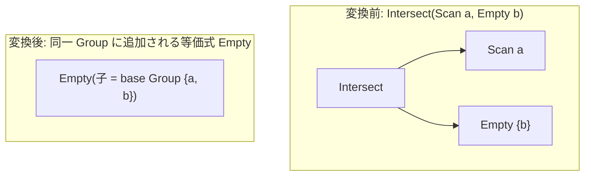

# setop_empty_simplification

- 状態: draft / 執筆基準リビジョン: `3880673` (2026-09-12)
- 定義位置: `plan/cascades.cpp` の `RuleSet::Default()`（登録名 `"setop_empty_simplification"`）

## 概要

`setop_empty_simplification` は、空の入力分岐を持つ INTERSECT 演算、および左入力が空である EXCEPT 演算を `Empty` 論理式へ縮退させる Rule である。

INTERSECT は 1 つでも空分岐があれば全体が空集合となり、EXCEPT は減算元となる左側入力が空であれば結果も空集合となる。この集合論的吸収則を適用し、演算子全体を 0 行を返す `kEmpty` 式へ置き換える。

## 変換前後の関係



## 適用条件

パターンは `Pattern::Any()` であり、対象演算子は動的に判定される。変換ラムダ内で以下の条件を検証する。

```cpp
          const bool intersect =
              expression.operation == LogicalOperator::kIntersect ||
              expression.operation == LogicalOperator::kIntersectAll;
          const bool except =
              expression.operation == LogicalOperator::kExcept ||
              expression.operation == LogicalOperator::kExceptAll;
          if ((!intersect && !except) || expression.children.size() < 2) {
            return;
          }
```

発火条件および非発火条件は以下の通りである。

1. 演算子が `LogicalOperator::kIntersect`, `kIntersectAll`, `kExcept`, `kExceptAll` のいずれかであり、子ノード数が 2 以上であること（UNION 演算は対象外）。
2. **INTERSECT / INTERSECT ALL**: いずれかの子グループ内に `LogicalOperator::kEmpty` 式が存在すること。
3. **EXCEPT / EXCEPT ALL**: 先頭の子グループ（左入力、`expression.children.front()`）内に `LogicalOperator::kEmpty` 式が存在すること。右側の減算対象のみが空の場合は発火しない。
4. 基底グループ（`memo.EnsureGroup(memo.Get(group).relations)`）が現在のグループ ID と一致しないこと（自己参照防止）。

## 意味論的根拠と代数的一致

本 Rule は集合論および多重集合論の吸収則に依拠する。

- **INTERSECT の吸収則**: 多重集合 $A, B$ に対して $A \cap B = \emptyset$（片方が空集合の場合）が常に成立する。したがって、任意の 1 つの分岐が空集合であれば、他の分岐の評価を待たずに全体が空集合となる。
- **EXCEPT の左吸収則**: $\emptyset \setminus B = \emptyset$ が常に成立する。左側が空であれば結果は必ず空集合である。
- **EXCEPT の右空の非対称性**: 一方で $A \setminus \emptyset = A$ であり、右側が空であっても全体は空集合にならない。右側が空のケースは単位元則として機能するため、本 Rule では処理せず `setop_empty_identity` が担当する。
- **UNION の対象外性**: UNION 演算は空集合に対して吸収則を持たず単位元則（$A \cup \emptyset = A$）に従うため、本 Rule では処理しない。
- **基底グループ（base Group）の整合性**: 集合演算ノードが属するグループの関係集合は、個々の入力分岐の関係集合の和集合となっている。`kEmpty` 式を Memo に登録する際、元の関係集合を満たす基底グループ（`base`）を確保して子ノードに指定することで、`Memo::AddExpression` の関係集合検証との整合性を保つ。

## 実装の詳細

`plan/cascades.cpp` における変換処理は以下の通りである。

```cpp
          const bool empty_branch =
              std::ranges::any_of(expression.children, [&](GroupId child) {
                return std::ranges::any_of(
                    memo.Get(child).expressions,
                    [](const LogicalExpression& candidate) {
                      return candidate.operation == LogicalOperator::kEmpty;
                    });
              });
          const bool empty_left =
              except &&
              std::ranges::any_of(
                  memo.Get(expression.children.front()).expressions,
                  [](const LogicalExpression& candidate) {
                    return candidate.operation == LogicalOperator::kEmpty;
                  });
          if (!empty_branch && !empty_left) {
            return;
          }
          const GroupId base = memo.EnsureGroup(memo.Get(group).relations);
          if (base == group) {
            return;
          }
          memo.AddExpression(
              group, LogicalExpression{.operation = LogicalOperator::kEmpty,
                                       .children = {base}});
```

空判定を満たした場合、単一の `kEmpty` 式をルートグループに登録する。

## 最適化効果

高コストな集合演算子および全入力分岐の実行が完全に排除される。

`kEmpty` は物理実装において即座に 0 行を返す定数演算子（`empty`）へ展開されるため、ハッシュテーブルの構築や外部ソート、中間バッファの確保がすべて不要となる。

## 関連 Rule との相互作用

- `setop_empty_identity`: 右側が空の EXCEPT や、空分岐を含む UNION を扱う対の Rule である。
- `join_empty_simplification`: 結合演算において空入力を検知して `Empty` へ縮退させる兄弟 Rule である。
- `eliminate_false_selection`: 矛盾述語から `kEmpty` 式を生成し、本 Rule の発火契機となる。

## 検証テスト

- `plan/cascades_test.cpp` の `IntersectWithEmptyBranchBecomesEmpty`: 右分岐に空式を持つ INTERSECT 論理式を探索した際、ルートグループに `kEmpty` 代替式が生成されることを検証する。
