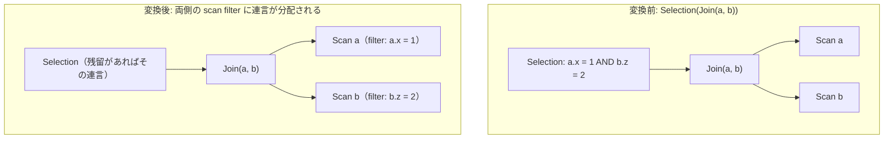

# split_selection_over_join

- 状態: draft / 執筆基準リビジョン: `3880673` (2026-09-12)
- 定義位置: `plan/cascades.cpp` の `RuleSet::Default()`（登録式。共通ヘルパー `PushSingleRelationConjuncts` を使用）

## 概要

`split_selection_over_join` は、`Selection(Join(L, R), A AND B)` において、結合の上に置かれた連言述語を分解し、単一のリレーションに閉じた連言を左右両方のスキャングループの scan filter へプッシュダウンする Rule である。

左入力側のみを対象とする `push_selection_through_join` を一般化し、左側・右側の双方に属する局所述語を同時に押し込むことで、結合の入力タプル数を最小化する。

## 変換前後の関係



## 適用条件

パターンは `Selection(Join(Any(), Any(), "input"))` であり、対象演算子は `LogicalOperator::kSelection` である。DSL の `Join` パターンは内部結合（`kJoin`）のみにマッチし、外部結合（`kOuterJoin`）にはマッチしない。

```cpp
    // Selection(Join(L, R), A AND B) with A over L and B over R: push both
    // sides. Guard rail: no outer-join pushdown yet.
    built.Add(Rule(
        "split_selection_over_join",
        Selection(Join(Any(), Any(), "input")),
        [](const Bindings&, Memo& memo, GroupId,
           const LogicalExpression& expression) {
          PushSingleRelationConjuncts(memo, *expression.predicate,
                                      [](const std::string&) { return true; });
        },
        LogicalOperator::kSelection));
```

ヘルパー関数 `PushSingleRelationConjuncts` における条件判定は以下の通りである。

1. 連言述語が参照するスキーマ修飾付きリレーション名集合のサイズが厳密に 1 であること（`touched.size() == 1`）。未修飾の列名は所属関係が未確定なため押し込み対象としない。
2. 複数リレーションにまたがる `OR` 述語については、補助ヘルパー `PushOrLocalConditions` により各リレーションの局所条件として安全に抽出できる場合のみ部分抽出を行う。
3. 外部結合に対しては一切発火しない（ガードレール）。

## 意味論的根拠と三値論理・例外保護

結合演算をまたぐ述語プッシュダウンの健全性は、三値論理と外部結合の NULL 補完意味論によって制約される。

- **単一リレーション局所述語の可換性**: 内部結合において、述語 $A(L)$ は結合の前に評価しても結合の後に評価しても全く同じタプルをフィルタリングする。内部結合は交差積の部分集合であり、各入力タプルの通過条件は他の入力と独立であるためである。
- **結合述語（相関述語）の保持**: $L.x = R.y$ のような複数関係にまたがる述語を片側のスキャンに押し込むことは、相手側の属性が未定義となるため不可能である。押し込めない述語は結合ノードまたは上位 Selection に残留する。
- **外部結合プッシュダウンの禁止（ガードレール）**: LEFT OUTER JOIN の右入力に対して述語を押し込むと、本来 NULL 補完されて残るべき左側行が除外されるか、あるいは逆に左側から右側へ押し込むことで結果が変質する。tinylamb は Null-rejection（NULL 棄却性）解析が未実装であるため、安全性の観点から外部結合へのプッシュダウンを全面的に禁止している。
- **OR 述語の局所条件抽出**: `OR(AND(t1.a=1, t2.b=2), AND(t1.a=3, t2.b=4))` のような式において、すべての OR 枝に `t1` の局所条件が含まれる場合に限り `OR(t1.a=1, t1.a=3)` を `t1` の scan filter へ先行フィルタとして押し込む。抽出後も元の OR 述語全体は残留述語として結合後に評価されるため、意味論的一致が厳密に保たれる。

## 実装の詳細

`plan/cascades.cpp` における変換処理は、`PushSingleRelationConjuncts` を介して行われる。

```cpp
    if (touched.size() == 1 && relation_enabled(*touched.begin())) {
      memo.MergeScanFilter(memo.EnsureGroup({*touched.begin()}), conjunct);
      continue;
    }
```

1. 連言が単一のリレーションに閉じている場合、`memo.EnsureGroup({*touched.begin()})` で対応する単一リレーショングループを取得し、`MergeScanFilter` で既存の filter 式と AND 結合する。
2. `MergeScanFilter` は単一リレーション以外のグループへの書き込みを `CHECK_MSG` で拒否し、データ整合性を強制する。
3. 押し込み先はスキャングループのグループ属性（`Group::filter`）であり、新たなプラン木を生成することなく物理スキャン時の述語として直接機能する。

## 最適化効果

結合演算に入る前の左右両方の入力タプル数が早期に削減される。

ハッシュ結合におけるビルド側ハッシュテーブルサイズおよびプローブ側走査行数の双方が削減され、ネステッドループ結合における反復回数も大幅に抑制される。

## 関連 Rule との相互作用

- `push_selection_through_join`: 左側のみを対象とする先行 Rule であるが、本 Rule と同一の `MergeScanFilter` へ合流するため、双方が適用されても結果の scan filter は同一に収束する（冪等性）。
- `push_selection_into_scan`: 単一表に対する Selection を scan filter に統合する。
- `infer_join_predicates` / `join_predicate_transitivity`: 等価結合条件から導出された新たな定数等式を scan filter へ注入する。

## 検証テスト

- `plan/cascades_test.cpp` の `CascadesTest.SplitSelectionOverJoinPushesConjunctsOfBothSides`: `a.x = 1 AND b.z = 2` の Selection から、テーブル `a` と `b` のそれぞれの単一リレーショングループの filter に対応する連言述語が正常に到達することを検証する。
