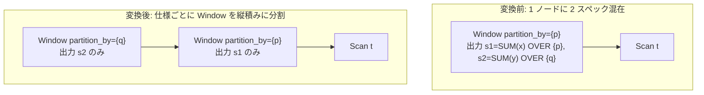

# split_window

- 状態: draft / 執筆基準リビジョン: `3880673` (2026-09-12)
- 定義位置: `plan/cascades.cpp` の `RuleSet::Default()`（登録名 `"split_window"`）

## 概要

`split_window` は、1 つの `LogicalOperator::kWindow` ノード内に異なる PARTITION BY 仕様を持つ複数のウィンドウ関数呼び出しが混在している場合に、互換性のある仕様ごとに単一の PARTITION BY を持つ複数の Window ノードの縦積み（stack）へと分割する Rule である。

論理演算子の Window ノードは単一の `partition_by` ペイロードしか保持できないため、仕様が異なるウィンドウ関数の混在は物理化時に正しく処理できない。本 Rule はそれらを独立した Window 階層へと正規化する。

## 変換前後の関係

`SUM(x) OVER (PARTITION BY p)` と `SUM(y) OVER (PARTITION BY q)` が混在する例:



## 適用条件

パターンは `Window(Any("input"))` であり、対象演算子は `LogicalOperator::kWindow` である。変換ラムダ内で以下の条件を検証する。

```cpp
          if (expression.operation != LogicalOperator::kWindow ||
              expression.children.size() != 1 ||
              expression.target_list.size() < 2) {
            return;
          }
```

発火条件および非発火条件は以下の通りである。

1. 子ノード数が 1 であり、`target_list` の要素数が 2 以上であること（1 つのみの場合は分割不要）。
2. 入力グループが現在のグループ自身でないこと（自己参照防止）。
3. `target_list` のすべての出力式がウィンドウ関数呼び出し（`TypeTag::kWindowFunctionExp`）であること。素の列参照や通常のスカラー計算式が混ざっている場合は発火しない。
4. 各関数の `partition_by` 仕様を文字列化して分類した結果、異なるパーティション仕様が 2 種類以上存在すること（`spec_order.size() >= 2`）。
5. 派生グループ（`window-split:<fingerprint>`）が現在の入力グループまたは自グループと一致しないこと。

## 意味論的根拠と多重度保存

本 Rule は単なるコストベースの最適化ではなく、論理演算子と物理実行エンジンの契約を整合させる必須の正規化変換である。

- **単一パーティション仕様の契約**: tinylamb の Window 演算子は、ノード単位で 1 つの `partition_by` リストを保持する。異なる PARTITION BY を持つ関数を同一ノードに含めると、片方のパーティション境界のみで全関数が実行されてしまい、結果が破壊される。
- **タプル多重度および順序の保存**: Window 演算子は入力をフィルタリングせず、集約値の列を新規に追加するのみであるため、タプルの多重度は完全に保存される。内側の Window ノードが入力を通過させ、外側の Window ノードがその拡張された行に対して計算を行うため、入力タプル集合の一貫性が保証される。
- **パーティションキー属性の透過性**: パーティションキーはベーステーブルの入力列であり、内側の Window 演算によって消去されることはない。外側の Window 演算子も全く同一の入力属性を参照できる。

## 実装の詳細

`plan/cascades.cpp` における変換処理は、パーティション仕様の辞書分類と連鎖的な派生グループ構築を行う。

```cpp
            if (outermost) {
              LogicalExpression outer = expression;
              outer.children = {current};
              outer.target_list = std::move(level_targets);
              outer.partition_by = std::move(level_partition);
              memo.AddExpression(group, std::move(outer));
            } else {
              // signature 組み立てと EnsureDerivedGroup の呼び出し
              memo.AddExpression(
                  level, LogicalExpression{
                             .operation = LogicalOperator::kWindow,
                             .children = {current},
                             .target_list = std::move(level_targets),
                             .partition_by = std::move(level_partition)});
              current = level;
            }
```

1. 出現順序（`spec_order`）に従って内側から順に Window レベルを構築する。
2. 内側のレベルは派生グループを順次生成して登録し、最外層のレベルのみ元のルートグループに対して登録する。
3. 内側レベルの Window には個別のソートフラグは設定されず、各関数のウィンドウ仕様に付随するソート要求に委ねられる。

## 最適化効果

異なるパーティション仕様を持つクエリが正しく実行可能となる。

同一仕様を持つ関数同士は同一の Window ノードに集約されるため、不必要なソートやパーティション分割の多重発生を回避し、最小限の階層数で実行計画が構成される。

## 関連 Rule との相互作用

- `merge_adjacent_windows`: 同一のパーティション・ソート仕様を持つ隣接 Window ノードを 1 つに融合する逆方向の Rule である。
- `window_frame_sort_sharing`: 縦積みされた Window ノード間で、ソート順が互換な場合にソート処理を共有・再利用する。
- `no_op_window_elimination`: 分割の結果、上位ノードから参照されない Window レベルが生じた場合にそれを削除する。

## 検証テスト

- `plan/cascades_test.cpp` の `CascadesTest.SplitWindowSeparatesPartitionSpecs`: `PARTITION BY p` の `SUM(x)` と `PARTITION BY q` の `SUM(y)` を持つ単一 Window ノードから、出力 1 個ずつの Window が 2 段積みに分割された論理式が生成されることを検証する。
