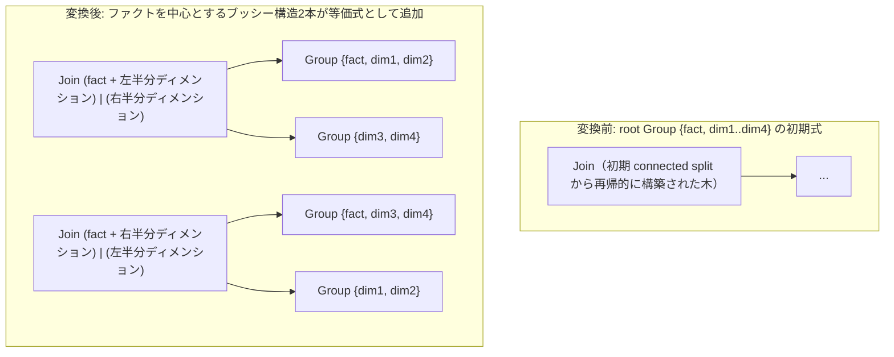

# star_join_reorder

- 状態: draft / 執筆基準リビジョン: `3880673` (2026-09-12)
- 定義位置: `plan/cascades.cpp` の `RuleSet::Default()`（登録名 `"star_join_reorder"`）

## 概要

`star_join_reorder` は、スタースキーマ（単一のファクト表に対して複数のディメンション表が結合するトポロジ）を検出し、ファクト表を中心としたブッシー木（bushy tree）の結合順序を2本生成するヒューリスティック論理変換Ruleです。他表との接続数が最大となる表をファクト表と判定し、残りのディメンション表を左右に等分して配置します。

## 変換前後の関係

ファクト表 `fact` と4つのディメンション表 `dim1`〜`dim4` を含む5表結合の例を示します。



## 適用条件

パターンは `Join(Any("left"), Any("right"))` です。適用ガード条件は以下のとおりです（`plan/cascades.cpp`）。

```cpp
          const auto& relations = memo.Get(group).relations;
          if (relations.size() < 3 || relations.size() > 16) {
            return;
          }
          std::string fact_table;
          size_t max_degree = 0;
          for (const auto& r : relations) {
            size_t degree = 0;
            const uint64_t r_mask = memo.RelationMask({r});
            for (const auto& other : relations) {
              if (r == other) {
                continue;
              }
              const uint64_t o_mask = memo.RelationMask({other});
              if (memo.CutConnected(r_mask, r_mask | o_mask)) {
                ++degree;
              }
            }
            if (degree > max_degree) {
              max_degree = degree;
              fact_table = r;
            }
          }
          if (max_degree < 2 || fact_table.empty()) {
            return;
          }
```

適用条件は以下の3点です。

1. **関係数の範囲**: 関係数が3以上16以下であること。3未満ではスタースキーマが成立せず、16超では $O(N^2)$ の接続度計算コストを避けるため除外されます。
2. **接続度の下限**: 最大接続度 `max_degree` が2以上であること。どの表も2つ以上の他表と結合述語を共有していない場合（単純な線形結合など）は適用されません。
3. **自己参照の回避**: 生成しようとする子Groupのいずれかが親Groupと一致する場合は登録をスキップします。

## 意味論的根拠とヒューリスティック

上限値16は、結合探索の計算量制御に基づく制約です。16表を超える領域は `greedy_join_order_fallback` が管轄し、本Ruleは全列挙と協調可能な3〜16表の範囲に限定されます。

最大接続度が2以上という条件は、スタースキーマのトポロジ的特徴を捉える指標です。接続度（degree）は、`CutConnected(r_mask, r_mask | o_mask)` により2表間に跨る結合述語が存在するかを判定して算出されます。ファクト表は多数のディメンション表と外部キー結合（例: `fact.dim_id = dim.id`）を持つため、接続度が最大値をとります。全表が1対1で直列に接続しているクエリでは最大接続度が1となり、本Ruleは適用されません。

本Ruleは厳密な意味保存ガードではなく、有望な計画を早期に供給するための探索ヒューリスティックとして設計されています。変形の健全性は、新規生成式が関係代数の正当な二分割を表す `NewJoin` で構築され、述語が `JoinConditionFor` により自動再導出されることによって担保されます。

## 実装の詳細

ファクト表が同定された後、ディメンション表のリストを二等分し、2つのブッシー結合式を構築します。

```cpp
          const auto mid = static_cast<std::ptrdiff_t>((dims.size() + 1) / 2);
          std::vector<std::string> dims_left(dims.begin(), dims.begin() + mid);
          std::vector<std::string> dims_right(dims.begin() + mid, dims.end());

          // Branch 1: Bushy tree with fact + dims_left joined with dims_right
          std::vector<std::string> fact_left_rels = dims_left;
          fact_left_rels.push_back(fact_table);
          const GroupId fact_left_group = memo.EnsureGroup(fact_left_rels);
          const GroupId dims_right_group = memo.EnsureGroup(dims_right);
          if (fact_left_group != group && dims_right_group != group) {
            memo.AddExpression(group,
                               memo.NewJoin(fact_left_group, dims_right_group));
          }
```

Branch 1 ではファクト表を左側ディメンショングループに結合し、Branch 2 では左右を反転させてファクト表を右側ディメンショングループに結合します。いずれの分岐においても、`memo.NewJoin` を呼び出すことで `JoinConditionFor` が機能し、各Group間に跨る等値結合条件が過不足なく割り当てられます。

## 最適化効果

本Ruleは、初期木（左深木）においてディメンション表同士の直積結合が先行して中間結果が不必要に肥大化する問題を緩和します。ファクト表を基底に据えたブッシー木を早期に提示することで、ハッシュ結合においてディメンション側をビルド側とし、ファクト側をプローブ側とする効率的な物理計画が選択されやすくなります。

## 関連Ruleとの相互作用

- `join_enumeration`: 3〜16表における結合順序の主要供給元。本Ruleが生成したブッシー結合がすでに列挙されていた場合は、指紋照合により重複が排除されます。
- `greedy_join_order_fallback`: 16表超の結合を担当するフォールバックRule。
- `join_commutativity` / `join_associativity_*`: 本Ruleによって生成された部分Groupの内部で局所的な形状変形を継続します。
- `Memo::EnsureGroup`: 本Ruleが要求する部分Groupを確保し、初期結合木を割り当てます。

## 検証テスト

- `plan/cascades_test.cpp`:
  - `StarJoinReorderAndCostModel`: ファクト表 `fact` とディメンション表 `dim1`, `dim2` からなるスタースキーマにおいて、ファクト表を中心とする分割が探索候補に含まれ、コストモデルにより最適な計画が選定されることを検証。

