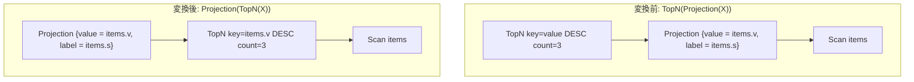

# topn_push_through_projection

- 状態: draft / 執筆基準リビジョン: `3880673` (2026-09-12)
- 定義位置: `plan/cascades.cpp` の `RuleSet::Default()`（登録名 `"topn_push_through_projection"`）

## 概要

`topn_push_through_projection` は、`TopN(Projection(X))` において、TopN のソートキーが射影の出力定義式を通じて下位の入力列へと翻訳可能な場合に、TopN を射影の下へ押し込んで `Projection(TopN(X))` へと反転させる Rule である。

TopN（ソートとリミットの融合演算）を生の入力データに対して直接評価させることで、早期枝刈り（ヒープソート等）を機能させ、射影（列計算やキャスト等）の評価対象を上位 $N$ 行のみに限定する。

## 変換前後の関係

ソートキー `value` が射影内で `items.v` と定義されている例:



## 適用条件

パターンは `TopN(Projection(Any(), "proj"))` であり、対象演算子は `LogicalOperator::kTopN` である。変換ラムダ内で以下のガード条件を検証する。

```cpp
    // TopN(Projection(R)) can sort R directly when every ordering expression
    // can be translated through the projection.  Keep the projection above
    // TopN so aliases and computed output columns remain unchanged.
```

発火条件および非発火条件は以下の通りである。

1. 子グループ内の式が `LogicalOperator::kProjection` であり、子ノード数が 1 であること。
2. TopN の**すべての**ソートキー式が、射影の `target_list` を通じて下位入力の列参照へと翻訳可能であること（ヘルパー `RewriteThroughOutputs` がすべて非 null を返すこと）。
3. 翻訳後のキーリストが空でないこと。
4. 新規派生グループ（`topn-below-proj:<count>:<offset>|<keys...>`）が現在のグループ自身または射影の子ノードと一致しないこと（自己参照防止）。

ソートキーの中に、射影の出力リストに含まれない列や、射影内で翻訳不能な複雑な未対応式が含まれる場合は発火しない。

## 意味論的根拠と例外保護・多重度保存

射影をまたぐ TopN の移動には、ソートキー値の厳密な同一性と多重度の不変性が求められる。

- **順序付けの代数的一致**: TopN 演算子は指定されたキー式の値に基づいてタプルを全順序化する。`RewriteThroughOutputs` は、射影の出力エイリアスまたは出力式をその定義元の式に置き換える。例えば射影が `value = items.v` と定義している場合、TopN のキー `value` を `items.v` に置き換えて下位でソートしても、タプル間の大小関係は完全に同一である。
- **射影の保持によるスキーマ契約の保護**: TopN を下に押し込んだ後も、最上位には元の射影演算子が残される。これにより、外部へ公開される列名（エイリアス）や型、および TopN キーとしては使われなかった他の計算列の定義がそのまま保持される。
- **例外発生の遅延と最適化効果**: 射影に計算列（例: 除算やキャスト）が含まれる場合、上位 $N$ 行以外については計算自体がスキップされる。これは SQL 規格における短絡評価および実行最適化の範疇であり、不要なタプルの計算コストを削減する。
- **フィンガープリントによる派生グループ分離**: 派生グループのタグには、リミット値・オフセット値に加え、翻訳後の全ソートキーの文字列表現を含める。異なるソートキーを持つ複数の TopN 式が同一の派生グループへ混線することを防ぐ。

## 実装の詳細

`plan/cascades.cpp` における変換処理は以下の通りである。

```cpp
            memo.AddExpression(
                pushed, LogicalExpression{
                            .operation = LogicalOperator::kTopN,
                            .children = {projection.children[0]},
                            .target_list = std::move(translated_keys),
                            .sort_ascending = expression.sort_ascending,
                            .sort_nulls_first = expression.sort_nulls_first,
                            .limit_count = expression.limit_count,
                            .limit_offset = expression.limit_offset});
            memo.AddExpression(
                group,
                LogicalExpression{.operation = LogicalOperator::kProjection,
                                  .children = {pushed},
                                  .target_list = projection.target_list});
```

1. 下位グループ `pushed` に翻訳後のソートキーを持つ `kTopN` 式を追加する。
2. ルートグループに `pushed` を子とする `kProjection` 式を追加する。元の `target_list` をそのまま保持する。

## 最適化効果

全件に対して射影の式評価（高コストな文字列演算や関数呼び出し）を行ってからソートするのではなく、生の入力データから有界ヒープ等を用いて上位 $(offset + count)$ 件のみを抽出し、その上位行に対してのみ射影を評価する。

ソートに伴うメモリ消費量と射影計算の CPU コストの双方が劇的に削減される。

## 関連 Rule との相互作用

- `push_limit_through_projection`: ソートキーを持たない単純な Limit 演算子のプッシュダウンを担当する。
- `limit_push_through_sort`: `Limit(Sort(X))` を単一の `TopN(X)` ノードへ融合する。
- `rank_row_number_to_topn`: `ROW_NUMBER()` ウィンドウ関数とフィルタの組み合わせから TopN を導出する。

## 検証テスト

- `plan/cascades_test.cpp` の `CascadesTest.PushTopNThroughProjectionRewritesOrderingExpression`: ソートキー `value` が射影を通じて `items.v` へ書き換えられ、射影の下に TopN が配置された論理式が生成されることを検証する。
