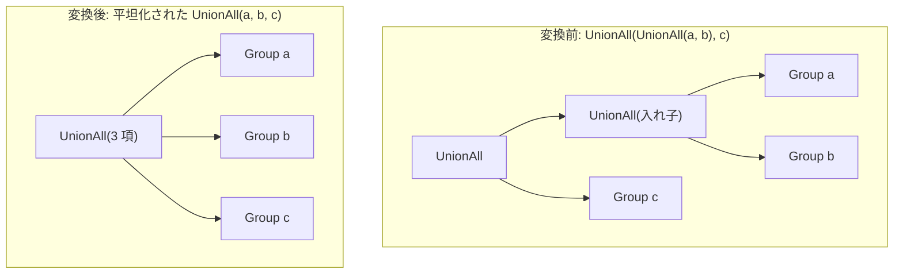

# union_all_merge

- 状態: draft / 執筆基準リビジョン: `3880673` (2026-09-12)
- 定義位置: `plan/cascades.cpp` の `RuleSet::Default()`（登録名 `"union_all_merge"`）

## 概要

`union_all_merge` は、入れ子になった `UnionAll(UnionAll(a, b), c)` のような木構造を、平坦化された単一の n 項演算子 `UnionAll(a, b, c)` へと統合する Rule である。

多重集合の連結（bag concatenation）が持つ結合法則に基づき、多段にネストした集合演算ノードを 1 つの平坦な Append ノードへ集約することで、中間イテレータのオーバーヘッドおよびバッファリングを削減する。

## 変換前後の関係



## 適用条件

パターンは `Pattern::Op(LogicalOperator::kUnionAll, {})` であり、対象演算子は `LogicalOperator::kUnionAll` である。変換ラムダ内で以下の条件を検証する。

```cpp
          std::vector<GroupId> flattened;
          bool changed = false;
          for (const GroupId child : expression.children) {
            const auto nested = std::ranges::find_if(
                memo.Get(child).expressions, [](const LogicalExpression& item) {
                  return item.operation == LogicalOperator::kUnionAll;
                });
            if (nested == memo.Get(child).expressions.end()) {
              flattened.push_back(child);
              continue;
            }
            flattened.insert(flattened.end(), nested->children.begin(),
                             nested->children.end());
            changed = true;
          }
          if (changed && flattened.size() >= 2) {
            memo.AddExpression(
                group,
                LogicalExpression{.operation = LogicalOperator::kUnionAll,
                                  .children = std::move(flattened)});
          }
```

発火条件および非発火条件は以下の通りである。

1. 子グループの中に、`LogicalOperator::kUnionAll` 式を持つグループが少なくとも 1 つ存在すること（`changed == true`）。
2. 平坦化後の子グループ数が 2 以上であること（`flattened.size() >= 2`）。
3. 子グループ内に入れ子の `kUnionAll` 式が存在しない場合は発火しない。

## 意味論的根拠と多重度保存

多重集合における UNION ALL は純粋な bag 結合演算であり、代数的に完全な結合律が成立する。

- **結合律の成立**: 任意の多重集合 $A, B, C$ に対し、$(A \uplus B) \uplus C = A \uplus (B \uplus C) = A \uplus B \uplus C$ が厳密に成立する。タプルの出力順序を除き（SQL では ORDER BY を伴わない集合演算の出力順序は未定義）、得られる多重集合の要素とその重複度は入れ子の構造に一切影響されない。
- **位置的スキーマ契約の維持**: UNION ALL は名前ではなく列の位置（positional contract）によって各分岐の属性を対応付ける。入れ子を平坦化しても、各分岐が供給する列数および型は変化しないため、スキーマ契約は完全に保たれる。
- **不動点探索による多段平坦化**: 子グループ内に複数の入れ子 `kUnionAll` 式が存在する場合でも、本 Rule は各子グループにつき最初に見つかった 1 つを展開する。探索エンジンのワークリスト駆動により、本 Rule が繰り返し適用されることで、任意の深さの入れ子構造が最終的に単一の n 項ノードへと収束する。

## 実装の詳細

`plan/cascades.cpp` における平坦化ロジックは極めて簡潔である。

1. 現在の子グループ配列を走査し、子グループ内に `kUnionAll` 式があればその子リストを展開して `flattened` に追加し、なければ子グループ自身をそのまま追加する。
2. 少なくとも 1 回の展開が行われた場合、新しい子リストを持つ `kUnionAll` 式を元のグループへ追加する。
3. 元の入れ子式は Memo 内に残され、コスト評価の対象となるが、平坦化された式が選択されることで実行計画上のノード階層が解消される。

## 最適化効果

物理実行時における集合演算ノードの段数が削減される。

入れ子演算子が排除されることで、実行時に関数呼び出しオーバーヘッドやパイプラインの中断が解消されるだけでなく、後続の `union_all_push_limit` や `values_fold_into_union` などの Rule が全分岐を単一ノードの子として一括認識できるようになり、最適化の連鎖を促進する。

## 関連 Rule との相互作用

- `union_to_union_all_plus_distinct` / `union_distinct_hash_sort_choice`: UNION DISTINCT から導出された派生 UNION ALL に対して本 Rule が適用され、平坦化を行う。
- `union_all_push_limit`: 平坦化された n 項 UNION ALL の全分岐に対して一括で LIMIT を押し込む。
- `values_fold_into_union`: 全分岐が単行 VALUES である平坦化ノードを単一の VALUES ノードへと畳み込む。

## 検証テスト

- `plan/cascades_test.cpp` の `CascadesTest.UnionAllMergeFlattensNestedBranches`: `UnionAll(UnionAll(a, b), c)` の論理式を探索した際、子ノード数 3 の平坦な `kUnionAll` 代替式が同一グループに生成されることを検証する。
