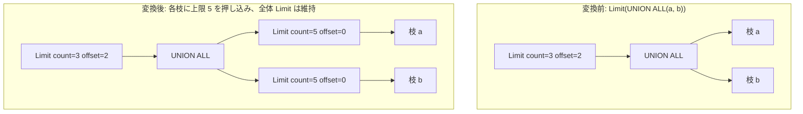

# union_all_push_limit

- 状態: draft / 執筆基準リビジョン: `3880673` (2026-09-12)
- 定義位置: `plan/cascades.cpp` の `RuleSet::Default()`（登録名 `"union_all_push_limit"`）

## 概要

`union_all_push_limit` は、`Limit(count, offset)` が `UNION ALL` の直上に配置されている場合に、各入力分岐に対して独立に `(offset + count)` 行の上限（capping）を押し込みつつ、全体の Limit 演算子を親ノードとして維持する Rule である。

各分岐から必要な最大行数のみを取り出し、不要なタプルの生成・走査を早期に打ち切ることで、UNION ALL の中間結果サイズを大幅に抑制する。

## 変換前後の関係

`LIMIT 3 OFFSET 2` の例:



## 適用条件

パターンは `Limit(Any("input"))` であり、対象演算子は `LogicalOperator::kLimit` である。変換ラムダ内で以下の条件を検証する。

```cpp
          if (expression.limit_count == 0 ||
              expression.limit_offset >
                  std::numeric_limits<size_t>::max() - expression.limit_count) {
            return;
          }
          if (memo.Get(bindings.at("input"))
                  .tag.starts_with("union-limit-setop:")) {
            return;
          }
```

発火条件および非発火条件は以下の通りである。

1. `limit_count > 0` であること（0 は tinylamb において無制限を意味するため押し込み不能）。
2. `limit_offset + limit_count` の計算が `size_t` の範囲内でオーバーフローしないこと。
3. 入力グループのタグが `"union-limit-setop:"` で始まらないこと（自己適用のループ防止）。
4. 入力グループ内に子ノード数 2 以上の `LogicalOperator::kUnionAll` 式が存在すること。
5. 枝ごとの派生グループ（`union-limit:<cap>`）が枝自身やルートグループと一致しないこと。

UNION DISTINCT に対しては、重複排除が分岐をまたいで行われるため本 Rule は発火しない。

## 意味論的根拠と多重度保存

多重集合における UNION ALL の結合順序と、Limit 演算子のタプル取得順序の一致が意味保存の論拠となる。

- **各枝の必要行数の上界**: UNION ALL は各分岐のタプルを順番に（または並行して）多重集合として連結する。全体として最初の $(offset + count)$ 行を決定するために、任意の 1 つの分岐から消費されるタプル数は最大でも $(offset + count)$ 行を超えることはない（最悪ケースでも、他のすべての分岐が 0 行で該当分岐のみから全タプルが供給される場合）。したがって各枝を `cap = offset + count` で切っても、必要なタプルが欠落することはない。
- **全体 Limit の保持（親ノードの存続）**: 各枝に Limit を押し込んだだけでは、全体の出力タプル数は「枝数 $\times cap$」となり、また全体としてのオフセットが適用されない。親ノードとして元の `count` および `offset` を持つ Limit を維持することで、グローバルな結果の正確性が厳密に保たれる。
- **オーバーフロー保護**: `offset + count` の加算における算術オーバーフローを事前に検出し、未定義動作を防止する。

## 実装の詳細

`plan/cascades.cpp` における変換処理は、枝ごとの派生グループ生成と、キャップ済み UNION ALL の登録で構成される。

```cpp
            std::vector<GroupId> limited_children;
            limited_children.reserve(setop.children.size());
            bool cycle = false;
            for (const GroupId child : setop.children) {
              const GroupId limited =
                  memo.EnsureDerivedGroup(memo.Get(child).relations,
                                          "union-limit:" + std::to_string(cap));
              if (limited == child || limited == group) {
                cycle = true;
                break;
              }
              memo.AddExpression(
                  limited,
                  LogicalExpression{.operation = LogicalOperator::kLimit,
                                    .children = {child},
                                    .limit_count = cap,
                                    .limit_offset = 0});
              limited_children.push_back(limited);
            }
```

1. 全枝に対して `limit_count = cap`, `limit_offset = 0` の `kLimit` 式を配置した派生グループを生成する。
2. 派生グループ `union-limit-setop:<cap>` に新しい子リストを持つ `kUnionAll` 式を配置する。
3. ルートグループにその派生グループを子とする元の `kLimit` 式を配置する。

## 最適化効果

各分岐の実行が最大 `cap` 件で早期停止（Early Termination）する。

スキャンノードへ Limit ヒント（`limit_hint`）が伝播することにより、ストレージ層での不要なブロック読み込みが抑制され、パイプライン全体のレイテンシが大幅に低減する。

## 関連 Rule との相互作用

- `push_limit_through_union_all`: 同種の Limit 押し込みを行う兄弟 Rule であり、枝側に既存の Limit がある場合の処理など一部のガードが異なる。
- `merge_limits`: 押し込まれた Limit と枝内に既存の Limit が合成される。
- `union_all_merge`: UNION ALL を平坦化し、本 Rule がすべての枝を一括してキャップできるように下地を整える。

## 検証テスト

- `plan/cascades_test.cpp` の `CascadesTest.UnionAllLimitCapsEveryChildAndKeepsGlobalLimit`: `Limit(3, offset=2)` の下の各枝に `count=5, offset=0` の Limit が配置され、全体として元の Limit(3, 2) が維持されることを検証する。
