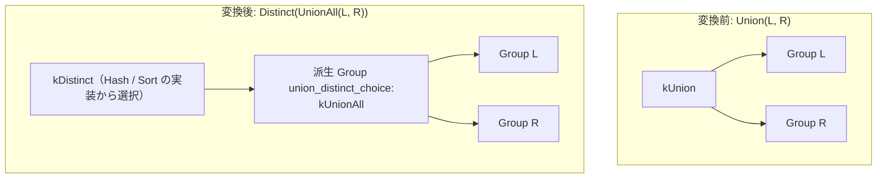

# union_distinct_hash_sort_choice

- 状態: draft / 執筆基準リビジョン: `3880673` (2026-09-12)
- 定義位置: `plan/cascades.cpp` の `RuleSet::Default()`（登録名 `"union_distinct_hash_sort_choice"`）

## 概要

`union_distinct_hash_sort_choice` は、`Union(children)`（重複排除を伴う集合演算）に対して、`Distinct(UnionAll(children))` という明示的な論理代替式を Memo に導入する Rule である。

重複排除を直接行う集合演算オペレータだけでなく、単純な Append（UNION ALL）の出力に対してハッシュ方式（HashDistinct）またはソート方式（SortMergeDistinct）による重複排除パイプラインを適用する選択肢を提供し、コストベースの最適化を可能にする。

## 変換前後の関係



## 適用条件

パターンは `Pattern::Op(LogicalOperator::kUnion, {})` であり、対象演算子は `LogicalOperator::kUnion` である。変換ラムダ内で以下の条件を検証する。

```cpp
          if (memo.Get(group).tag.find("union_distinct_choice") !=
              std::string::npos) {
            return;
          }
```

発火条件および非発火条件は以下の通りである。

1. 論理式が `LogicalOperator::kUnion` であること。
2. 現在のグループのタグに `"union_distinct_choice"` が含まれていないこと（自己再入・循環生成の抑止）。
3. 派生グループ（`memo.EnsureDerivedGroup(relations, "union_distinct_choice")`）が現在のグループ ID と一致しないこと。

## 意味論的根拠と物理実行の契約

代数的に UNION（DISTINCT）と「UNION ALL + DISTINCT」は完全に等価である。

- **代数的同一性**: 関係代数において、集合としての和 $A \cup B$ は、多重集合としての和 $A \uplus B$ に対して重複排除射影 $\pi_{\text{distinct}}$ を適用したものと定義される。したがって $A \cup B \equiv \text{DISTINCT}(A \uplus B)$ は常に成立する。
- **物理アルゴリズムの選択肢拡大**: 直接の UNION オペレータは通常ハッシュセットを用いて全件の重複を排除する。一方、入力がすでにソートされている場合や、インデックススキャンを活用できる場合、SortMergeDistinct（あるいはストリーミング重複排除）を用いる方がハッシュテーブル構築よりも安価になる。本 Rule は論理段階で Distinct ノードを明示化することで、物理実装 Rule（`distinct`, `sort_distinct`, `skip_scan_distinct`）がそれぞれのコストを評価できるようにする。
- **スキーマおよび属性の維持**: 派生グループの `kUnionAll` およびルートグループの `kDistinct` 式の双方が元の `target_list` および `output_schema` を引き継ぎ、出力契約の同一性を維持する。

## 実装の詳細

`plan/cascades.cpp` における変換処理は以下の通りである。

```cpp
          const GroupId union_all = memo.EnsureDerivedGroup(
              memo.Get(group).relations, "union_distinct_choice");
          if (union_all != group) {
            memo.AddExpression(
                union_all,
                LogicalExpression{.operation = LogicalOperator::kUnionAll,
                                  .children = expression.children,
                                  .target_list = expression.target_list,
                                  .output_schema = expression.output_schema});
            // HashDistinct / Distinct alternative
            memo.AddExpression(
                group,
                LogicalExpression{.operation = LogicalOperator::kDistinct,
                                  .children = {union_all},
                                  .target_list = expression.target_list,
                                  .output_schema = expression.output_schema});
          }
```

兄弟 Rule である `union_to_union_all_plus_distinct` との差分として、派生グループタグに `"union_distinct_choice"` を使用し、タグ判定による自己再入抑止を備え、かつ `target_list` と `output_schema` を明示的にコピーして設定している。

## 最適化効果

直交する物理実装アルゴリズムの比較が可能となる。

入力の順序特性やカーディナリティに応じて、ハッシュテーブルによるメモリ消費を避け、ストリーミングソートやインデックス走査を活かした低コストな実行計画が選択される。

## 関連 Rule との相互作用

- `union_to_union_all_plus_distinct`: 同一の論理変換を行う兄弟 Rule。
- `union_all_merge`: 派生グループ内の `UnionAll` を平坦化する。
- `distinct` / `sort_distinct` / `skip_scan_distinct`: 本 Rule が生成した `kDistinct` を物理実装する演算子群である。

## 検証テスト

- `plan/cascades_test.cpp` の `CascadesTest.UnionDistinctHashSortChoice`: `kUnion` の論理式を探索した際、同一グループ内に `kDistinct` 代替式が登録されることを検証する。
